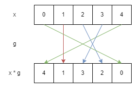
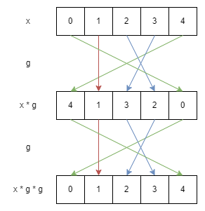

# permutation

> n!
> 
> MD5 (permutation.zip) = e7920324a0db237e1860f98be5846bb2
> 
> - mechfrog88

### disclaimer

* Not a uni student, the math might be a bit eh but it works

* Quite lengthy because 1. I'm relatively new to writeups and 2. I found this chal really fun to solve

---

We are given an output file as well as _2_ python files -- one for the `Perm` class and another to run the script.

Let us first analyse the class bit by bit:

```python
class Perm():
    def __init__(self, arr):
        assert self.valid(arr)
        self.internal = arr
        self.n = len(arr)

    def valid(self, arr):
        x = sorted(arr)
        n = len(arr)
        for i in range(n):
            if (x[i] != i):
                return False
        return True

    def __str__(self):
        return ",".join(map(str, self.internal))
```

So far, `Perm` seems to be just a glorified array. As the name suggests, a `Perm` of order `n` is a permutation of an array of length `n`.

```python
    def __mul__(self, other):
        assert other.n == self.n
        res = []
        for i in other.internal:
            res.append(self.internal[i])
        return Perm(res)
```

Now this gets interesting. We can multiply 2 `Perm`s with the same order, where the first array is permuted through the second array. Essentially, `x * [i0, i1, i2, i3, i4] = [x[i0], x[i1], x[i2], x[i3], x[i4]]`.

Let's say we have a `Perm` `g = [4, 1, 3, 2, 0]`. We can draw a simple illustration for `x * g`:



Here, `g` simply represents the arrows (which do not change). Notice that when `x` is a sorted array (identity `Perm`), We get `x * g = g`.

An alternative representation is through linear algebra. For example, `g` in the above scenario can be represented as

$$
G = \begin{bmatrix}
0&0&0&0&1\\
0&1&0&0&0\\
0&0&0&1&0\\
0&0&1&0&0\\
1&0&0&0&0\\
\end{bmatrix}
$$

Where `x * g = g` can be represented as $GX=G$ (In this case $X$ is conveniently the identiy matrix). Note that matrix multiplication (i.e. the multiplication operation of `Perm`) is associative.

```python
    def __pow__(self, a):
        res = Perm([i for i in range(self.n)])
        g = Perm(self.internal)
        while (a > 0):
            if (a & 1): res = res * g
            g = g * g
            a //= 2
        return res
```

Finally, we have the exponent operation. Note that `a` should be a positive integer. The code in the `while` loop is essentially reads `a` like a binary number and keeps multiplying the identity array by `g` until the number of `g` operations is equal to `a`, something like $11 = 1011_2 = 1\times2^0+1\times2^1+0\times2^2+1\times2^3$.

Fortunately, since the multiplication operation is associative, this is equivalent to multiplying by `g` for a total of `a` times. I guess this is done in order to speed up the operation as `a` can get pretty large.

---

Now, onto our main script:

```python
from secrets import randbits
from hashlib import shake_256
import random
import perm

FLAG = <REDACTED>

def encrypt(key : str) -> str:
    otp = shake_256(key.encode()).digest(len(FLAG))
    return xor(otp, FLAG).hex()

def xor(a : bytes, b : bytes) -> bytes:
    return bytes([ x ^ y for x, y in zip(a, b)])
```

Pretty standard encryption. It seems that our main goal will be to acquire the key used to encrypt the flag.

```python
n = 5000
h = 2048

arr = [i for i in range(n)]
random.shuffle(arr)

g = perm.Perm(arr)
a = randbits(h); b = randbits(h)
A = g ** a; B = g ** b
S = A ** b
key = str(S)

print(f"g = [{g}]"); print(f"A = [{A}]"); print(f"B = [{B}]"); 

print(f"c = {encrypt(key)}")
```

For this challenge, we have a `Perm` of order `5000`, and `a` and `b` are 2 large numbers (which presumably cannot be brute-forced). Notice that:

* We are given `g`, `g ** a` and `g ** b`

* We need to calculate `(g ** a) ** b`, which is equivalent to `g ** (a * b)`

Normally for challenges with large numbers like these, we must find a way to simplify the equation. Here is how it works:

---

Recall the illustration used previously. If we multiply the result again by `g`, we get:



Out of pure luck, we are back with our original input `x`! In fact, if you follow the coloured arrows closely, you will notice that

* `0` and `4` are swapped (by the green arrows)

* `2` and `3` are swapped (by the blue arrows)

* `1` remains in the same position

To generalise, if you track any specific number closely, you will notice that it will **always return to its initial position eventually** after a certain amount of `g` is multiplied to the initial array. This is because:

* Multiplying by `Perm` maps the numbers in an array 1 to 1, i.e. a number cannot end up in 2 different positions after multiplying by `g`

* If a number returns to an index it has reached before, it essentially "closes" the loop; The next multiplication operations simply repeat that loop
  
  * All indices a number travels to within the loop will be part of the same loop
* No new number previously outside the loop can enter it, as all the numbers within the loop must remain in the loop

Taking all these into account, we basically have a bunch of inner loops within `g` itself, each independent of other loops. This also means that the LCM of the inner loop lengths tells us the loop length of `g` itself.

Using the example above,

* `1` is a loop by itself

* `0` and `4` forms a loop (with length 2)

* `2` and `3` forms another loop (also with length 2)

It is also abundantly clear that `g ** 2` gives us the identity `Perm` (i.e. the length of the entire `g` loop is 2).

---

Applying these to the actual challenge:

```python
from perm import Perm

g, ga, gb, c = [x.split(' = ')[1] for x in open('./out.txt').read().split('\n')]
g, ga, gb = [list(map(int, x[1:-1].split(','))) for x in (g, ga, gb)]
mapping = Perm(g)

uniques, loops, amods, bmods = [], [], [], []
travelled = set()
for i in range(5000):
  if i in travelled:
    continue
  uniques.append(i)
  cur = Perm([j for j in range(5000)])
  for rnd in range(1, 5001):
    cur = cur * mapping
    idx = cur.internal.index(i)
    travelled.add(idx)
    if ga[idx] == i:
      amods.append(rnd)
    if gb[idx] == i:
      bmods.append(rnd)
    if idx == i:
      loops.append(rnd)
      break

amods = [amods[i] % loops[i] for i in range(len(loops))]
bmods = [bmods[i] % loops[i] for i in range(len(loops))]

print('Uniques:', uniques)
print('Loops:', loops)
print('a Mods:', amods)
print('b Mods:', bmods)
```

* `loops` keeps track of the lengths of the internal loops of `g`

* `uniques` stores one of the indices (first one to be precise) in each loop

Essentially what the code does is:

1. Fixate on a number that is not explored yet by previous loops, starting on the identity `Perm`

2. Repeatedly multiply `g` to the current `Perm` until the number returns to its original index
   
   1. If the index of the number in the current `Perm` happens to match up with that in `g ** a`, we store the amount of times `g` is currently multiplied (Similarly for `g ** b`)

3. All indices that the number has ended up in along the way constitute one inner loop, with the loop length being the total amount of times `g` is multiplied

4. Repeat until all numbers have been covered

The output:

```
Uniques: [0, 6, 17, 30, 39, 238, 313, 3298]
Loops: [4294, 482, 35, 51, 73, 36, 27, 2]
a Mods: [2289, 179, 28, 46, 68, 19, 10, 1]
b Mods: [3740, 456, 13, 5, 17, 20, 20, 0]
```

(If you plug the loop lengths into a calculator, they should sum up to 5000)

So what can we do with this? Note that every (internal) loop of `g` (the ones above) _should_ align with that of `g ** a` after `a % L` multiplications of `g` (where `L` is the length of the specific internal loop).

For example, suppose `a` is 37. Then the loop containing `313` within `g ** 10` will align with that within `g ** a`, because that specific loop repeats itself every 27 iterations, and $37 \equiv 10 \pmod{27}$.

What we have now is basically **Chinese Remainder Theorem** (but with non-pairwise coprime divisors). Fortunately, `sympy` handles this beautifully:

```python
from sympy.ntheory.modular import crt

a, n = crt(loops, amods)
b, _n = crt(loops, bmods)
assert n == _n

print('n:', n)
print('a:', a)
print('b:', b)
```

```
n: 2427239708460
a: 1530077333743
b: 261895623968
```

Finally, since `g` repeats every `n` iterations, we have `(g ** a) ** b = g ** (a * b) = g ** (a * b % n)`. Hence:

```python
from hashlib import shake_256

# from challenge script
def encrypt(key : str) -> str:
    otp = shake_256(key.encode()).digest(len(FLAG))
    return xor(otp, FLAG).hex()
def xor(a : bytes, b : bytes) -> bytes:
    return bytes([ x ^ y for x, y in zip(a, b)])

def parse(flag):
  return bytes([int(flag[i:i+2], 16) for i in range(0, len(flag), 2)])

FLAG = parse(c)
key = str(Perm(g) ** (a * b % n))
print(parse(encrypt(key)).decode())
```

`grey{DLP_Is_Not_Hard_In_Symmetric_group_nzDwH49jGbdJz5NU}`
