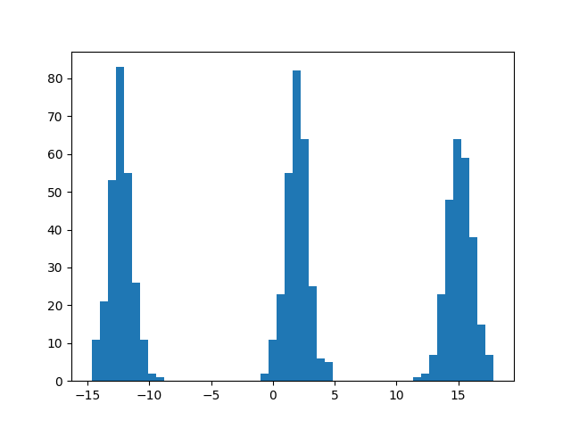

# data degeneration

> Generating data is ez but recovering is >< I lost the `mean` I used to generate it, can you find the most probable one for me? #bigdata #helpmepliz
> 
> MD5 (dist.zip) = 126c1396ca42f06600feffc2fde773dd
> 
> - david tan

We are given a python script and an output file containing a bunch of numbers. Let us analyse the python script:

```python
import numpy as np
import random as r
from math import sqrt
import time

r.seed(time.time())

def rand(start, end) -> float:
  return r.random() * (end - start) + start

count = 3
interval = [-30, 30]

means = [rand(*interval) for _ in range(count)]
variance = 1
std_dev = round(sqrt(variance))

def sample(mu, sigma):
    return np.random.normal(mu, sigma)

points = []
for _ in range(800):
    mean = means[r.randint(0, len(means)-1)]
    points.append(sample(mean, std_dev))

with open("data.txt", "w") as f:
    inter = list(map(str,interval))
    ps = list(map(str, points))

    f.write(", ".join(ps))
```

* `rand` is a function that generates a random number within a specified interval, in this case between `-30` and `30`

* `means` is a list containing 3 numbers between that interval

* `sample` is a function which grabs a random point on a Normal distribution with specified mean and standard deviation (fixed to `1`)

* Each iteration of the loop picks 1 of the means at random and runs `sample` on it, adding the output point to the list

The key information here is the Normal distribution. In this distribution,

* roughly 95% of all values lie within 2 standard deviations of the mean (in this case, $[M-2, M+2]$)

* roughly 99.7% of all values lie within 3 standard deviations of the mean

Since the 3 means span a relatively large interval, there is a very high chance that the points generated do not even overlap at all!

We can visualise / verify this using python:

```python
import numpy as np
import matplotlib.pyplot as plt
data = np.array([float(x) for x in open('./data.txt').read().split(', ')])
plt.hist(data, bins=50)
plt.show()
```



As shown above, the points are clearly separated into 3 clusters. Thus we can simply separate the data into 3 lists and calculate the means individually:

```python
lst = [[], [], []]
for i in data:
    if i <= -5:
        lst[0].append(i)
    elif i <= 7.5:
        lst[1].append(i)
    else:
        lst[2].append(i)
print([np.mean(np.array(lst[i])) for i in range(3)])
```

`[-12.338427064508236, 1.9577592884447568, 15.138693435527589]`

Upon entering these means into the online server, we receive the flag `grey{3m_iS_bL4cK_mAg1C}`.
