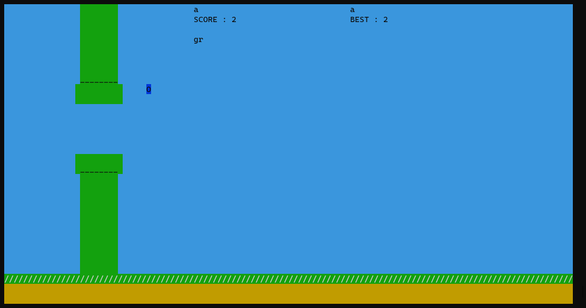

# flappy-o / flappy-o2

> I know you cheated in flappy-js. This time the game is written in C, I don't think you can cheat so easily. Or can you?
> 
> Show me your skills by getting a score of at least 64.
> 
> MD5 (flappybird) = f1f36482358dc35992f076e6ea483df8
> 
> - daniellimws

> This challenge uses the same binary as `flappy-o`.
> 
> Every 10000 points you reach, you unlock a character of the bonus flag. This is the real test of your skills.
> 
> MD5 (flappybird) = f1f36482358dc35992f076e6ea483df8
> 
> - daniellimws

I suppose these challenges were built on top of `flappy-js`, but my teammate solved that challenge and I did not look much into it.

Upon running the binary, we were greeted with a fully functional flappy bird game directly in the terminal. The game works just like the original flappy bird, but each time we score a point we earn one character of the flag:



Theoretically we could solve `flappy-o` just by being good at the game, but that seems kind of boring.

Like any challenge with only 1 binary provided, the next natural step is to decompile the binary. Basically, the program does some initialisation, then enters a `gameLoop` function which, as the name describes, keeps on looping and handling the game mechanics until the player loses.

Immediately within the function we notice something sus:

```c
updateAndDrawFlag();
```

```c
void updateAndDrawFlag(void)

{
  uint uVar1;
  uchar uVar2;
  uint x;
  int actualScore;
  int score;

  mvprintw(3,col / 2 + -0x14,&DAT_001034f8,flag1);
  mvprintw(4,col / 2 + -0x14,&DAT_001034f8);
  score = ::score;
  if (::score < 0) {
    score = ::score + 7;
  }
  x = score >> 3;
  uVar1 = prevScore;
  if (x != prevScore) {
    if (x - prevScore != 1) {
      reportCheater();
    }
    if (x < 0x40) {
      uVar2 = genFlag1(x - 1);
      flag1[(int)(x - 1)] = uVar2;
    }
    lfsr2(1);
    uVar1 = x;
    if (((int)x % 10000 == 0) && ((uint)((int)x / 10000) < 0x1a)) {
      score = genFlag2(x - 10000);
      (&DAT_001052dc)[(int)x / 10000] = score;
    }
  }
  prevScore = uVar1;
  return;
}
```

This seems to handle most of the flag-reading logic. Fortunately for us, the flag for `flappy-o2` seems to be handled in the same function as well!

The function seems to handle scores in a slightly peculiar way. I did not look too much into  other functions, but the logic around `reportCheater()` tells us that `score` is probably added in multiples of 8 -- my guess is that the `score` simply stores the number of collisions between the bird and the empty portion of a pipe (each pipe is 8 birds wide).

Either way, by setting a breakpoint at `genFlag1` in gdb, we notice that it is only called once per pipe clear. The first pipe takes in an input of `0`, and second pipe an input of `1` and so on.

I personally find handling C code to be kind of annoying, so I translated everything into python, removing most of the unncessary steps along the way:

```python
key1 = [170, 122, 225, 187, 154, 231, 255, 124, 53, 1, 6, 9, 194, 80, 98, 56, 219, 118, 213, 225, 104, 169, 191, 180, 82, 143, 192, 23, 14, 47, 218, 234, 138, 207, 162, 144, 231, 8, 235, 14, 59, 20, 114, 190, 154, 222, 213, 81, 151, 44, 188, 243, 53, 182, 33, 41, 125, 168, 215, 43, 237, 254, 240]

def lfsr1(n):
  seed = 0xabcd
  for _ in range(n):
    x = seed % 2
    seed //= 2
    if x != 0:
      seed ^= 0x82ee
  return seed

def gen_flag1(n):
  return (lfsr1(n) ^ key1[n]) % 0x100

flag1 = ''
for x in range(1, 0x40):
  flag1 += chr(gen_flag1(x-1))

print(flag1)
```

`grey{y0u_4r3_pr0_4t_7h1s_g4m3_b6d8745a1cc8d51effb86690bf4b27c9}`

---

Now for `flappy-o2`. Notice that the solving method is basically the same as `flappy-o`, except:

* The input values are multiples of `10000`

* `key2` is read integer by integer (as opposed to `key1` read char by char)
  
  * consequently, the flag is loaded in groups of 4 chars

* `lfsr2` is called every iteration of `x`, and the `seed` is stored globally

But we simply have to factor these in when rewriting it, no big deal.

```python
key2 = [2091533035, 3444833704, 4148299095, 1382543044, 2034135277, 1758572224, 953820139, 1864200113, 961059707, 4109923606, 3982998552, 2329111456, 2938792015, 2156409201, 2261679400, 1133293590, 1468307596, 1270163339, 3218919622, 1843033993, 2968558243, 1433696446, 3279073000, 1084392560, 2824157242]
seed2 = 0x1a2b3c4d

def lfsr2(n):
  global seed2
  for _ in range(n):
    x = seed2 % 2
    seed2 //= 2
    if x != 0:
      seed2 ^= (0x80000dd7-0x100000000)
  return seed2 % 0x100000000

def gen_flag2(n):
  return key2[n//10000] ^ lfsr2(lfsr1(n))

flag2 = ''
for x in range(1, 260000):
  lfsr2(1)
  if x % 10000 == 0:
    res = gen_flag2(x-10000)
    res = hex(res)
    flag2 += ''.join([chr(int(res[i:i+2], 16)) for i in range(len(res)-2, 0, -2)])

print(flag2)
```

`grey{y0u_4r3_v3ry_g00d_4t_7h1s_g4m3_c4n_y0u_t34ch_m3_h0w_t0_b3_g00d_ef4bd282d7a2ab1ebdcc3616dbe7afb}`

P.S. Since `lfsr2` uses a global `seed`, the difficulty challenge could very easily be increased if `lfsr2` is called / the `seed` is simply modified somewhere else in the binary, but we could probably still deal with that by just searching hard enough / checking the `seed` every score iteration.
