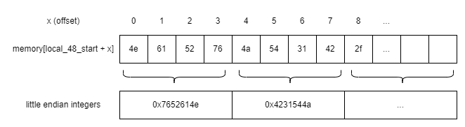
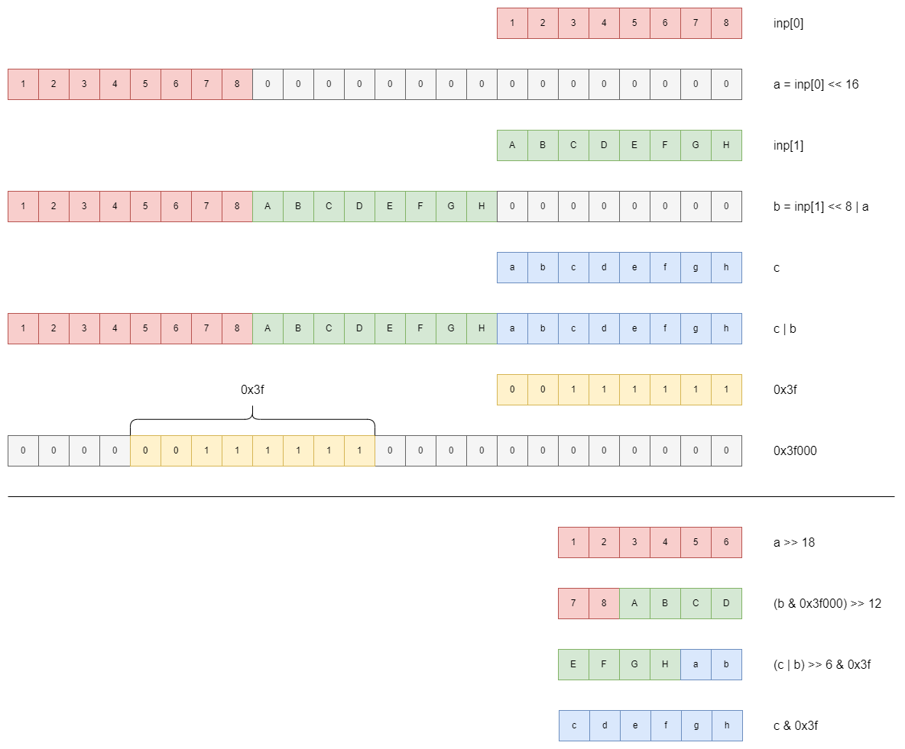

# runtime environment 1

> GO and try to solve this basic challenge.
> 
> FAQ: If you found the input leading to the challenge.txt you are on the right track
> 
> MD5 (gogogo.tar.gz) = 5515f1c3eee00e4042bf7aba84bbec5c
> 
> - rootkid

From the description and the archive name it is abundantly clear that this is a golang reversing challenge.

Anyways, this challenge consists of a single binary as well as a text file containing some gibberish:

```
GvVf+fHWz1tlOkHXUk3kz3bqh4UcFFwgDJmUDWxdDTTGzklgIJ+fXfHUh739+BUEbrmMzGoQOyDIFIz4GvTw+j--
```

The format of the string looks very suspiciously like Base64.

When we run the binary, we get nothing but a prompt. Inputting a bunch of `A`'s result in this:

```
./binary
AAAAAAAAAAAAAAAAAAAAAAAAAAAAAAAAAAAAAAAAAAAAAAAAA
VbTaVbTaVbTaVbTaVbTaVbTaVbTaVbTaVbTaVbTaVbTaVbTaVbTaVbTaVbTaVbTaVV--
```

Very clearly, the input is handled in blocks -- by counting them, we deduce that every 3 charactes of input generates 4 characters of output, with the last block padded with `-`'s.

---

The next step is to simply crack open the binary using a decompiler (I used Ghidra). For golang, the main function is labelled as `main.main`. There is a surprising amount of symbols which makes this reversal a breeze. For example, just by looking at the decompiled code in `main.main` we can immediately tell that the encoding is handled all in the `main.Encode`. function:

```c
void main.main(void)

{
  ulong *puVar1;
  long in_FS_OFFSET;
  undefined8 local_a0;
  undefined8 local_70;
  undefined local_28 [16];
  undefined local_18 [16];

  puVar1 = (ulong *)(*(long *)(in_FS_OFFSET + 0xfffffff8) + 0x10);
  if ((undefined *)*puVar1 <= local_28 && local_28 != (undefined *)*puVar1) {
    runtime.newobject();
    local_18 = CONCAT88(local_a0,0x4a86a0);
    fmt.Fscanln();
    runtime.makeslice();
    runtime.stringtoslicebyte();
    main.Encode();
    runtime.slicebytetostring();
    runtime.convTstring();
    local_28 = CONCAT88(local_70,0x4ab9c0);
    fmt.Fprintln();
    return;
  }
  runtime.morestack_noctxt();
  main.main();
  return;
}
```

The contents of `main.Encode` looks much scarier:

```c
void main.Encode(void)

{
  ulong uVar1;
  ulong uVar2;
  long lVar3;
  ulong uVar4;
  ulong uVar5;
  ulong uVar6;
  long in_stack_00000008;
  ulong in_stack_00000010;
  long in_stack_00000020;
  ulong in_stack_00000028;
  undefined4 local_48;
  undefined4 uStack68;
  undefined4 uStack64;
  undefined4 uStack60;
  undefined4 local_38;
  undefined4 uStack52;
  undefined4 uStack48;
  undefined4 uStack44;
  undefined4 local_28;
  undefined4 uStack36;
  undefined4 uStack32;
  undefined4 uStack28;
  undefined4 local_18;
  undefined4 uStack20;
  undefined4 uStack16;
  undefined4 uStack12;

  local_48 = 0x7652614e;
  uStack68 = 0x4231544a;
  uStack64 = 0x41366d2f;
  uStack60 = 0x394c584f;
  local_38 = 0x49464456;
  uStack52 = 0x6b475562;
  uStack48 = 0x53732b43;
  uStack44 = 0x35687a6e;
  local_28 = 0x3251786a;
  uStack36 = 0x34643337;
  uStack32 = 0x6750486c;
  uStack28 = 0x45637730;
  local_18 = 0x72715970;
  uStack20 = 0x66795775;
  uStack16 = 0x384d6f5a;
  uStack12 = 0x654b7469;
  uVar1 = 0;
  uVar2 = 0;
  while( true ) {
    if ((((long)(SUB168(SEXT816(-0x5555555555555555) * SEXT816((long)in_stack_00000028) >> 0x40,0) +
                in_stack_00000028) >> 1) - ((long)in_stack_00000028 >> 0x3f)) * 3 <= (long)uVar1) {
      lVar3 = in_stack_00000028 - uVar1;
      if (in_stack_00000028 == uVar1) {
        return;
      }
      if (in_stack_00000028 <= uVar1) {
                    /* WARNING: Subroutine does not return */
        runtime.panicIndex();
      }
      uVar4 = (ulong)*(byte *)(in_stack_00000020 + uVar1) << 0x10;
      if (lVar3 == 2) {
        if (in_stack_00000028 <= uVar1 + 1) {
                    /* WARNING: Subroutine does not return */
          runtime.panicIndex();
        }
        uVar4 = (ulong)*(byte *)(in_stack_00000020 + 1 + uVar1) << 8 | uVar4;
      }
      if (in_stack_00000010 <= uVar2) {
                    /* WARNING: Subroutine does not return */
        runtime.panicIndex();
      }
      *(undefined *)(in_stack_00000008 + uVar2) = *(undefined *)((long)&local_48 + (uVar4 >> 0x12));
      if (in_stack_00000010 <= uVar2 + 1) {
                    /* WARNING: Subroutine does not return */
        runtime.panicIndex();
      }
      *(undefined *)(uVar2 + 1 + in_stack_00000008) =
           *(undefined *)((long)&local_48 + (uVar4 >> 0xc & 0x3f));
      if (lVar3 == 1) {
        if (in_stack_00000010 <= uVar2 + 2) {
                    /* WARNING: Subroutine does not return */
          runtime.panicIndex();
        }
        *(undefined *)(uVar2 + 2 + in_stack_00000008) = 0x2d;
        if (in_stack_00000010 <= uVar2 + 3) {
                    /* WARNING: Subroutine does not return */
          runtime.panicIndex();
        }
        *(undefined *)(uVar2 + 3 + in_stack_00000008) = 0x2d;
      }
      else {
        if (lVar3 == 2) {
          if (in_stack_00000010 <= uVar2 + 2) {
                    /* WARNING: Subroutine does not return */
            runtime.panicIndex();
          }
          *(undefined *)(uVar2 + 2 + in_stack_00000008) =
               *(undefined *)((long)&local_48 + (uVar4 >> 6 & 0x3f));
          if (in_stack_00000010 <= uVar2 + 3) {
                    /* WARNING: Subroutine does not return */
            runtime.panicIndex();
          }
          *(undefined *)(uVar2 + 3 + in_stack_00000008) = 0x2d;
        }
      }
      return;
    }
    if (in_stack_00000028 <= uVar1) {
                    /* WARNING: Subroutine does not return */
      runtime.panicIndex();
    }
    if (in_stack_00000028 <= uVar1 + 1) {
                    /* WARNING: Subroutine does not return */
      runtime.panicIndex();
    }
    uVar4 = (ulong)*(byte *)(in_stack_00000020 + uVar1) << 0x10;
    uVar6 = (ulong)*(byte *)(in_stack_00000020 + 1 + uVar1) << 8 | uVar4;
    if (in_stack_00000028 <= uVar1 + 2) {
                    /* WARNING: Subroutine does not return */
      runtime.panicIndex();
    }
    uVar5 = (ulong)*(byte *)(uVar1 + 2 + in_stack_00000020);
    if (in_stack_00000010 <= uVar2) break;
    *(undefined *)(in_stack_00000008 + uVar2) = *(undefined *)((long)&local_48 + (uVar4 >> 0x12));
    if (in_stack_00000010 <= uVar2 + 1) {
                    /* WARNING: Subroutine does not return */
      runtime.panicIndex();
    }
    *(undefined *)(uVar2 + 1 + in_stack_00000008) =
         *(undefined *)((long)&local_48 + ((uVar6 & 0x3f000) >> 0xc));
    if (in_stack_00000010 <= uVar2 + 2) {
                    /* WARNING: Subroutine does not return */
      runtime.panicIndex();
    }
    *(undefined *)(uVar2 + 2 + in_stack_00000008) =
         *(undefined *)((long)&local_48 + ((uVar5 | uVar6) >> 6 & 0x3f));
    if (in_stack_00000010 <= uVar2 + 3) {
                    /* WARNING: Subroutine does not return */
      runtime.panicIndex();
    }
    *(undefined *)(in_stack_00000008 + 3 + uVar2) = *(undefined *)((long)&local_48 + (uVar5 & 0x3f))
    ;
    uVar1 = uVar1 + 3;
    uVar2 = uVar2 + 4;
  }
                    /* WARNING: Subroutine does not return */
  runtime.panicIndex();
}
```

But honestly, we can easily do some cleaning. Firstly, `runtime.panicIndex()` calls are most likely redundant for the encoding logic, and immediately after removing them, the code becomes _much_ more readable.

Secondly, notice near the bottom of the function:

```c
    uVar1 = uVar1 + 3;
    uVar2 = uVar2 + 4;
```

This matches with what we have experienced previously! Right after this we enter the next iteration of the while loop, which solidifies our guess that `uVar1` and `uVar2` represent the current input and output indices respectively.

Thirdly, we look at this snippet (near the top of the while loop):

```c
      lVar3 = in_stack_00000028 - uVar1;
      if (in_stack_00000028 == uVar1) {
        return;
      }
```

This is one of our proper exits. If we do not return here, a bunch of `0x2d`s are added (corresponding to `-` in ASCII), then we still return. This means that `in_stack_00000028` most likely represents the length of the input, while `lVar3` stores the final difference (in order to add the padding).

At the same time, this also allows us to figure out that

```c
    if ((((long)(SUB168(SEXT816(-0x5555555555555555) * SEXT816((long)in_stack_00000028) >> 0x40,0) +
                in_stack_00000028) >> 1) - ((long)in_stack_00000028 >> 0x3f)) * 3 <= (long)uVar1) { 
```

simply checks if we are nearing the end of the encoding process, even though it looks basically unreadable.

We look at 1 more snippet before we consolidate:

```c
      if (lVar3 == 1) {
        *(undefined *)(uVar2 + 2 + in_stack_00000008) = 0x2d;
        *(undefined *)(uVar2 + 3 + in_stack_00000008) = 0x2d;
      }
```

Evidently, the output is stored in `in_stack_00000008`. At the same time, we can also very easily tell that the input is stored in `in_stack_00000020`, due to it essentially being the input counterpart of `in_stack_00000008`.

So right now, the while loop looks like this:

```c
  x = 0;
  y = 0;
  while( true ) {
    if (len - x <= 2) {
      remaining = len - x;
      if (len == x) {
        return;
      }
      a = (ulong)*(byte *)(inp + x) << 0x10;
      if (remaining == 2) {
        a = (ulong)*(byte *)(inp + x + 1) << 8 | a;
      }
      *(undefined *)(out + y) = *(undefined *)((long)&local_48 + (a >> 0x12));
      *(undefined *)(out + y + 1) = *(undefined *)((long)&local_48 + (a >> 0xc & 0x3f));
      if (lVar3 == 1) {
        *(undefined *)(out + y + 2) = 0x2d;
        *(undefined *)(out + y + 3) = 0x2d;
      }
      else if (lVar3 == 2) {
        *(undefined *)(out + y + 2) = *(undefined *)((long)&local_48 + (a >> 6 & 0x3f));
        *(undefined *)(out + y + 3) = 0x2d;
      }
      return;
    }

    a = (ulong)*(byte *)(inp + x) << 0x10;
    b = (ulong)*(byte *)(inp + x + 1) << 8 | a;
    c = (ulong)*(byte *)(inp + x + 2);

    *(undefined *)(out + y) = *(undefined *)((long)&local_48 + (a >> 0x12));
    *(undefined *)(out + y + 1) = *(undefined *)((long)&local_48 + ((b & 0x3f000) >> 0xc));
    *(undefined *)(out + y + 2) = *(undefined *)((long)&local_48 + ((c | b) >> 6 & 0x3f));
    *(undefined *)(out + y + 3) = *(undefined *)((long)&local_48 + (c & 0x3f));

    x += 3;
    y += 4;
  }
```

Much more readable! Now onto our second round of cleaning:

```c
    *(undefined *)(out + y) = *(undefined *)((long)&local_48 + (a >> 0x12));
```

Notice the `*(undefined *)` mess. It is like saying

```c
memory[out_start + y] = memory[local_48_start + (a >> 0x12)];
```

What is `local_48`? If we look just above the while loop:

```c
  local_48 = 0x7652614e;
  uStack68 = 0x4231544a;
  uStack64 = 0x41366d2f;
  uStack60 = 0x394c584f;
  local_38 = 0x49464456;
  uStack52 = 0x6b475562;
  uStack48 = 0x53732b43;
  uStack44 = 0x35687a6e;
  local_28 = 0x3251786a;
  uStack36 = 0x34643337;
  uStack32 = 0x6750486c;
  uStack28 = 0x45637730;
  local_18 = 0x72715970;
  uStack20 = 0x66795775;
  uStack16 = 0x384d6f5a;
  uStack12 = 0x654b7469;
```

Essentially, due to how little endian works, `memory[local_48_start] == 0x4e`, `memory[local_48_start + 3] == 0x76`, `memory[local_48_start + 4] == 0x4a` and so on. The decompiler probably read this portion as such:



In other words, we can treat `local_48` as a char array, our `key`.

Finally, we look at the actual encoding process:

```c
    a = (ulong) inp[x] << 16;
    b = (ulong) inp[x+1] << 8 | a;
    c = (ulong) inp[x+2];

    out[y] = key[a >> 18];
    out[y+1] = key[b & 0x3f000) >> 12];
    out[y+2] = key[(c | b) >> 6 & 0x3f];
    out[y+3] = key[c & 0x3f];
```

Let's say:

* `inp[0]` is `12345678` in binary

* `inp[1]` is `ABCDEFGH` in binary

* `inp[2]` is `abcdefgh` in binary

Going through the process step by step:



In conclusion, this portion of code simply breaks the 3 x 8 bits of input into 4 x 6 bits of output, then mapping each output to a specific character from the key.

The padding part is also similarly straightforward. It pads the final few bits to a full 24, then converts the artificially added `000000`s to `-`s.

Thus, in order to find the input that gives us `GvVf+fHWz1tlOkHXUk3kz3bqh4UcFFwgDJmUDWxdDTTGzklgIJ+fXfHUh739+BUEbrmMzGoQOyDIFIz4GvTw+j--`, we simply have to reverse the encoding process:

```python
seed = 'NaRvJT1B/m6AOXL9VDFIbUGkC+sSnzh5jxQ273d4lHPg0wcEpYqruWyfZoM8itKe'
chal = 'GvVf+fHWz1tlOkHXUk3kz3bqh4UcFFwgDJmUDWxdDTTGzklgIJ+fXfHUh739+BUEbrmMzGoQOyDIFIz4GvTw+j--'

codes = ''.join(['000000' if x == '-' else '{0:06b}'.format(seed.index(x)) for x in chal])
flag = ''.join([chr(int(codes[i:i+8], 2)) for i in range(0, len(codes), 8)]).replace('\x00', '')
print(flag)
```

Essentially:

* For each character in the original string, we find its index in the `seed`, and convert the index (number between `0` and `63`) to its 6-digit binary representation, storing them all together in `codes`
  
  * `-` is converted to `000000`

* We now break `codes` into groups of 8 bits instead, converting each 8-digit binary into its corresponding ASCII character
  
  * The final few `00000000`s resulting from the padding can be discarded

However, we run into a "problem":

`X47gzutoh1zMUyWvU2zunI+kDBUGXfDQVuz+LFw7zUzIOduoS2zunb3dSI7gX1mf`

This is definitely not what the flag looks like! However, if we plug this string into the binary executable, we do indeed get back the original string. So what is the issue?

---

From the challenge description:

> FAQ: If you found the input leading to the challenge.txt you are on the right track

Notice that the format of the output string looks _suspiciously_ similar to that of the original string. It is very likely that the challenge setter ran the flag through the encoding multiple times. Thus we just repeat the decoding process a few more times:

```python
seed = 'NaRvJT1B/m6AOXL9VDFIbUGkC+sSnzh5jxQ273d4lHPg0wcEpYqruWyfZoM8itKe'
chal = 'GvVf+fHWz1tlOkHXUk3kz3bqh4UcFFwgDJmUDWxdDTTGzklgIJ+fXfHUh739+BUEbrmMzGoQOyDIFIz4GvTw+j--'

while True:
  codes = ''.join(['000000' if x == '-' else '{0:06b}'.format(seed.index(x)) for x in chal])
  flag = ''.join([chr(int(codes[i:i+8], 2)) for i in range(0, len(codes), 8)]).replace('\x00', '')
  print(flag)
  input()
  chal = flag
```

```
X47gzutoh1zMUyWvU2zunI+kDBUGXfDQVuz+LFw7zUzIOduoS2zunb3dSI7gX1mf

6y+wOyxgzWmCV7tq6WDuV7tbCGY9+duWS2m9n7tqIfm9+4bw

+fm3hkwRXBOr+TtBOTalOfm5n2OrOrOrOfu-

grey{B4s3d_G0Ph3r_r333333}
```

And there is our flag!
