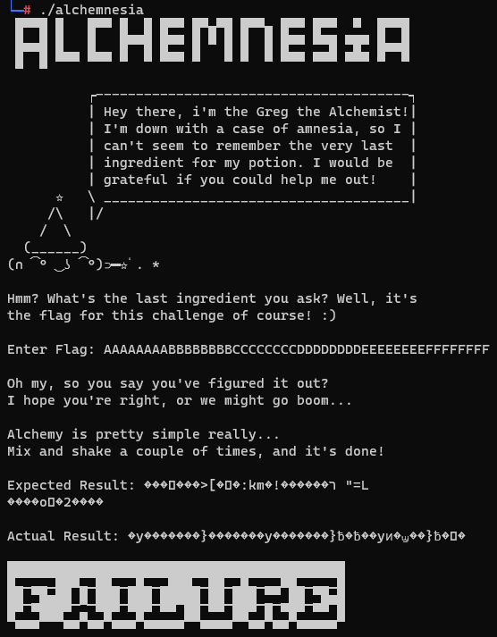

# Alchemnesia

Category: `rev`

**Disclaimer:** The tl;dr of this writeup is "just hack into the binary lol" (since I'm pretty basic at rev). If you are looking for other "cooler" solutions this is probably not for you XD But personally this was really cool too!

---

## Part I

Simple on the surface. We are given just 1 binary to fiddle around with. Let's see what we can do!



Firstly, the program itself. The functionality is rather simple; you enter a certain number of bytes, then it applies some function to it and check whether it matches some other byte string. We can surely crack this open up and retrieve all the details!

... Not that simple! Turns out it is a statically-linked and stripped binary. But no worries, we can surely handle this! We can generally have a *feel* about whether it will be a libc function, but other than that it should not be too big of a deal.

However, upon opening [insert decompiler] (I used Ghdira in my case) we are immediately greeted with some unintelligible code:

```c
undefined8 FUN_004035b6(void)

{
    // ...
    local_18 = &stack0x00000008;
    local_48 = FUN_004031b3;
    local_40 = FUN_00402dc1;
    local_28 = &local_48;
    local_38 = 0xfa1e0ff3;
    local_34 = 0xbb49;
    local_32 = FUN_00401dd5;
    local_2a = 0xba49;
    local_20 = 0x90e3ff49;
    local_80 = &local_38;
    local_58 = &stack0x00000008;
    local_88 = FUN_004034b0;
    local_68 = &local_88;
    local_78 = 0xfa1e0ff3;
    local_74 = 0xbb49;
    local_72 = FUN_00401dd5;
    local_6a = 0xba49;
    local_60 = 0x90e3ff49;
    (*(code *)&local_78)(FUN_00401e0c);
    // ...
    return 0;
}
```

We can clearly see that a bunch of function addresses are referenced, but the only function call is at the end. So what is happening?

If you stare hard enough at the statement

```c
    (*(code *)&local_78)(FUN_00401e0c);
```

things will gradually start to make sense. The address of `local_78` is treated as code address, which means that `0xfa1e0ff3` (and whatever follows) should be assembly.

We also see that there are a lot of repeated instructions within the block, so perhaps these are just convoluted function calls! We shall zoom in on one snippet at `local_78` by popping into `gdb` (`gef`):

```c
gef➤  x/8gx $rax
0x7fffffffddf0: 0x1dd5bb49fa1e0ff3      0xba49000000000040
0x7fffffffde00: 0x00007fffffffdde0      0x00007fff90e3ff49
0x7fffffffde10: 0x00007fffffffde70      0x0000000000000002
0x7fffffffde20: 0x00000000004031b3      0x0000000000402dc1
gef➤  x/6i $rax
   0x7fffffffddf0:      endbr64
   0x7fffffffddf4:      movabs r11,0x401dd5
   0x7fffffffddfe:      movabs r10,0x7fffffffdde0
   0x7fffffffde08:      rex.WB jmp r11
   0x7fffffffde0b:      nop
   0x7fffffffde0c:      (bad)
```

Notice that `0x401dd5` is referenced for all of these snippets, so maybe it is somehow related. We can take a quick look at what it does:

```c
gef➤  x/20i 0x401dd5
   0x401dd5:    endbr64
   0x401dd9:    push   rbp
   0x401dda:    mov    rbp,rsp
   0x401ddd:    push   rbx
   0x401dde:    sub    rsp,0x18
   0x401de2:    mov    QWORD PTR [rbp-0x18],rdi
   0x401de6:    mov    rbx,r10
   0x401de9:    mov    QWORD PTR [rbp-0x20],r10
   0x401ded:    mov    rdx,QWORD PTR [rbx+0x8]
   0x401df1:    mov    rax,QWORD PTR [rbp-0x18]
   0x401df5:    mov    rdi,rax
   0x401df8:    call   rdx
   0x401dfa:    mov    rdx,rax
   0x401dfd:    mov    rax,QWORD PTR [rbx]
   0x401e00:    mov    rdi,rdx
   0x401e03:    call   rax
   0x401e05:    add    rsp,0x18
   0x401e09:    pop    rbx
   0x401e0a:    pop    rbp
   0x401e0b:    ret
```

The focus lies on these few instructions:

```c
   0x401de6:    mov    rbx,r10
   0x401ded:    mov    rdx,QWORD PTR [rbx+0x8]
   0x401df8:    call   rdx
   0x401dfd:    mov    rax,QWORD PTR [rbx]
   0x401e03:    call   rax
```

If you trace hard enough (just somewhere above) you will find that, at least for this example,

1. `r10` is `0x7fffffffdde0`
2. which itself results from the assembly reading whatever is stored at `0x7fffffffde00`
3. which is `&local_78 + 0x10`, i.e. `&local_68`
4. `local_68` itself is `&local_88`, i.e. "whatever is stored there" is just `0x7fffffffdde0`
5. and this address (`0x7fffffffdde0`) itself stores `FUN_004034b0`, a function of interest.
6. since `rbx` = `r10`, the first function called will be stored at `&local_88+0x8`, or `&local_80`.

In this case `local_80` contains another such convoluted loop, but this is essentially what happens in these code. Then we can look at how the parameters are passed around, but in summary,

```c
    (*(code *)&local_78)(FUN_00401e0c);
```

can be "replaced" with

```c
    local_88(local_80(0x401e0c));
```

Looking above,
* `local_88` is `0x4034b0`
* `local_80` is `&local_38`, almost identical to `&local_78`, hence we apply the same method and see that
* `local_48` is `0x4031b3`
* `local_40` is `0x402dc1`

Thus we end up with something like

```c
    0x4034b0(0x4031b3(0x402dc1(0x401e0c)));
```

Honestly, that's the main trick of the challenge tackled. Feel free to skip to somewhere near the end as it's gonna get repetitive.

---

`0x402dc1(param_1)`:

```c
// ...
    local_18 = &stack0x00000008;
    local_48 = FUN_00402c89;
    local_40 = FUN_00402c37;
    local_28 = &local_48;
    local_38 = 0xfa1e0ff3;
    local_34 = 0xbb49;
    local_32 = FUN_00401dd5;
    local_2a = 0xba49;
    local_20 = 0x90e3ff49;
    local_80 = &local_38;
    local_58 = &stack0x00000008;
    local_88 = FUN_00402d50;
    local_68 = &local_88;
    local_78 = 0xfa1e0ff3;
    local_74 = 0xbb49;
    local_72 = FUN_00401dd5;
    local_6a = 0xba49;
    local_60 = 0x90e3ff49;
    (*(code *)&local_78)(param_1);
// ...
```

becomes

```c
    0x402d50(0x402c89(0x402c37(param_1)));
```

`0x402c37` looks like some libc function, so I will not bother with it.

`0x402c89` and `0x402d50` are function to print the welcome message (you can take a look at it yourself).

And so we have completed `0x402dc1`. Onto the next one, `0x4031b3`:

```c
long FUN_004031b3(void)

{
    // ...
    lVar1 = FUN_0042fef0(0x31);
    FUN_00401110(lVar1,0,0x31);
    FUN_00412340("Enter Flag: ");
    for (local_15c = 0; local_15c < 0x30; local_15c = local_15c + 1) {
        FUN_004124d0(&DAT_004b54d5,lVar1 + local_15c);
    }
    FUN_00422260("\nOh my, so you say you\'ve figured it out?");
    FUN_00422260("I hope you\'re right, or we might go boom...");
    FUN_00422260("\nAlchemy is pretty simple really...");
    FUN_00422260("Mix and shake a couple of times, and it\'s done!");
    local_18 = &stack0x00000008;
    local_48 = FUN_00402f59;
    local_40 = FUN_00402efa;
    local_28 = &local_48;
    local_38 = 0xfa1e0ff3;
    local_34 = 0xbb49;
    local_32 = FUN_00401dd5;
    local_2a = 0xba49;
    local_20 = 0x90e3ff49;
    local_80 = &local_38;
    local_58 = &stack0x00000008;
    local_88 = FUN_00402fc4;
    local_68 = &local_88;
    local_78 = 0xfa1e0ff3;
    local_74 = 0xbb49;
    local_72 = FUN_00401dd5;
    local_6a = 0xba49;
    local_60 = 0x90e3ff49;
    local_c0 = &local_78;
    local_98 = &stack0x00000008;
    local_c8 = FUN_00402f59;
    local_a8 = &local_c8;
    local_b8 = 0xfa1e0ff3;
    local_b4 = 0xbb49;
    local_b2 = FUN_00401dd5;
    local_aa = 0xba49;
    local_a0 = 0x90e3ff49;
    local_100 = &local_b8;
    local_d8 = &stack0x00000008;
    local_108 = FUN_00403154;
    local_e8 = &local_108;
    local_f8 = 0xfa1e0ff3;
    local_f4 = 0xbb49;
    local_f2 = FUN_00401dd5;
    local_ea = 0xba49;
    local_e0 = 0x90e3ff49;
    (*(code *)&local_f8)(lVar1);
    // ...
    return lVar1;
}

Wow, now there is some interesting stuff. We can sort of see that this is where the user inputs the byte string.

`0x42fef0` and `0x401110` look like libc functions, and I am guessing that they are `malloc` and `memset` respectively. Then we see some form of read and some form of write, and then it is the familiar code again, which simplifies to:

```c
    return 0x403154(0x402f59(0x402fc4(0x402f59(0x402efa(lVar1)))));
```

Wow, that's a lot of functions! Maybe we will go all the way to the first such chain and look at the final function first, `0x4034b0`:

```c
long FUN_004034b0(long param_1)

{
    int local_1c;
    int local_18;
    int local_14;
    
    local_1c = 0;
    while( true ) {
        if (0x2f < local_1c) {
            FUN_00422260(&DAT_004b5700);
            return param_1;
        }
        if (*(char *)(param_1 + local_1c) != (&DAT_004e2100)[local_1c]) break;
        local_1c = local_1c + 1;
    }
    FUN_00412340("\nExpected Result: ");
    for (local_18 = 0; local_18 < 0x30; local_18 = local_18 + 1) {
        FUN_00422690((int)(char)(&DAT_004e2100)[local_18]);
    }
    FUN_00412340("\n\nActual Result: ");
    for (local_14 = 0; local_14 < 0x30; local_14 = local_14 + 1) {
        FUN_00422690((int)*(char *)(param_1 + local_14));
    }
    FUN_00422260(&DAT_004b54fd);
    FUN_00422260(&DAT_004b5500);
    return param_1;
}
```

This function probably does not require much explanation -- it checks if the byte string at address `param_1` is equivalent to that at address `0x4e2100`, which in hex is

```
7ffd96d91c8edac03e5bd6f1a4be9ae03a6b6d83219effaa8bfdbcd7a80e221bcf3d4c0adafe84ec6f1dcc32b8ded3c2
```

Alright, so now we are ready to tackle the main algorithm! For easier reference here is where we left off just now:

```c
    return 0x403154(0x402f59(0x402fc4(0x402f59(0x402efa(lVar1)))));
```

Firstly, `0x402efa`:

```c
long FUN_00402efa(long param_1)

{
    ulong local_10;
    
    for (local_10 = 0; local_10 < 0x30; local_10 = local_10 + 1) {
        FUN_0040203f(param_1 + local_10);
    }
    return param_1;
}

// ...

byte * FUN_0040203f(byte *param_1)

{
    *param_1 = (byte)((int)(uint)*param_1 >> 3) | *param_1 << 5;
    return param_1;
}
```

We can first treat each byte in the input byte string as a string of 8 bits; this function simply rotates right by 3 bits for each byte in the input. For example, `ABCDEFGH` becomes `FGHABCDE`.

Next, `0x402f59`:

```c
long FUN_00402f59(long param_1)

{
    long local_10;
    
    for (local_10 = 0; (ulong)(local_10 << 3) < 0x30; local_10 = local_10 + 1) {
        FUN_004021a8(local_10 * 8 + param_1);
    }
    return param_1;
}

// ...

byte * FUN_004021a8(byte *param_1)

{
    byte bVar1;
    byte bVar2;
    // ...
    
    *param_1 = (byte)((int)(uint)*param_1 >> 1) | *param_1 << 7;
    pbVar29 = param_1 + 1;
    *pbVar29 = (byte)((int)(uint)*pbVar29 >> 2) | *pbVar29 << 6;
    pbVar30 = param_1 + 2;
    *pbVar30 = (byte)((int)(uint)*pbVar30 >> 3) | *pbVar30 << 5;
    pbVar31 = param_1 + 3;
    *pbVar31 = (byte)((int)(uint)*pbVar31 >> 1) | *pbVar31 << 7;
    pbVar32 = param_1 + 4;
    *pbVar32 = (byte)((int)(uint)*pbVar32 >> 4) | *pbVar32 << 4;
    pbVar33 = param_1 + 5;
    *pbVar33 = (byte)((int)(uint)*pbVar33 >> 3) | *pbVar33 << 5;
    pbVar34 = param_1 + 6;
    *pbVar34 = (byte)((int)(uint)*pbVar34 >> 2) | *pbVar34 << 6;
    pbVar35 = param_1 + 7;
    *pbVar35 = (byte)((int)(uint)*pbVar35 >> 1) | *pbVar35 << 7;
    bVar1 = *param_1;
    bVar2 = *param_1;
    bVar3 = *pbVar29;
    bVar4 = *param_1;
    bVar5 = *pbVar29;
    bVar6 = *pbVar30;
    bVar7 = *param_1;
    bVar8 = *pbVar29;
    bVar9 = *pbVar30;
    bVar10 = *pbVar31;
    bVar11 = *param_1;
    bVar12 = *pbVar29;
    bVar13 = *pbVar30;
    bVar14 = *pbVar31;
    bVar15 = *pbVar32;
    bVar16 = *param_1;
    bVar17 = *pbVar29;
    bVar18 = *pbVar30;
    bVar19 = *pbVar31;
    bVar20 = *pbVar32;
    bVar21 = *pbVar33;
    bVar22 = *param_1;
    bVar23 = *pbVar29;
    bVar24 = *pbVar30;
    bVar25 = *pbVar31;
    bVar26 = *pbVar32;
    bVar27 = *pbVar33;
    bVar28 = *pbVar34;
    *param_1 = (char)*pbVar35 >> 7 & 1U |
                *param_1 & 0x80 | (char)*pbVar29 >> 1 & 0x40U | (char)*pbVar30 >> 2 & 0x20U |
                (char)*pbVar31 >> 3 & 0x10U | (char)*pbVar32 >> 4 & 8U | (char)*pbVar33 >> 5 & 4U |
                (char)*pbVar34 >> 6 & 2U;
    *pbVar29 = (char)*pbVar35 >> 6 & 1U |
                bVar1 * '\x02' & 0x80 | *pbVar29 & 0x40 | (char)*pbVar30 >> 1 & 0x20U |
                (char)*pbVar31 >> 2 & 0x10U | (char)*pbVar32 >> 3 & 8U | (char)*pbVar33 >> 4 & 4U |
                (char)*pbVar34 >> 5 & 2U;
    *pbVar30 = (char)*pbVar35 >> 5 & 1U |
                (byte)(((int)(char)bVar2 & 0x3fffffe0U) << 2) | bVar3 * '\x02' & 0x40 | *pbVar30 & 0x20
                | (char)*pbVar31 >> 1 & 0x10U | (char)*pbVar32 >> 2 & 8U | (char)*pbVar33 >> 3 & 4U |
                (char)*pbVar34 >> 4 & 2U;
    *pbVar31 = (char)*pbVar35 >> 4 & 1U |
                (byte)(((int)(char)bVar4 & 0x1ffffff0U) << 3) | (byte)(((int)(char)bVar5 & 0x10U) << 2)
                | bVar6 * '\x02' & 0x20 | *pbVar31 & 0x10 | (char)*pbVar32 >> 1 & 8U |
                (char)*pbVar33 >> 2 & 4U | (char)*pbVar34 >> 3 & 2U;
    *pbVar32 = (char)*pbVar35 >> 3 & 1U |
                (byte)(((int)(char)bVar7 & 0xffffff8U) << 4) | (byte)(((int)(char)bVar8 & 8U) << 3) |
                (byte)(((int)(char)bVar9 & 8U) << 2) | bVar10 * '\x02' & 0x10 | *pbVar32 & 8 |
                (char)*pbVar33 >> 1 & 4U | (char)*pbVar34 >> 2 & 2U;
    *pbVar33 = (char)*pbVar35 >> 2 & 1U |
                (byte)(((int)(char)bVar11 & 0x7fffffcU) << 5) | (byte)(((int)(char)bVar12 & 4U) << 4) |
                (byte)(((int)(char)bVar13 & 4U) << 3) | (byte)(((int)(char)bVar14 & 4U) << 2) |
                bVar15 * '\x02' & 8 | *pbVar33 & 4 | (char)*pbVar34 >> 1 & 2U;
    *pbVar34 = (char)*pbVar35 >> 1 & 1U |
                (byte)(((int)(char)bVar16 & 0x3fffffeU) << 6) | (byte)(((int)(char)bVar17 & 2U) << 5) |
                (byte)(((int)(char)bVar18 & 2U) << 4) | (byte)(((int)(char)bVar19 & 2U) << 3) |
                (byte)(((int)(char)bVar20 & 2U) << 2) | bVar21 * '\x02' & 4 | *pbVar34 & 2;
    *pbVar35 = *pbVar35 & 1 |
                (byte)((int)(char)bVar22 << 7) | (byte)(((int)(char)bVar23 & 1U) << 6) |
                (byte)(((int)(char)bVar24 & 1U) << 5) | (byte)(((int)(char)bVar25 & 1U) << 4) |
                (byte)(((int)(char)bVar26 & 1U) << 3) | (byte)(((int)(char)bVar27 & 1U) << 2) |
                bVar28 * '\x02' & 2;
    return param_1;
}
```

Okay, this function looks crazy!

Let's stay calm, and break this down step by step:

```c
    for (local_10 = 0; (ulong)(local_10 << 3) < 0x30; local_10 = local_10 + 1) {
        FUN_004021a8(local_10 * 8 + param_1);
    }
```

We see that the crazy function takes in a sequence of 8 bytes as input.

```c
    *param_1 = (byte)((int)(uint)*param_1 >> 1) | *param_1 << 7;
```

This does not look too bad, in fact it is similar to the previous function we explored! This part simply rotates the bits of each byte by a certain amount (1, 2, 3, 1, 4, 3, 2, 1).

```c
    *param_1 = (char)*pbVar35 >> 7 & 1U |
                *param_1 & 0x80 | (char)*pbVar29 >> 1 & 0x40U | (char)*pbVar30 >> 2 & 0x20U |
                (char)*pbVar31 >> 3 & 0x10U | (char)*pbVar32 >> 4 & 8U | (char)*pbVar33 >> 5 & 4U |
                (char)*pbVar34 >> 6 & 2U;
```

`pbVar29` to `pbVar35` are used to reference each index of the sequence of 8 bytes. So what this does is it

* takes the first (most significant) bit of the first byte
* and places the first bit of the second byte in its second position
* and so on ...

until it forms a new byte with the `i`-th bit being the **first** bit of the `i`-th byte. And it does the same for the other 7 **new** bytes.

That sounds really complicated because I don't know how to explain this part. But a much simpler concept to visualise is matrix transposition! If you imagine this sequence of 8 bytes as a matrix of 8 x 8 bits, this section spits out a transpose of that.

`0x402fc4`:

```c
// ...
    local_18 = &stack0x00000008;
    local_48 = FUN_0040215c;
    local_40 = FUN_00401f6f;
    local_28 = &local_48;
    local_38 = 0xfa1e0ff3;
    local_34 = 0xbb49;
    local_32 = FUN_00401dd5;
    local_2a = 0xba49;
    local_20 = 0x90e3ff49;
    local_80 = &local_38;
    local_58 = &stack0x00000008;
    local_88 = FUN_0040210f;
    local_68 = &local_88;
    local_78 = 0xfa1e0ff3;
    local_74 = 0xbb49;
    local_72 = FUN_00401dd5;
    local_6a = 0xba49;
    local_60 = 0x90e3ff49;
    for (local_b0 = 0; local_b0 < 0x30; local_b0 = local_b0 + 1) {
        (*(code *)&local_78)(param_1 + local_b0);
    }
// ...
```

which becomes

```c
    for (local_b0 = 0; local_b0 < 0x30; local_b0 = local_b0 + 1) {
        0x40210f(0x40215c(0x401f6f(param_1 + local_b0)));
    }
```

`0x401f6f`:

```c
byte * FUN_00401f6f(byte *param_1)

{
    *param_1 = (byte)((int)(uint)*param_1 >> 1) | *param_1 << 7;
    return param_1;
}
```

rotating by 1 bit;

`0x40215c`:

```c
byte * FUN_0040215c(byte *param_1)

{
    *param_1 = (char)*param_1 >> 4 & 0xfU | (byte)((int)(char)*param_1 << 4);
    return param_1;
}
```

shifting by 4 bits;

`0x40210f`:

```c
byte * FUN_0040210f(byte *param_1)

{
    *param_1 = (char)*param_1 >> 1 & 0x55U | *param_1 * '\x02' & 0xaa;
    return param_1;
}
```

This one is kind of funny but still easily derivable; essentially `ABCDEFGH` becomes `BADCFEHG`.

`0x402f59` (repeated; see the crazy function above)

`0x403154`:

```c
long FUN_00403154(long param_1)

{
    ulong local_10;
    
    for (local_10 = 0; local_10 < 0x30; local_10 = local_10 + 1) {
        FUN_00401f2c(param_1 + local_10);
    }
    return param_1;
}

// ...

byte * FUN_00401f2c(byte *param_1)

{
    *param_1 = *param_1 ^ 0xff;
    return param_1;
}
```

A simple xor. What a nice way to end this. In the matrix representation this is as simple as taking subtracting each bit from `1`.

---

## Part II

In summary, here is a python consolidation of the entire algorithm above:

```python
import numpy as np

inp = 'AAAAAAAABBBBBBBBCCCCCCCCDDDDDDDDEEEEEEEEFFFFFFFF'
inp = np.array([list(map(int, list(bin(ord(x))[2:].zfill(8)))) for x in list(inp)])

abcdef_out = 'fb 79 ed f7 f8 ef e3 fa cb 7d f7 eb d8 ff ff d2 cb 79 e5 e3 d8 ef e3 d2 fb 7d df bf e0 df bf aa fb 79 cd b7 e0 cf a3 aa cb 7d d7 ab c0 df bf 82'
abcdef_out = np.array([list(map(int, list(bin(int(x, 16))[2:].zfill(8)))) for x in abcdef_out.split(' ')])

solve = '7F FD 96 D9 1C 8E DA C0 3E 5B D6 F1 A4 BE 9A E0 3A 6B 6D 83 21 9E FF AA 8B FD BC D7 A8 0E 22 1B CF 3D 4C 0A DA FE 84 EC 6F 1D CC 32 B8 DE D3 C2'
solve = np.array([list(map(int, list(bin(int(x, 16))[2:].zfill(8)))) for x in solve.split(' ')])

# rotates rightwards
def rot(x, n):
    return np.concatenate([x[-n:], x[:-n]])

def crazy(p):
    return np.array([rot(p[i, :], n) for i, n in enumerate([1, 2, 3, 1, 4, 3, 2, 1])]).T

def mix(x):
    return np.array([x[1], x[0], x[3], x[2], x[5], x[4], x[7], x[6]])


def rotate_inp(m):
    return np.array([rot(x, 3) for x in m])

def crazy_inp(m):
    for i in range(0, 0x30, 8):
        m[i:i+8, :] = crazy(m[i:i+8, :])
    return m

def more_mix_inp(m):
    return np.array([mix(rot(x, 5)) for x in m])

def xor_inp(m):
    return 1-m


print(xor_inp(crazy_inp(more_mix_inp(crazy_inp(rotate_inp(inp))))) - abcdef_out)
```

(`abcdef_out` was used as a sanity check.)

And that's it! Luckily all the above functions can easily be reversible, hence we shall do exactly that.

> Again, this part was done by my teammate :)

```python
# ...

def f(x):
    return np.array([sum([x<<i for i,x in enumerate(p[::-1])]) for p in x])

def rev_rot(x, n):
    return rot(x, -n)

def rev_crazy(p):
    p = p.T
    return np.array([rev_rot(p[i, :], n) for i, n in enumerate([1, 2, 3, 1, 4, 3, 2, 1])])

def rev_mix(x):
    return mix(x)

def rev_rotate_inp(m):
    return np.array([rev_rot(x, 3) for x in m])

def rev_crazy_inp(m):
    for i in range(0x28, -1, -8):
        m[i:i+8, :] = rev_crazy(m[i:i+8, :])
    return m

def rev_more_mix_inp(m):
    return np.array([rev_rot(rev_mix(x), 5) for x in m])

def xor_inp(m):
    return np.array([1-x for x in m])

out = solve
out = xor_inp(out)
out = rev_crazy_inp(out)
out = rev_more_mix_inp(out)
out = rev_crazy_inp(out)
out = rev_rotate_inp(out)
print("".join([chr(x) for x in f(out)]))
```

And there we have it: `STF22{L0T5_0F_H0P1UM_4ND_C0P1UM_4ND_SH33R_LUCK}`!