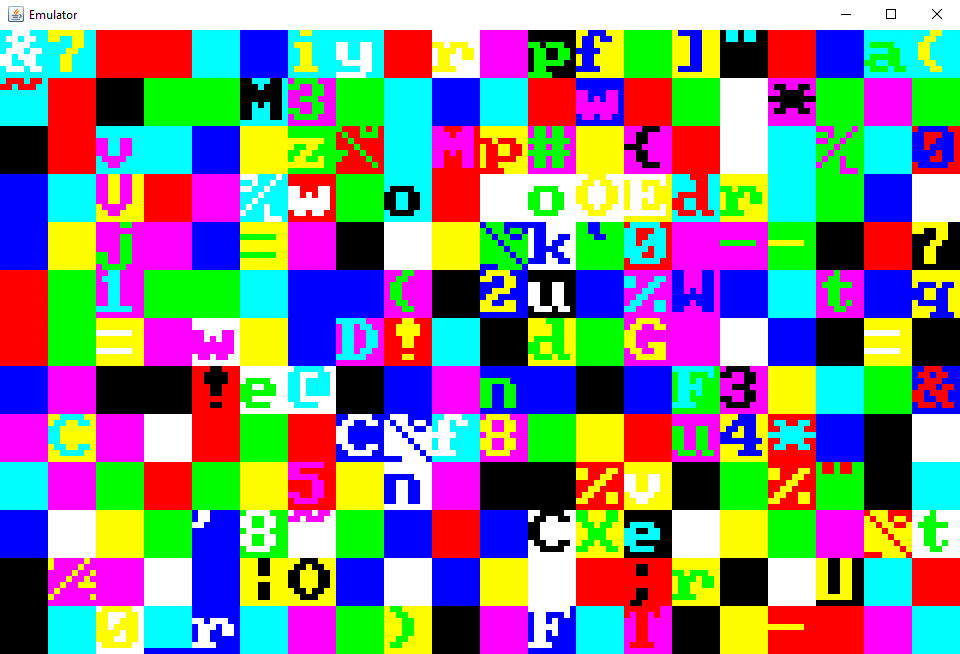
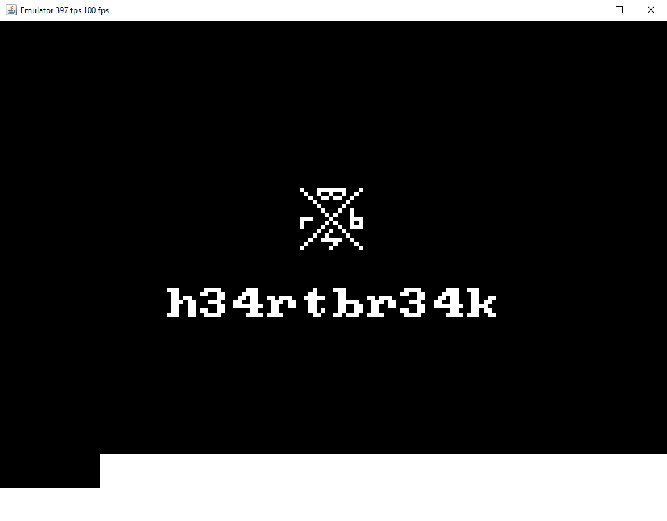
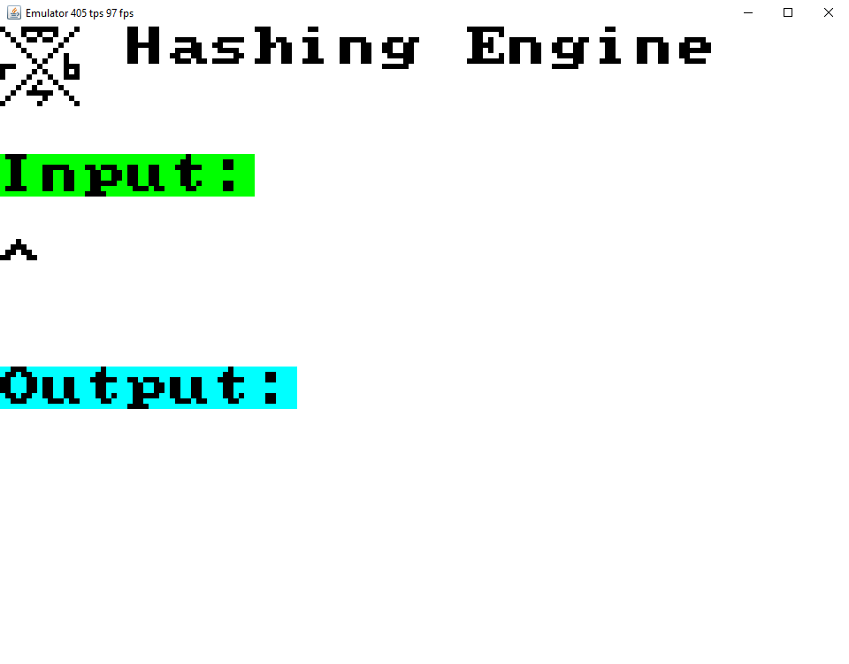
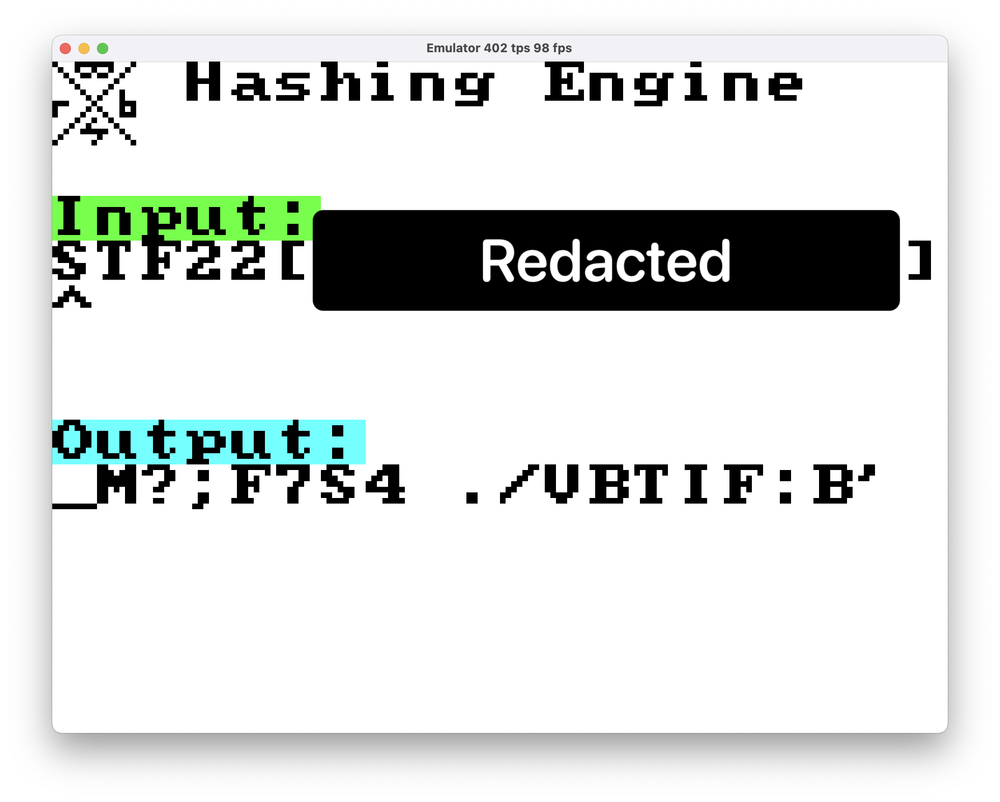

# Emulator

Category: `rev`

**Disclaimer:** Do pardon my lack of knowledge in assembly / rev in general XD

---

Looks like we are given a `.jar` file. Running it normally shows us a sequence of 3 screens:



The program starts off with a matrix of random colours which gradually get wiped out.



The splash screen shows a black background with a white logo and some text.



The main screen seems to allow the user to provide some input and then spit out some output. Mashing keys normally does not seem to work. Looking at the provided image we see that the "user" is able to provide some text which outputs a "hash":



---

## Part I

Onto the decompilation. 5 files were successfully retrieved, all of which use confusing names to make reverse engineering difficult.

**Hence to reduce some of the pain, I will first rename all classes from their respective single letters to its corresponding upper case (e.g. class named `a` is changed to `A`).**

We start off with the smallest file, `D.java`:

```java
public final class D
{
    public static int[] a;
    
    static {
        D.a = new int[] { 0, 255, 65280, 65535, 16711680, 16711935, 16776960, 16777215 };
    }
}
```

This class only contains a static integer array. Through a simple search we discover that the array is only used in the main class, hence we can simply migrate the array there (though not necessary).

Next, we hace `C.java`:

```java
public final class C
{
    public short a;
    public short[] b;
    public boolean c;
    public A d;
    
    public C() {
        this.a();
    }
    
    public final void a() {
        this.c = true;
        this.a = 2048;
        this.b = new short[8];
        this.d = new A("
            [omitted]
        ");
        this.c = false;
    }
}
```

The omitted portion is a pretty long hex string. We can try to figure out what it is used for by following the constructor to `A.java`:

```java
import java.util.Random;

public class A
{
    private short[] a;
    private short[] b;
    private short[] c;
    private int[] d;
    private int e;
    
    public A() {
        this("c0f100c07038f00008c49001c000016414007b9ffc");
    }
    
    public A(final String s) {
        this.a = new short[1024];
        this.b = new short[512];
        this.c = new short[1];
        this.d = new int[2048];
        this.a();
        this.a(s);
    }
    
    public void a() {
        final Random random = new Random();
        for (int i = 0; i < this.a.length; ++i) {
            this.a[i] = (short)random.nextInt();
        }
        for (int j = 0; j < this.b.length; ++j) {
            this.b[j] = (short)random.nextInt();
        }
        for (int k = 0; k < this.d.length; ++k) {
            this.d[k] = random.nextInt();
        }
    }
    
    public void a(final String s) {
        this.e = Math.floorDiv(s.length(), 6);
        for (int i = 0; i < this.e; ++i) {
            final int beginIndex = i * 6;
            this.d[i] = Integer.parseInt(s.substring(beginIndex, beginIndex + 6), 16);
        }
    }

    // ...

}
```

As a note, a lot of the other functions in this class are also named `a`; we can check which function is called in the constructor by looking at the type of the argument passsed.

The first method named `a` seems to initialise arrays `a`, `b` and `d` with random values. The second one though is what seems to parse the hex string. Looking at the function, `A` (class) expects the string `s` to be a series of 6 characters, each of which is then directly turned into an integer and stored in `d`. This means that the integers in `d` will have a maximum of 12 bytes.

But so far, the program is only being fed "useless" information; where are these values actually used in the program? For that, we shall return to the main class, starting from, of course, the entry point:

```java
// ...

public class EmuMain extends Canvas implements Runnable
{

    // ...

    public static void main(final String[] array) {
        final EmuMain comp;
        (comp = new EmuMain()).setMinimumSize(new Dimension(960, 720));
        comp.setMaximumSize(new Dimension(960, 720));
        comp.setPreferredSize(new Dimension(960, 720));
        (EmuMain.h = new JFrame("Emulator")).setDefaultCloseOperation(3);
        EmuMain.h.setLayout(new BorderLayout());
        EmuMain.h.add(comp, "Center");
        new JPanel().setLayout(new GridLayout(1, 1));
        EmuMain.h.pack();
        EmuMain.h.setResizable(true);
        EmuMain.h.setLocationRelativeTo(null);
        EmuMain.h.setVisible(true);
        comp.setFocusable(true);
        final EmuMain target;
        (target = comp).a = true;
        new Thread(target).run();
    }
}
```

This portion does 2 things:
* Initialise fields;
* Run the bulk of the program.

Looking at the first point:

```java
// ...

public class EmuMain extends Canvas implements Runnable
{
    private boolean a;
    private int b;
    private BufferedImage c;
    private int[] d;
    private static double e;
    private static double f;
    private C g;
    private static JFrame h;
    
    static {
        new Random();
        EmuMain.e = 400.0;
        EmuMain.f = 1.0E9 / EmuMain.e;
    }
    
    public EmuMain() {
        this.a = false;
        this.b = 0;
        this.c = new BufferedImage(160, 120, 1);
        this.d = ((DataBufferInt)this.c.getRaster().getDataBuffer()).getData();
        this.g = new C();
        new B(this, this.g);
    }

    // ...

}
```

Right now these don't make much sense yet, but the notable variables for now are `d` and `g`. We can pretty easily tell that `d` controls the individual "pixels" of whatever will be drawn in the program, while `g` (if you recall what the class `C` did) seemed to load some "code" into the "system".

This is later further confirmed by the repeated access of `g.d` which, perhaps confusingly, references an `A` **object**, where all the interesting arrays are.

Finally, we see `EmuMain` create a `B` object (keycodes annotated):

```java
import java.awt.event.KeyEvent;
import java.awt.event.KeyListener;

public final class B implements KeyListener
{
    private boolean[] a;
    private C b;
    
    public B(final EmuMain emuMain, final C b) {
        this.a = new boolean[128];
        emuMain.addKeyListener(this);
        this.b = b;
    }
    
    private void a(int n, final boolean b) {
        if (n < this.a.length) { this.a[n] = b; }
        if (this.a[82]) { this.b.a(); } // R
        n = 0;
        if (this.a[38]) { n = 1; } // up
        if (this.a[40]) { n = (short)(n | 0x2); } // down
        if (this.a[37]) { n = (short)(n | 0x4); } // left
        if (this.a[39]) { n = (short)(n | 0x8); } // right
        if (this.a[49]) { n = (short)(n | 0x10); } // 1
        if (this.a[50]) { n = (short)(n | 0x20); } // 2
        if (this.a[51]) { n = (short)(n | 0x40); } // 3
        if (this.a[52]) { n = (short)(n | 0x80); } // 4
        this.b.d.a((short)n);
    }
    
    @Override
    public final void keyPressed(final KeyEvent keyEvent) {
        this.a(keyEvent.getKeyCode(), true);
    }
    
    @Override
    public final void keyReleased(final KeyEvent keyEvent) {
        this.a(keyEvent.getKeyCode(), false);
    }
    
    @Override
    public final void keyTyped(final KeyEvent keyEvent) {
    }
}
```

When `B` is created, the program's `C` object is loaded. We can easily tell that this class mainly handles the inputs, where the keys being pressed down are encoded as bits of a short

`b.d.a` is then **called**; Which exact function is called is kind of confusing, but by patiently tracing the objects we arrive at this specific function within `A.java`:

```java
// ...
    public void a(final short n) {
        this.c[0] = n;
    }
// ...
```

> How?
>
> 1. `B.b` is a `C` object
> 2. `C.d` is an `A` object
> 3. `A.a` refers to the above function when a short is passed.

**Note:** Most of the painful parts were related to this, but if confused a quick renaming always helps a ton. For example even renaming `B.b` to `B.c` saves quite a bit of brain power trying to understand where each thing comes from. Of course ultimately to intuitively understand the program we can also rename them to something useful.

Back to the code; We can now figure out that `A.c` is an array that only contains one (1) short, which is a sequence of bits corresponding to keypresses.

---

Now we shall attempt to understand the bulk of `EmuMain`.

```java
// ...
    @Override
    public void run() {
        long nanoTime = System.nanoTime();
        double n = 0.0;
        int i = 0;
        int j = 0;
        long currentTimeMillis = System.currentTimeMillis();
        while (this.a) {
            final long nanoTime2 = System.nanoTime();
            n += (nanoTime2 - nanoTime) / EmuMain.f;
            nanoTime = nanoTime2;
            while (n >= 1.0) {
                ++j;
                final C g;
                if (!(g = this.g).c) {
                    final int b;
                    final int n2 = (b = g.d.b(g.a)) >> 18 & 0x3F;
                    final int n3 = b >> 15 & 0x7;
                    final int n4 = b >> 12 & 0x7;
                    final int n5 = b >> 9 & 0x7;
                    final int n6 = (b & 0x7FF) - (b & 0x800);
                    final C c = g;
                    ++c.a;
                    switch (n2) {
                        case 0: { g.c = true; break; }
                        case 24: { g.b[n3] = g.d.a(g.b[n4] + n6); break; }
                        // ...
                    }
                }
                ++this.b;
                --n;
            }
            try {
                Thread.sleep(8L);
            }
            catch (InterruptedException ex) {
                ex.printStackTrace();
            }
            ++i;
            final BufferStrategy bufferStrategy;
            if ((bufferStrategy = this.getBufferStrategy()) == null) {
                this.createBufferStrategy(3);
            }
            else {
                for (int k = 0; k < 120; ++k) {
                    for (int l = 0; l < 160; ++l) {
                        final int n33 = k * 160 + l;
                        final short c5;
                        final int n34 = (c5 = this.g.d.c((l >> 3) + (k >> 3) * 20)) & 0xFF;
                        final int n35 = c5 >> 8 & 0x7;
                        final int n36 = c5 >> 11 & 0x7;
                        final int n37 = n34;
                        final int n38 = k & 0x7;
                        final int n39 = l & 0x7;
                        final int n40 = n38;
                        long n41 = 0L;
                        switch (n37 & 0xFF) {
                            default: { n41 = 0L; break; }
                            case 17: { n41 = -8700919226847423759L; break; }
                            // ...
                        }
                        this.d[n33] = (((n41 >> (n40 << 3) + n39 & 0x1L) == 0x1L) ? D.a[n36] : D.a[n35]);
                    }
                }
                final Graphics drawGraphics;
                (drawGraphics = bufferStrategy.getDrawGraphics()).drawImage(this.c, 0, 0, this.getWidth(), this.getHeight(), null);
                drawGraphics.dispose();
                bufferStrategy.show();
            }
            if (System.currentTimeMillis() - currentTimeMillis > 1000L) {
                currentTimeMillis += 1000L;
                EmuMain.h.setTitle("Emulator " + j + " tps " + i + " fps\n");
                i = 0;
                j = 0;
            }
        }
    }
// ...
```

Looks crazy! But if we first look at the outer shells we quickly notice that the while loop contains 2 main components:

* Fiddling with arrays in `C` and `A`
* Handling graphics (i.e. drawing stuff)

Starting with the second bullet as it is relatively easier to handle. At a glance we can tell that `k` and `l` represent the "height" and "width" of the image grid, and `n33` represents the "index" of each specific cell.

`g.d.c(idx)` is again a function that simply grabs the value at `A.b[idx]`. We can see that `A.b` is sort of the "graphics" section of the "memory". The `>> 3` part tells is that each 8x8 square corresponds to a single value in memory, which means that the image is actually 15 (high) by 20 (wide) cells.

Looking at how the stored value is subsequently split up tells us about how the bits of the short is utilised to contain information about the entire drawn cell. Each short is coded as `00fffbbbcccccccc`, where `f` is the foreground "colour", `b` is the background "colour", and `c` is the character in ASCII (the daunting `switch` portion simply spits out the corresponding graphic for each ASCII used). We can also now see that the values in `D.a` (the static array from the very beginning) actually stores colour values (e.g. `0x0`, `0xFF`, `0xFF00`, etc.).

That is essentially it for this portion -- we learnt that `A.b` stores the characters to be printed on the image. Now onto the first bullet:

```java
// ...
                final C g;
                if (!(g = this.g).c) {
                    final int b;
                    final int n2 = (b = g.d.b(g.a)) >> 18 & 0x3F;
                    final int n3 = b >> 15 & 0x7;
                    final int n4 = b >> 12 & 0x7;
                    final int n5 = b >> 9 & 0x7;
                    final int n6 = (b & 0x7FF) - (b & 0x800);
                    final C c = g;
                    ++c.a;
                    switch (n2) {
                        case 0: { g.c = true; break; }
                        case 24: { g.b[n3] = g.d.a(g.b[n4] + n6); break; }
                        // ...
                    }
                }
// ...
```

We can see a similar pattern in that the value in `b` contains quite some information encoded as bits. As a side node, looking inside the `switch` portion immediately gives away the fact that program is reading pseudo-assembly.

Returning to `g.d.b` (which is in a sense `A.b`) we see:

```java
    // ...
    public int b(final int n) {
        if (n >= 2048) {
            return this.d[n - 2048];
        }
        return 0;
    }
    // ...
```

Judging by how the value is subsequently broken up and interpreted, we can safely assume that `A.d` represents the "machine code" of the embedded program. Interestingly, `n` is offset by `2048`, but that does not impact the program too much.

For completeness sake, here are the remaining functions in `A`:

```java
// ...
    public short a(final int n) {
        if (n == 1535) {
            return this.c[0];
        }
        if (n >= 1024) {
            return this.b[n - 1024];
        }
        return this.a[n];
    }
    
    public void a(final int n, final int n2) {
        if (n >= 1024) {
            this.b[n - 1024] = (short)n2;
            return;
        }
        this.a[n] = (short)n2;
    }
// ...
```

This should complete the picture. The above functions provide a way to get / set the memory, while the arrays of `A` are as follows: `a` is the "regular" memory (e.g. stack), `b` holds the graphics portion, `c` contains the keypresses and `d` the instructions. (The registers themselves are found in `C`).

---

## Part II

Together with the cases inside `switch`, the previously read long hex string can now be understood and parsed into some sort of assembly with the help of some generic script (e.g. python).

For my solution I did not translate it into something with some sort of assembly syntax, but actually more of a python syntax (but it should not matter). By default the numbers shown below are in hex. Also the capital letters are the registers (8 total).

Here's the starting point of the program (`0x800`, or 2048 in decimal):
```python
800 | G = H + 100
801 | B = H + 0
802 | [H + 0] = B
803 | (H) jz 899; F = 804; clear H
```

I did not know at that time how to explain something like `0x803`, but essentially the program does 3 things, in this order:
1. Set some register to some value (`F = 0x804`)
2. Set register `H` to `0`
3. Jump if a certain register (in brackets) is `0` (or sometimes if not `0`).

It is important to note that register `H` is almost always set to `0`, as sort of a "reference point" to reset to values of other registers (such that e.g. `A = H + 0x400` "sets" `A` to `0x400`).

We can also sort of see that `F` generally stores the "return address" for functions, which is kind of interesting (some familiarity in the unknown :))

Anyways, looking at the above snippet we notice that `G` is set to `0x100`, and the program jumps to `0x899`.

```python
899 | G = G + 1
89a | [G - 1] = F
89b | A = H + 38
89c | A = A << 8
89d | (H) jz 904; F = 89e; clear H
# ...
```

Here we can more clearly see the role of `G`, and that is of course the stack pointer. It does not do much however, as it only serves to save values of certain registers. Interesting nonetheless.

Do take note of the value of `A`, being an interesting `0x3800`.

```python
904 | G = G + 1
905 | [G - 1] = F
906 | G = G + 1
907 | [G - 1] = B
908 | B = H + 12c
909 | B = B - 1
90a | [B + 400] = A
90b | (B) jnz 909; H = 90c; clear H
90c | B = [G - 1]
90d | G = G - 1
90e | F = [G - 1]
90f | G = G - 1
910 | jmp F; H = 911; clear H
```

Ignoring the stack manipulation this function is actually only 4 instructions long. We also see an implementation of a *loop*, where `B` starts from `0x12c` (which in decimal is 300, or 15 by 20 -- seems familiar?).

The memory at `B+400` is then populated with `A`, being `0x3800`. If you can recall what this does, you will notice that this exactly corresponds to the portion where the random colours of the first screen (of the program) is replaced with a black splash screen! `0x3800`, or `0b00 111 000 00000000`, tells the program to draw null characters with a white foreground and black background.

Once completed, we jump back to the saved return address, `0x89e`:

```python
89e | B = H + 400
89f | C = A + 11
8a0 | [B + 6d] = C
8a1 | C = A + 12
8a2 | [B + 6e] = C
# ...
900 | F = [G - 1]
901 | G = G - 1
902 | jmp F; H = 903; clear H
903 | end
```

I will not bore you with the details, but essentially the program here prints out the logo / text on the splash screen, followed by the entirety of the input screen, done in a fashion similar to `0x89f` and `0x8a0`.

We then return to our initial saved address:

```python
804 | (H) jz 806; F = 805; clear H
805 | end
806 | (H) jz 809; F = 807; clear H
807 | (H) jz 806; H = 808; clear H
808 | end
```

After some confusing manoeuvres the program will end up at `0x809`:

```python
809 | G = G + 1
80a | [G - 1] = F
80b | G = G + 1
80c | [G - 1] = A
80d | G = G + 1
80e | [G - 1] = B
80f | G = G + 1
810 | [G - 1] = C

811 | A = [H + 5ff] # keypresses
812 | B = A & 1 # up
813 | (B) jz 81f; H = 814; clear H
```

We can see that the program starts to look at the keypresses. The following is run if the program detects "up" being pressed:


```python
814 | B = [H + 0]
815 | B = [B + 450] # user input location
816 | C = B - 20
817 | C = C + 1
818 | C = C & 3f
819 | C = C + 20
81a | B = B >>> 8
81b | B = B << 8
81c | B = B | C
81d | C = [H + 0]
81e | [C + 450] = B
```

Honestly this part was quite confusing to me, but essentially it does what it does in the actual program, which is to cycle through the 64 valid characters. We can also see that the `0`-th index of the memory stores the "caret" position.

To not bore you of the details, the program then runs similar checks for down, left and right, which have uninteresting functionalities (and can be found out pretty easily by running the actual program).

Here comes the interesting part though:


```python
847 | B = A & 10 # 1
848 | (B) jz 84a; H = 849; clear H
849 | (H) jz 853; F = 84a; clear H

84a | C = [G - 1]
84b | G = G - 1
84c | B = [G - 1]
84d | G = G - 1
84e | A = [G - 1]
84f | G = G - 1
850 | F = [G - 1]
851 | G = G - 1
852 | jmp F; H = 853; clear H
```

Firstly, the program detects if `1` is pressed; if not, the program finishes its checks and exit the function call.

However, if `1` *is* pressed, the program jumps to an extremely important section at `0x853`: The "hash".

---

## Part III

> Note: This part was solved by my teammate

As the algorithm instructions are written in a way similar to python, we can very easily translate it into a much more readable python form.

```python
# A-Z[\]^_ !"#$%&'()*+,-./0123456789:;<=>?@

def short(key):
    return key % (2**15) - (2**15)*((key >> 15) % 2)

def func(key):
    temp = key
    temp = short(temp ^ (temp << 7))
    temp = short(temp ^ (temp >> 9))
    temp = short(temp ^ (temp << 8))
    return temp

inp = [0 for _ in range(20)] # input
out = [0 for _ in range(20)]

key = 0x2a
for x in inp[::-1]:
    key = (key^x) << 1

for _ in range(0x100):
    key = func(key)

for j, x in enumerate(inp[::-1]):
    i = len(inp)-j-1
    key = func(key) ^ x
    out[i] = key%64


print(bytes([i+32 for i in out]).decode())
```

The trick for this actually lies in the size of the key. Because a short has a maximum size of `65535`, a brute-force attack is actually rather feasible. As such, we can easily try all possible keys (right before the last for loop in the above script) to derive the input.

```python
out = [63, 45, 31, 27, 38, 23, 51, 20, 0, 14, 15, 54, 34, 52, 41, 38, 26, 34, 7, 0]

for K in range(65536):
    key = K
    for j, x in enumerate(out[::-1]):
        i = len(inp)-j-1
        key = func(key)
        inp[i] = (x^key)%64
        key ^= inp[i]

    X = bytes([i+32 for i in inp])
    if (b"STF" in X):
        print(X)
```

And there we have it! `STF22[CU5T0M1C5BCPU]`

Thanks for sticking with me till the end :) I'm still relatively inexperienced at writeups so hopefully this was an okay read. Accidentally made this quite long as I wanted to make my half-day solving process as detailed as possible (within limits), regardless of whether this is the intended solve.