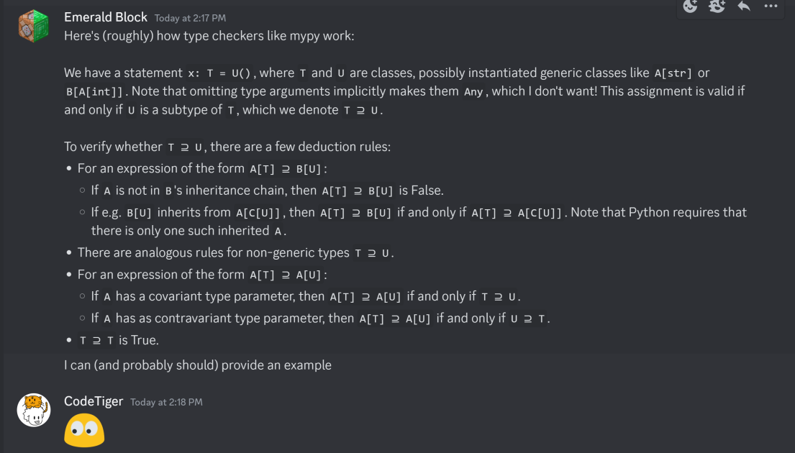

# ilovepython

Category: `rev`

Description:
> I love Python. In fact, I just spent the last 2d11h36m comprehensively understanding Python's typing module!
>
> ...Say, could you help me finish one line of my code?

---

When we open the `ilovepython.py` file, we are greeted with a monster. If we follow the description and the helpful comment at the top we arrive at the "instructions" to get the flag:

```python
# I don't know what type to give var. Thanks! (Please no "object" or "Any"... I want a specific type)
var = _Q0[z[_[z[_[N[_[N[_[J[_[O[_[N[_[V[_[E[_[G[_[Z[_[U[_[Z[_[U[_[U[_[Y[_[C[_[I[_[S[_[T[_[Y[_[G[_[W[_[B[_[G[_[U[_[U[_[Z[_[H[_[W[_[Q[_[V[_[V[_[K[_[M[_[G[_[U[_[W[_[D[_[_L[_[_E]]]]]]]]]]]]]]]]]]]]]]]]]]]]]]]]]]]]]]]]]]]]]]]]]]]]]]]]]]]]]]]]]]]]]]]]]]]]]]]]]()
# just some validation
var = _V[_E]()
```

This challenge makes use of python type hinting, which seems really complicated especially when we face tons of classes, inheritance and nesting. I was initially quite lost and didn't put too much effort into making sense of the challenge until subsequent hints were released (because it was too hard and still had 0 solves like 2 days into the CTF):

> I lied. I didn't comprehensively understand Python's typing module. I just figured out what covariance and contravariance really mean for a type checker. Oh, and subtyping too.

Honestly, the hint was kind of cryptic to me at first. It was only after the second hint dropped that I started to pick up on how this challenge works.



```py
from typing import TypeVar, Generic, Never

_Z = TypeVar("_Z")
_P = TypeVar("_P", covariant=True)
_N = TypeVar("_N", contravariant=True)

class _E: ...
class _L(Generic[_N]): ...
class H(Generic[_N]): ...
class I(Generic[_N]): ...
class _(Generic[_N]): ...
class _V(Generic[_Z], _L[_[_Z]], H[_["_V[_Z]"]], I[_["_V[_Z]"]]): ...

var: H[_[I[_[_L[_[_E]]]]]] = _V[_E]()
'''
H[_[I[_[_L[_[_E]]]]]] >= _V[_E]
H[_[I[_[_L[_[_E]]]]]] >= H[_[_V[_E]]]   by Inheritance _V[_Z] -> H[_[_V[_Z]]]
_[_V[_E]] >= _[I[_[_L[_[_E]]]]]         by Contravariant Unfolding H[_N]
I[_[_L[_[_E]]]] >= _V[_E]               by Contravariant Unfolding _[_N]
I[_[_L[_[_E]]]] >= I[_[_V[_E]]]         by Inheritance _V[_Z] -> I[_[_V[_Z]]]
_[_V[_E]] >= _[_L[_[_E]]]               by Contravariant Unfolding I[_N]
_L[_[_E]] >= _V[_E]                     by Contravariant Unfolding _[_N]
_L[_[_E]] >= _L[_[_E]]                  by Inheritance _V[_Z] -> _L[_[_Z]]
_[_E] >= _[_E]                          by Contravariant Unfolding _L[_N]
_E >= _E                                by Contravariant Unfolding _[_N]
True                                    by Reflexivity
'''
```

From the original challenge file, we know that our target `var` also has a similar assignment to `_V[_E]()`, which clearly shows that the type of `var` should follow a similar format as what is shown in the example hint. In fact, we can actually derive this ourselves, which I will do later!

But first, let us process and understand the hint and how it helps us to solve the challenge:

Suppose `var` has type `T1[T2[T3[T4[T5[...]]]]]`. Some notation tweaks for brevity:
* Brackets are omitted: `T1 T2 T3 T4 T5 ...`
* Spaces are omitted, and types with more than 1 character are surrounded with parentheses: `(T1)(T2)(T3)(T4)(T5)...` <- might seem counterintuitive here but will come in handy later

When we instantiate `var`, in order to not produce an error, the type of the new object must be a subtype of `var`, or `type(var) >= type(whatever())`. How does python check if it is valid if the type is a nested mess? Well, we can perform simplification, where there are essentially only 2 main rules:

1. `A[T] >= B[U] <=> A[T] >= A[C[U]]`, or rewritten `AT >= BU <=> AT >= ACU`, **where `BU` inherits from `ACU`.** Note 4 pointers:
   1. The direction of the `>=`, where it is the subtype that "changes"
   2. If `B` does not inherit from any form of `A`, there's something wrong with our type :D
   3. Generic typing: In general for this challenge `BU` inherits from `ACU` for all `U`, which means when solving we can simply swap out `B` for `AC`.
   4. The end result is that the outermost type matches, allowing us to undergo subsequent redution (below).
2. `AT >= AU <=> T <= / >= U` depending on whether `A` has a covariant (same direction) or contravariant (flip) type parameter. This is our main reduction step.

**Note: If you are somewhat lost / need more examples, please visit the appendix at the bottom**

In a way, we can look at this as a program with 2 stacks, where the outermost type on the subtype side is our opcode, that on the supertype side is the operand, and the result is pushed onto the subtype stack (opcode and operand are used up since rule 2 almost always succeeds rule 1). We'll come back to this later.

For now, let's take a look at this in action, using the validation code `var = _V[_E]()`. `_V`, with type `(V)`, inherits 2 kinds of classes:
* `(V) -> x_(V)`, where `x` is any uppercase letter; this allows for some sort of factory (shown in example below)
* `(V) -> (L)_`, this essentially acts as the end of the factory

```
(T1)(T2)(T3)(T4)(T5) >=   (V)(E)
   A(T2)(T3)(T4)(T5) >= A_(V)(E) ; [rule 1] let (T1) = A
    (T2)(T3)(T4)(T5) <=  _(V)(E) ; [rule 2] A is contravariant
        (T3)(T4)(T5) >=   (V)(E) ; [rule 2] (T2) is _, _ is contravariant
         (L)(T4)(T5) >=  (L)_(E) ; [rule 1] let (T3) = (L)
            (T4)(T5) <=     _(E) ; [rule 2] (L) is contravariant
                (T5) >=      (E) ; [rule 2] (T4) is _, _ is contravariant
                     T           ; (T5) is (E)
```

I will not go into detail as to why `(T2)` and `(T4)` has to be `_`, but at this point you can probably see that the validation portion simply requires the type of `var` to be `([A-z]_)*\(L\)_\(E\)` (yes this is regex).

With this knowledge, we can start working the "program" out to figure out how our type gets parsed and checked. I initially started off parsing manually, but here I will use the script I made towards the end of solving.

```python
# see parse.py for full listing
INSTRUCTIONS = {
    '_': {
        # how this works is:
        # suppose we encounter (X) >= _...
        # our only logical step forward is to apply rule 1,
        # which converts _ to (X)<something>,
        # based on what it inherits from.
        # over here the inheritance is represented with a nested dict
        # such that INSTRUCTIONS['_']['(X)'] gives us the remainder of the inheritance,
        # which in this case is (X)a_(L) ---[rule 2]---> a_(L).
        '(X)': ['a', '_', '(L)'],
        '(Ra0)': ['(Q0)', 'a', '_'],
        '(Rab)': ['(Qb)', 'a', '_'],
        '(Rad)': ['(Qd)', 'a', '_'],
        ...
    },
    ...
}

# contravariant and covariant types
CONTRA = {'(X)', '(L)', 'A', 'B', ..., 'z', '_'}
CO = {'(Ra0)', '(Rab)', '(Rad)', '(Rbb)', ..., '(Rzc)'}

# the 2 sides of the subtype equation can be represented with 2 "stacks"
# (front of the "string" is at the end of the list representation)
# since we don't know the flag yet, let us insert a dummy one
s0 = (list('_'.join('LITCTFABCDEFGHIJKLMNOPQRSTUVWXYZABCDE')) + ['_', '(L)', '_', '(E)'])[::-1]
# type of the class provided converted into the second stack below
s1 = (['(Q0)', 'z', '_', 'z', '_', 'N', '_', 'N', '_', 'J', '_', ..., 'D', '_', '(L)', '_', '(E)'])[::-1]
s = [s0, s1]

# function for stepping through the equations.
# op and param are the outermost type on the subtype and supertype sides respectively
def step(op, param):
    # over here we are applying rule 2 directly after rule 1.
    # the "control" (direction of subtyping) of the stacks for tne next step
    # depends on whether param is covariant or contravariant.
    assert param in CONTRA or param in CO, f'{param} is invalid'
    return (
        # if op == param, apply rule 2 directly;
        # else apply rule 1 then rule 2
        # see the dict at the top of the script to understand the process.
        None if op == param else INSTRUCTIONS[op][param][::-1],
        param in CONTRA
    )

def prettify(stack):
    return ''.join(reversed(stack))

ib = 1 # which stack has "control" (contains the opcode)
prev_print = ''
with open('output.txt', 'w') as f:
    while True:
        prev_print = f'{prettify(s[0])} {">" if ib else "<"}= {prettify(s[1])}\n'
        # get our next op and param and step through
        res, change = step(s[ib].pop(), s[1-ib].pop())
        if res != None:
            # "skip steps" by combining all consecutive applications of rule 2
            f.write(prev_print)
            # append the inherited remainder to the stack with control
            s[ib] += res
        if change:
            ib = 1-ib
```

Running the script, we get `KeyError: 'Z'` (which is somewhat expected given we don't have the correct flag).

We shall now analyse the program by looking at the output:

```
L_I_T_C_T_F_A_B_C_D_E_..._E_(L)_(E) >= (Q0)z_z_N_N_J_O_N_V_E_...D_(L)_(E)
I_T_C_T_F_A_B_C_D_E_..._E_(L)_(E) >= (Q2)L_z_z_N_N_J_O_N_V_E_...D_(L)_(E)
T_C_T_F_A_B_C_D_E_..._E_(L)_(E) >= (Q2)O_L_z_z_N_N_J_O_N_V_E_...D_(L)_(E)
```

The program starts off relatively straightforward (to understand). If we look at the instructions of opcode `(Q[0123])`:

```python
INSTRUCTIONS = {
    ...,
    '(Q0)': {
        '(L)': ['(X)', '(Q0)'],
        'A': ['_', '(Q3)', 'A', '_'], # substitute A with A, then jump to (Q3)
        'B': ['_', '(Q1)', 'B', '_'], # substitute B with B, then jump to (Q1)
        'C': ['_', '(Q2)', 'C', '_'],
        'D': ['_', '(Q3)', 'D', '_'],
        ...,
        'Y': ['_', '(Q3)', 'Y', '_'],
        'Z': ['_', '(Q1)', 'Z', '_'],
        'a': ['(Ra0)'],
        'z': ['_', '(Qa)', 'z', '_']
    },
    ...,
    '(Q3)': {
        '(L)': ['(X)', '(Q3)'],
        'A': ['_', '(Q1)', 'Z', '_'], # substitute A with Z, then jump to (Q1)
        'B': ['_', '(Q2)', 'X', '_'], # substitute B with X, then jump to (Q2)
        'C': ['_', '(Q3)', 'P', '_'],
        'D': ['_', '(Q3)', 'M', '_'],
        ...,
        'Y': ['_', '(Q1)', 'Q', '_'],
        'Z': ['_', '(Q3)', 'V', '_'],
        'a': ['(Ra0)'],
        'z': ['_', '(Qa)', 'z', '_']
    },
    ...
}
```

We can see that their main functionality is simply

```python
MACHINE = list(map(
    lambda x: list(zip(x[0], map(int, x[1]))),
    [( # Q0
        'ABCDEFGHIJKLMNOPQRSTUVWXYZ',
        '31231231231231231231231231'
    ), ( # Q1
        'QWERTYUIOPASDFGHJKLZXCVBNM',
        '11121322233332313121223113'
    ), ( # Q2
        'PYFGCRLAOEUIDHTNSQJKXBMWVZ',
        '33232223212231113131213131'
    ), ( # Q3
        'ZXPMCHRTNSDGKJBWFLAEIOUYQV',
        '12332121133313112231222313'
    )]
))

def run(inp):
    # process always starts off with Q0
    cur = 0
    res = ''
    for x in inp:
        # Qn(uppercase_letter) is essentially substitution
        new, cur = MACHINE[cur][ord(x)-ord('A')]
        res += new
    # flipped due to the stack's FILO arrangement
    return res[::-1]
```

Which we can very easily reverse with

```python
def rev_run(inp):
    # we know that the process always starts off with Q0
    cur = 0
    res = ''
    # again FILO
    # the first letter processed is all the way at the end of inp
    # but we want to read from first to last letter processed
    for x in inp[::-1]:
        # we know the output of the substitution and the specific Qn
        # which allows us to determine what exactly went into it
        # as well as to recover the next Qn for the subsequent letter
        new, cur = next(
            (i, j)
            for i, (y, j) in enumerate(MACHINE[cur])
            if y == x
        )
        res += chr(ord('A')+new)
    return res
```

Scrolling down the nice zigzag pattern in the output file, we soon realise that the program goes on from `z_z_` all the way to `z_a_`, processing the string twice each, for a total of $2(26) = 52$ substitution cycles. Afterwards is where things start to deviate:

```
(Qa)z_T_Z_R_Z_U_D_...O_a_(L)(E) <= a_N_N_J_O_N_V_...D_(L)_(E)
(Qc)z_z_T_Z_R_Z_U_D_...O_a_(L)(E) <= N_N_J_O_N_V_...D_(L)_(E)
(RzN)z_z_T_Z_R_Z_U_D_...O_a_(L)(E) >= _N_J_O_N_V_...D_(L)_(E)
z_z_T_Z_R_Z_U_D_...O_a_(L)(E) >= (QN)z_N_J_O_N_V_...D_(L)_(E)
z_T_Z_R_Z_U_D_...O_a_(L)(E) >= (QO)z_z_N_J_O_N_V_...D_(L)_(E)
T_Z_R_Z_U_D_...O_a_(L)(E) >= (QT)z_z_z_N_J_O_N_V_...D_(L)_(E)
_Z_R_Z_U_D_...O_a_(L)(E) <= (Rzc)z_z_z_N_J_O_N_V_...D_(L)_(E)
```

The instructions go `Qa` -> `Qc` -> `_` -> `QN` -> `QO` -> `QT` -> `_`. Looking at the instructions of above `(Q[NOT])`:

```python
INSTRUCTIONS = {
    ...,
    '(QN)': {'(L)': ['(X)', '(QN)'], 'N': ['(Rzc)'], 'z': ['_', '(QO)', 'z', '_']},
    '(QO)': {'(L)': ['(X)', '(QO)'], 'O': ['(Rzc)'], 'z': ['_', '(QT)', 'z', '_']},
    ...,
    '(QS)': {'(L)': ['(X)', '(QS)'], 'S': ['(Rzc)'], 'z': ['_', '(QN)', 'z', '_']},
    '(QT)': {'(L)': ['(X)', '(QT)'], 'T': ['(Rzc)'], 'z': ['_', '(QS)', 'z', '_']},
    ...
}
```

Ignoring the `(L)` operand, we see that they essentially do 2 things:
* When the operand is `z` (followed by `_`), they get "moved over" to the other stack (see above output), modifying the current target letter in the process
* Once the `z_`'s are all shifted over, the program checks the immediate letter operand against the final target letter

In code:

```python
# for the first case we have check('N', 'T')
def check(initial_sample, input_letter):
    target = initial_sample
    for _ in range(rounds): # number of rounds not known yet
        target = shift(target) # N -> O -> T -> S -> N ...
    return input_letter == target
```

Since the checking occurs at the end, we can very easily bypass this by tweaking our step function:

```python
from string import ascii_uppercase as UPPER                       ### inserted code

def step(op, param):
    assert param in CONTRA or param in CO, f'{param} is invalid'
    if op.startswith('(Q') and op[2] in UPPER and param in UPPER: ###
        print(op[2], end='')                                      ###
        return ['(Rzc)'], True                                    ###
    return (
        None if op == param else INSTRUCTIONS[op][param][::-1],
        param in CONTRA
    )
```

We get our "target" string, `TNXOTVCGHUHUMYEIOTIGKBAUMZZWQVLKUGMWD` (`_` omitted here). And finally, by plugging this string back into the reverse of the first step:

```python
flag = 'TNXOTVCGHUHUMYEIOTIGKBAUMZZWQVLKUGMWD'
for i in range(26*2):
    flag = rev_run(flag)
print(flag) # LITCTFWUNLASTTHINGINSURTBRASEZOKAEBAI
```

Or according to the flag content itself:

```
LITCTF{WUNLASTTHINGINSURTBRASEZOKAEBAI}
```

Plugging in the flag without the program patch (and without flag braces) we get a pretty clean set of output along with an error saying `(obj)` is invalid. I'm pretty sure this just signifies the end of the program.

Thanks for reading! I feel that this challenge is really creative and rewarding once you start getting the hang of it. It is also surprising to see the likes of program emulation hidden inside something as innocent as Python type hints ... Python is indeed pretty amazing after all :D

---

### Appendix

If you are lost, don't worry, I was too when I first interacted with the rules (tbh I still kinda am)! But you can gain a lot of intuition just by playing around. As a walkthrough, pretend you are the parser and you want to verify

```
L[_[I[_[T[_[C[_[_L[_[_E]]]]]]]]]] >= _Q0[z[_[z[_[N[_[N[_[_L[_[_E]]]]]]]]]]]
```

or rewritten,

```
L_I_T_C_(L)_(E) >= (Q0)z_z_N_N_(L)_(E)
```

is correct. Firstly we cannot deduce anything until we attempt to simplify it, and the best way to do that is to reduce the number of terms!

Applying **rule 1**, we look at the class declaration for `(Q0)` and search for one that starts with `L`:

```python
class _Q0(Generic[_Z], _L[_X["_Q0[_Z]"]], A[_["_Q3[A[_[_Z]]]"]], B[_["_Q1[B[_[_Z]]]"]], C[_["_Q2[C[_[_Z]]]"]], D[_["_Q3[D[_[_Z]]]"]], E[_["_Q1[E[_[_Z]]]"]], F[_["_Q2[F[_[_Z]]]"]], G[_["_Q3[G[_[_Z]]]"]], H[_["_Q1[H[_[_Z]]]"]], I[_["_Q2[I[_[_Z]]]"]], J[_["_Q3[J[_[_Z]]]"]], K[_["_Q1[K[_[_Z]]]"]], L[_["_Q2[L[_[_Z]]]"]], M[_["_Q3[M[_[_Z]]]"]], N[_["_Q1[N[_[_Z]]]"]], O[_["_Q2[O[_[_Z]]]"]], P[_["_Q3[P[_[_Z]]]"]], Q[_["_Q1[Q[_[_Z]]]"]], R[_["_Q2[R[_[_Z]]]"]], S[_["_Q3[S[_[_Z]]]"]], T[_["_Q1[T[_[_Z]]]"]], U[_["_Q2[U[_[_Z]]]"]], V[_["_Q3[V[_[_Z]]]"]], W[_["_Q1[W[_[_Z]]]"]], X[_["_Q2[X[_[_Z]]]"]], Y[_["_Q3[Y[_[_Z]]]"]], Z[_["_Q1[Z[_[_Z]]]"]], a[_Ra0[_Z]], z[_["_Qa[z[_[_Z]]]"]]): ...
```

(Note that the double quotes can be ignored)

We find one (there should only be one) instance, `(Q0)(Z) -> L_(Q2)L_(Z)` for generic `(Z)`. Hence when we apply this back to our equation

```
L_I_T_C_(L)_(E) >= (Q0)z_z_N_N_(L)_(E)
L_I_T_C_(L)_(E) >= L_(Q2)L_z_z_N_N_(L)_(E)
```

If you recall how it is formulated `AT >= BU <=> AT >= ACU`, in this case `A` is `L`, `B` is `Q0`, `C` is `_(Q2)L_`, and `T` and `U` is everything else.

Notice now that both sides start off with `L_`; by applying **rule 2** twice we can simplify the terms

```
L_I_T_C_(L)_(E) >= L_(Q2)L_z_z_N_N_(L)_(E)
 _I_T_C_(L)_(E) <=  _(Q2)L_z_z_N_N_(L)_(E) ; contravariant
  I_T_C_(L)_(E) >=   (Q2)L_z_z_N_N_(L)_(E) ; contravariant
```

and allow us to go back to **rule 1** to repeat the whole process over and over until we reach the end.

```
I_T_C_(L)_(E) >= (Q2)L_z_z_N_N_(L)_(E)
I_T_C_(L)_(E) >= I_(Q2)O_L_z_z_N_N_(L)_(E) ; (Q2) -> I_(Q2)O_
 _T_C_(L)_(E) <=  _(Q2)O_L_z_z_N_N_(L)_(E) ; contravariant
  T_C_(L)_(E) >=   (Q2)O_L_z_z_N_N_(L)_(E) ; contravariant
...
```
