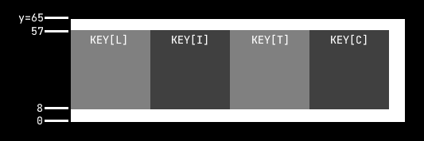
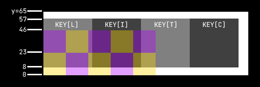

# Squish

Category: `rev`

Description:

> oops! i squished my flag.

---

This looks like a classic binary reversing challenge. Upon running the binary, we are greeted with a prompt that asks for something to squish, then spitting out an `out.bmp` file.

The output file attached in the challenge description shows a `2 x 124` (very long) image filled with seemingly random monochrome pixels, which very likely implies that the pixel values themselves hold some form of data.

Quickly running through the pixels it seems that the RGB values are the same for each pixel, meaning that each pixel represents 1 byte, i.e. we can treat the squished flag output as a `2 x 124` byte array:

```
ca ff ff ca fc c1 f6 c9 ea c3 fa b6 e8 f2 d9 e2 c4 f9 ad ff a7 e4 bd e9 ff ff ff da ff ff ff bf ff ac e8 cc ec d2 d1 cd d0 ff ff ff da ff ff ff a7 c8 d3 b5 e8 bb ff ff ff 9d f7 bc dc dc dd d1 c0 ff ff ff a7 ff a3 e8 dd dd eb cd e0 c5 e1 b3 ff aa fe ba db ff ff d5 c4 ff ff eb aa ff ba ff bf ff ff ff ee cf cf c3 f4 b2 ff b6 f0 c8 de ff ff c8 a8 e1 d8 fe bc ff a4 f0 ef f3

e1 e3 ff e8 ff e8 fe ca ed e8 ff e8 ff ff db f2 d3 fe c7 ff c6 fe dd ec e0 e5 ff e9 f0 d5 ff e3 ff e5 ee f1 f7 e9 e9 e9 e5 f1 d3 ff e9 ff d5 f0 d5 e9 f9 e5 f7 dc f3 d2 fe db f8 d3 e6 e8 f3 e8 df ee d7 fe ca ff d5 ee da e6 ff e9 ec dc f1 e1 ff c6 fe d1 ef da ea e0 da ea db f6 ca ff e9 ff e3 fe dc e9 fc e6 f1 d7 fb c9 ff cb fa d8 ed de e7 e9 d4 f2 ce ff ca ff e0 f3 f3 f7
```

To start off, let us decompile the binary! The bulk of the contents is contained within the `main` function, and I will be breaking it up into chunks:

```c
__int64 __fastcall main(int a1, char **a2, char **a3)
{
  int v3;
  __int64 v4;
  // ...
  _BYTE v13[8];
  // ...
  char s[72];
  unsigned __int64 v55;

  v55 = __readfsqword(0x28u);
  v14 = v13;
  puts("what to squish?");
  __isoc99_scanf("%64s", s);
  v43 = 65;                                   // height_maybe
  v3 = strlen(s);                             // sz
  v45 = 92;                                   // width_maybe
```

Very clearly, our input is stored in `s`. There is an interesting initialisation of 2 integers to `65` and `92`, which might come in useful later.

A simple guess, especially with 2 moderately-sized numbers in an image spitter chal, could just be width and height. I'll label them just that for now.

```c
  v44 = (92 - 50 * sz % 92) % 92 + 50 * sz;   // sz_expanded
  v47 = v44 - 1LL;                            // sz_expanded_pred
  v4 = 3LL * v44;                             // triple_sz_expanded
  v48 = height_maybe - 1LL;
  v29 = v44;                                  // sz_expanded_2
  v30 = 0LL;
  v27 = v44;                                  // sz_expanded_3
  v28 = 0LL;
  v25 = height_maybe;                         // height_maybe_2
  v26 = 0LL;
  v5 = 16 * ((3 * height_maybe * (__int64)v44 + 15) / 0x10uLL);
  while ( v13 != &v13[-(v5 & 0xFFFFFFFFFFFFF000LL)] )
    ;
```

The first line just sets `v44` to `50 * sz` rounded up to the nearest multiple of `92`. Note that with a quick scan of the rest of the decompilation, it seems that `50` and `23` (which is $\frac{92}4$) becomes quite significant later on, so these numbers are definitely something to take note of as well.

```c
  v6 = alloca(v5 & 0xFFF);
  if ( (v5 & 0xFFF) != 0 )
    *(_QWORD *)&v13[(v5 & 0xFFF) - 8] = *(_QWORD *)&v13[(v5 & 0xFFF) - 8];
  v49 = v13;                                  // buf
  for ( i = 0; i < height_maybe; ++i )
  {
    for ( j = 0; j < sz_expanded; ++j )
    {
      v49[3 * j + 2 + triple_sz_expanded * i] = -1;
      v49[3 * j + 1 + triple_sz_expanded * i] = v49[3 * j + 2 + triple_sz_expanded * i];
      v49[3 * j + triple_sz_expanded * i] = v49[3 * j + 1 + triple_sz_expanded * i];
    }
  }
```

More cleanly in Python:

```python
buf = v13
for i in range(height_maybe):
    for j in range(sz_expanded):
        for k in range(3):
            buf[(i*sz_expanded + j)*3 + k] = -1
```

Classic nested `for` appears! `v49` (`buf`) is a `height_maybe x sz_expanded x 3` array initialised with `-1`s. We can hence more or less confirm that `height_maybe` is our height and `sz_expanded` is our width. We will rename `width_maybe` to `what` in the meantime.


```c
  v53 = 'pmb.tuo'                             // filename
  for ( k = 0; ; ++k )
  {
    v7 = k;
    if ( v7 >= strlen(s) )
      break;
    v46 = s[k];
    for ( m = 0; m <= 49; ++m )
    {
      for ( n = 0; n <= 49; ++n )
      {
        for ( ii = 0; ii <= 2; ++ii )
          buf[150 * k + 3 * n + ii + triple_width * (57 - m)] = byte_4020[2500 * v46 + 50 * m + n];
      }
    }
  }
```

Again more cleanly in Python:

```python
for idx, cur in enumerate(s):
    for i in range(50):
        for j in range(50):
            for k in range(3):
                buf[((57-i)*width + (idx*50+j))*3 + k] = KEY[(cur*50 + i)*50 + j]
```

This is a slightly more complicated `for` loop. Firstly for the simpler RHS, `KEY` (originally `byte_4020`) is a `128 x 50 x 50` array, containing mostly `0xff`s (white) with other values popping up once in a while. Note that `k` is not referenced at all.

Now for the LHS, recall `buf` is a `height x width x 3` array, with `width` (renamed from `sz_expanded`) being `50 * sz` rounded up against `92`. Perhaps it is cleaner to rewrite to

```python
import numpy as np
buf = np.full((65, round_up(50*len(s), 92), 3), -1)
KEY = np.random.rand(128, 50, 50)
for idx, cur in enumerate(s):
    buf[57:7:-1, idx*50:(idx+1)*50] = KEY[cur, :, :, None]*np.ones((1, 1, 3))
```

In which case the indexing looks like



Note the reverse order. This is probably done because `.bmp` files have `y=0` at the bottom instead of the top.


```c
  v8 = (unsigned int)(height / 23);           // height_new
  v50 = width / 23 - 1LL;                     // width_new_pred
  v23 = width / 23;                           // width_new
  v24 = 0LL;
  v9 = 3 * v23;                               // triple_width_new
  v51 = (int)v8 - 1LL;                        // height_new_pred
  v21 = v23;                                  // width_new_2
  v22 = 0LL;
  v19 = (int)v8;                              // height_new_2
  v20 = 0LL;
  v17 = v23;                                  // width_new_3
  v18 = 0LL;
  v15 = (int)v8;                              // height_new_3
  v16 = 0LL;
  v10 = 16 * ((3 * (int)v8 * v23 + 15) / 0x10uLL);
  while ( v13 != &v13[-(v10 & 0xFFFFFFFFFFFFF000LL)] )
    ;
```

Here we see that we are now working with a new set of variables, where this time the width and height are scaled down by a factor of `23`. This is probably what the "squishing" means.

```c
  v11 = alloca(v10 & 0xFFF);
  if ( (v10 & 0xFFF) != 0 )
    *(_QWORD *)&v13[(v10 & 0xFFF) - 8] = *(_QWORD *)&v13[(v10 & 0xFFF) - 8];
  v52 = v13;                                  // arr
  for ( jj = 0; jj < height / 23; ++jj )
  {
    for ( kk = 0; kk < width / 23; ++kk )
    {
      v34 = 0;
      for ( mm = 0; mm <= 22; ++mm )
      {
        for ( nn = 0; nn <= 22; ++nn )
          v34 += (unsigned __int8)buf[69 * kk + 3 * nn + triple_width * (23 * jj + mm)];
      }
      v34 = (int)v34 / 529;
      for ( i1 = 0; i1 <= 2; ++i1 )
      {
        height_new = v34;
        v52[3 * kk + i1 + triple_width_new * jj] = v34;
      }
    }
  }
```

Again more cleanly in Python:

```python
for i in range(height_new):
    for j in range(width_new):
        tmp = 0
        for y in range(23):
            for x in range(23):
                tmp += buf[((i*23+y)*width + (j*23+x))*3 + 0]
        res = tmp//(23**2)
        for k in range(3):
            arr[(i*width + j)*3 + k] = res
```

We can honestly just ignore the rgb portion because it's quite redundant.

```python
import numpy as np
arr = np.zeros((height_new, width_new))
for i in range(height_new):
    for j in range(width_new):
        arr[i, j] = buf[i*23:(i+1)*23, j*23:(j+1)*23, 0].sum()//(23**2)
```

What this does is that the program simply looks at `23 x 23` chunks from `buf` and takes the average to be inserted into the corresponding pixel in the output image.

Note that while the width of `buf` is a multiple of `23` (due to the adjusting from `sz_expanded`), the height of `buf` is fixed at `65`, which means that the output image will always have a height of `65 // 23 = 2`.

```c
  sub_12F5(arr, (unsigned int)(height / 23), (unsigned int)(width / 23), &filename, height_new, triple_width_new)
  puts("ok it squished");
  return 0LL;
}
```

A quick look at the function tells us that this simply creates the required `out.bmp` image with `arr` as the pixel data, confirming our guess.

To summarise, the squishing process looks like this:



In words, for each character in the flag, the program looks up the corresponding `50 x 50` byte chunk and loads it into `buf` (which is initialised with all `0xff`). Then the program squishes `buf` by taking `23 x 23` chunk averages, which gives us our output `arr`.

---

To reverse this, notice that for each character (represented as the `50 x 50` large chunk), there will always be at least 2 (top and bottom) output pixels that are fully determined by it. Note that it is possible for 2 different characters to produce the same 2 values, but either

1. The checking can be fortified by looking at the data from the previous (already determined) chunk / character, or
2. We should still be able to guess the flag if there are very limited clashes

(For simplicity sake, I chose method 2.)

```python
import numpy as np

WIDTH = 124
HEIGHT = 2
DEPTH = 3

with open('out.bmp', 'rb') as f:
    out = list(f.read()[-WIDTH*HEIGHT*DEPTH::3])

# top and bottom bytes
top, bottom = out[124:], out[:124]

# retrieve key from binary
START = 0x3020
with open('./squish', 'rb') as f:
    KEY = np.array(list(f.read()[START:START+128*50*50])).reshape((128, 50, 50))

def search(cur):
    # supposed bounds of the 2 23x23 chunks within key
    # that correspond to the top and bottom pixels after squishing
    y1 = 57-45
    y2 = 57-22
    x1 = (cur*23)%50
    x2 = ((cur+1)*23)%50
    # test all ascii printable bytes and see
    # which ones produce the desired squished values
    res = bytes(
        i
        for i in range(32, 127)
        if (
            KEY[i, y1:y2, x1:x2].sum()//(23**2) == top[cur]
            and (KEY[i, y2:, x1:x2].sum()+255*8*23)//(23**2) == bottom[cur]
        )
    )
    # if there are multiple possible characters,
    # we display them first and at the end
    # see (manually) which flag makes the most sense.
    return res if len(res) == 1 else b'[' + res + b']'

idx = 0
flag = b''
while True:
    # search for the index of the 23x23
    # that lies completely within our current 50x50
    cur = (idx*50+23-1)//23
    try:
        flag += search(cur)
    except IndexError:
        break
    idx += 1
print(flag.decode())
```

With this, the output is

```
LI[7T]CT[FH]{oops_i_th1nk_i_m[4Y]y_have_squ1sh3d_a_b1t_t0oo[do]_much[]
```

Which we can pretty easily figure out that the supposed flag should be

```
LITCTF{oops_i_th1nk_i_m4y_have_squ1sh3d_a_b1t_t0ooo_much}
```
