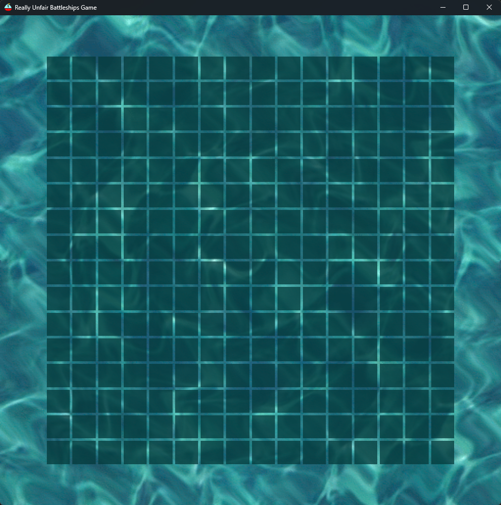
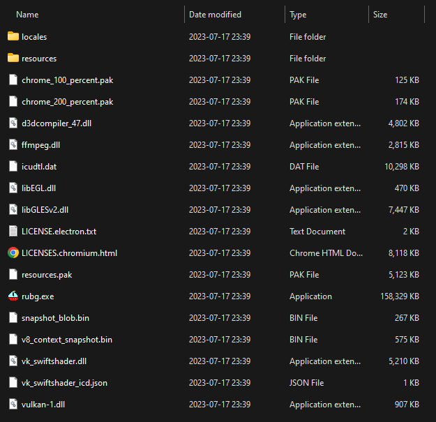
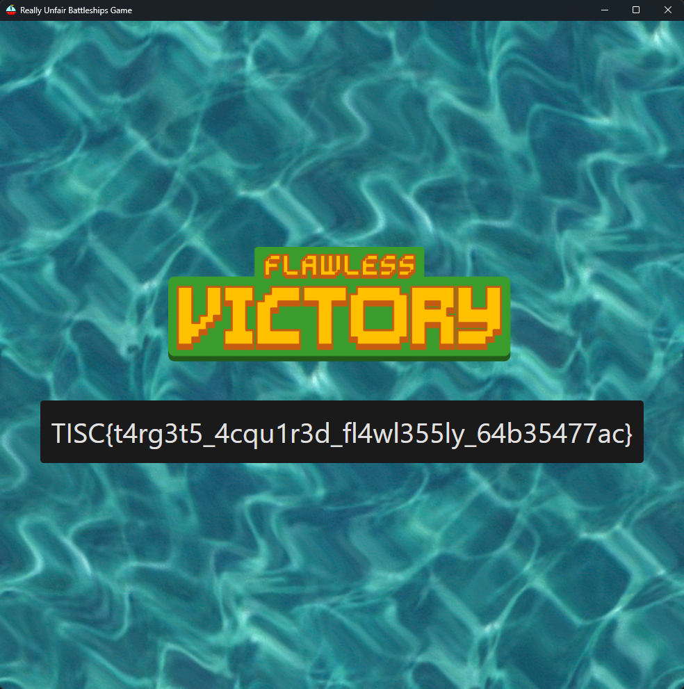

# [4] Really Unfair Battleships Game

Category: `misc` / `rev`

Description:

> After last year's hit online RPG game "Slay The Dragon", the cybercriminal organization PALINDROME has once again released another seemingly impossible game called "Really Unfair Battleships Game" (RUBG). This version of Battleships is played on a 16x16 grid, and you only have one life. Once again, we suspect that the game is being used as a recruitment campaign. So once again, you're up!
> 
> Things are a little different this time. According to the intelligence we've gathered, just getting a VICTORY in the game is not enough.
> 
> PALINDROME would only be handing out flags to hackers who can get a FLAWLESS VICTORY.
> 
> You are tasked to beat the game and provide us with the flag (a string in the format TISC{xxx}) that would be displayed after getting a FLAWLESS VICTORY. Our success is critical to ensure the safety of Singapore's cyberspace, as it would allow us to send more undercover operatives to infiltrate PALINDROME.
> 
> Godspeed!

---

## Part I

I used the Windows executable file to solve this challenge. To first get a feel of the challenge, I launched the executable (with caution) and played around with it. I also tried a bit of Cheat Engine but it was not as straightforward as I expected it to be.



In short, this is a "Battleship" game where the player will need to guess the locations of a number of "ships" (each represented by consecutive tiles on the `16x16` board) in order to attain "Victory". Note that any wrong guess will immediately result in defeat where a restart is required and the location of the ships change again.

Obviously, we are not expected to magically win just by guessing the locations alone, and hence we will attempt to crack open the exe. Unfortunately my copy of IDA is unable to decompile the exe for some reason, which means that actually reversing the exe itself is pretty infeasible.

Instead, I started off by running `file` on the exe:

```bash
$ file rubg_1.0.0.exe
rubg_1.0.0.exe: PE32 executable (GUI) Intel 80386, for MS Windows, Nullsoft Installer self-extracting archive
```

Emphasis on the word `archive`; which means that the exe is probably packaged someway where we could hopefully access the component files. And indeed we can! I opened the exe using an archive tool (PeaZip) and it easily displayed the components of the archive:

* `$PLUGINSDIR/app-64.7z`
* `$PLUGINSDIR/nsis7z.dll`
* `$PLUGINSDIR/StdUtils.dll`
* `$PLUGINSDIR/System.dll`

And opening the `.7z` we are immediately greeted with a very pleasing sight:



It is an electron app! A quick google search tells us how we can easily extract the **source code** from the app, namely by running (`asar` installed via `npm`)

```bash
$ asar extract resources/app.asar ../source
```

---

## Part II

Traversing the directory we arrive at `dist/assets/index-4456e191.js`, which is obfuscated most likely for optimisation. The file is too massive for detailed reversing, hence we need to find the right parts to focus on.

To do this, we note that the `assets` folder also contains the resources for the game, including `victory-87ae9aad.png` and `fvictory-5006d78b.png`. This is a reference to the challenge description which states that just obtaining a regular victory is not enough the solve the challenge.

Going back to the JavaScript file, we can now gradually figure out how to reach the flawless victory by tracing references and calls:

```js
const bc = "" + new URL("banner-cb836e88.png", import.meta.url).href,
  _c = "" + new URL("defeat-c9be6c95.png", import.meta.url).href,
  yc = "" + new URL("victory-87ae9aad.png", import.meta.url).href,
  wc = "" + new URL("fvictory-5006d78b.png", import.meta.url).href,
  Ec = "" + new URL("bgm-1e1048f6.wav", import.meta.url).href;
```

```js
const Ku = "" + new URL("bomb-47e36b1b.wav", import.meta.url).href,
  qu = "" + new URL("gameover-c91fde36.wav", import.meta.url).href,
  _s = "" + new URL("victory-3e1ba9c7.wav", import.meta.url).href,
  it = e => (Hi("data-v-66546397"), e = e(), $i(), e),
  // ...
  lf = it(() => W("div", null, [W("img", {
      class: "outcome-banner",
      src: wc,
      alt: ""
  })], -1)),
```

```js
const // ...
  df = Zs({
      __name: "BattleShips",
      setup(e) {
          const t = Ke([0]),
              n = Ke(BigInt("0")),
              r = Ke(BigInt("0")),
              s = Ke(0),
              o = Ke(""),
              i = Ke(100),
              l = Ke(new Array(256).fill(0)),
              c = Ke([]);

        function f(x) {
              let _ = [];
              for (let y = 0; y < x.a.length; y += 2) _.push((x.a[y] << 8) + x.a[y + 1]);
              return _
          }

          function d(x) {
              return (t.value[Math.floor(x / 16)] >> x % 16 & 1) === 1
          }
          async function m(x) {
              if (d(x)) {
                  if (t.value[Math.floor(x / 16)] ^= 1 << x % 16, l.value[x] = 1, new Audio(Ku).play(), c.value.push(`${n.value.toString(16).padStart(16,"0")[15-x%16]}${r.value.toString(16).padStart(16,"0")[Math.floor(x/16)]}`), t.value.every(_ => _ === 0))
                      if (JSON.stringify(c.value) === JSON.stringify([...c.value].sort())) {
                          const _ = {
                              a: [...c.value].sort().join(""),
                              b: s.value
                          };
                          i.value = 101, o.value = (await $u(_)).flag, new Audio(_s).play(), i.value = 4
                      } else i.value = 3, new Audio(_s).play()
              } else i.value = 2, new Audio(qu).play()
          }
          async function E() {
              i.value = 101;
              let x = await Hu();
              t.value = f(x), n.value = BigInt(x.b), r.value = BigInt(x.c), s.value = x.d, i.value = 1, l.value.fill(0), c.value = [], o.value = ""
          }
          // ...
      }
  });
```

```js
const Du = ee,
  ju = "http://rubg.chals.tisc23.ctf.sg:34567",
  Sr = Du.create({
      baseURL: ju
  });
async function Hu() {
  return (await Sr.get("/generate")).data
}
async function $u(e) {
  return (await Sr.post("/solve", e)).data
}
async function ku() {
  return (await Sr.get("/")).data
}
```

To summarise, this is how we would achieve a flawless victory:

1. GET `http://rubg.chals.tisc23.ctf.sg:34567/generate`
2. Parse the resulting JSON to setup our board
3. Derive the corresponding output in `m`
4. POST `http://rubg.chals.tisc23.ctf.sg:34567/solve`

For reference, this is a sample `/generate` output:

```json
{"a":[4,15,4,0,0,0,0,0,248,0,0,0,0,0,8,2,8,2,8,0,0,0,0,0,0,0,0,0,0,0,0,0],"b":"11159479162363971765","c":"4462129919617373985","d":467671507}
```

The original `m` seems to be called every time a tile is clicked, and appends some result based on the tile data to `c` (if the tile is not a ship the defeat screen is immediately shown). Once all ships have sunk, the program displays either a flawless victory or a regular victory depending on whether the result is `c` is in sorted order.

This means that we just need to patch over (remove) the defeat branch, click every single tile, and sort the result in `c` in order to acquire a flawless victory.

```js
          async function m(x) {
              if (d(x)) {
                  if (t.value[Math.floor(x / 16)] ^= 1 << x % 16, l.value[x] = 1, new Audio(Ku).play(), c.value.push(`${n.value.toString(16).padStart(16,"0")[15-x%16]}${r.value.toString(16).padStart(16,"0")[Math.floor(x/16)]}`), t.value.every(_ => _ === 0))
                      if (true) {
                          const _ = {
                              a: [...c.value].sort().join(""),
                              b: s.value
                          };
                          i.value = 101, o.value = (await $u(_)).flag, new Audio(_s).play(), i.value = 4
                      } else i.value = 3, new Audio(_s).play()
              }
              if (x < 255) {
                  m(x+1);
              }
          }
```

Now we simply have to repackage the patched script into the program. This is extremely simple in electron:

```bash
$ asar pack source app.asar
```

We then replace the `resources/app.asar`, and also run the exe, within the electron directory. To trigger the patched `m` function correctly we click the top left tile (index `0`) and let the program handle the rest.



```
TISC{t4rg3t5_4cqu1r3d_fl4wl355ly_64b35477ac}
```
