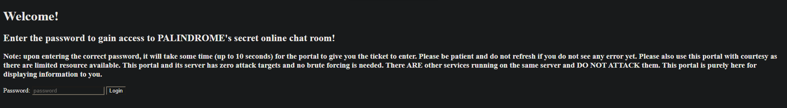

# [5] PALINDROME's Invitation

Category: `osint` / `misc`

Description:

> Valuable intel suggests that PALINDROME has established a secret online chat room for their members to discuss on plans to invade Singapore's cyber space. One of their junior developers accidentally left a repository public, but he was quick enough to remove all the commit history, only leaving some non-classified files behind. One might be able to just dig out some secrets of PALINDROME and get invited to their secret chat room...who knows?

---

## Part I

We are given a link to kickstart our hunt:

> Start here: https://github.com/palindrome-wow/PALINDROME-PORTAL

The GitHub repo seems pretty bare, with nothing much interesting going on, and with only 1 file, `.github/workflows/test_portal.yml`:

```yml
name: Test the PALINDROME portal

on:
    issues:
        types: [closed]

jobs:
  test:
    runs-on: windows-latest
    steps:
      - uses: actions/checkout@v3
      - name: Test the PALINDROME portal
        run: | 
          C:\msys64\usr\bin\wget.exe '''${{ secrets.PORTAL_URL }}/${{ secrets.PORTAL_PASSWORD }}''' -O test -d -v
          cat test
```

Clearly, we will need to find the portal URL as well as the password somehow in order to infiltrate. And with nothing much else interesting going on, we begin our hunt inside GitHub.

Since this is a GitHub workflow, we can perhaps look around the Actions tab. Ignoring the workflows created by other participants (the repo was unfortunately polluted), we come aross the `Portal opening` run under the `Test the PALINDROME portal` workflow, created by `palindrome-wow` (repo owner) itself.

Inside it, we can easily find crucial information that the workflow logged:

```
Run C:\msys64\usr\bin\wget.exe '''***/***''' -O test -d -v
Setting --verbose (verbose) to 1
DEBUG output created by Wget 1.21.4 on cygwin.

Reading HSTS entries from /home/runneradmin/.wget-hsts
URI encoding = 'ANSI_X3.4-1968'
logging suppressed, strings may contain password
--2023-09-08 04:01:29--  ***/:dIcH:..uU9gp1%3C@%3C3Q%22DBM5F%3C)64S%3C(01tF(Jj%25ATV@$Gl
Resolving chals.tisc23.ctf.sg (chals.tisc23.ctf.sg)... 18.143.127.62, 18.143.207.255
Caching chals.tisc23.ctf.sg => 18.143.127.62 18.143.207.255
Connecting to chals.tisc23.ctf.sg (chals.tisc23.ctf.sg)|18.143.127.62|:45938... Closed fd 4
failed: Connection timed out.
Connecting to chals.tisc23.ctf.sg (chals.tisc23.ctf.sg)|18.143.207.255|:45938... Closed fd 4
failed: Connection timed out.
Releasing 0x0000000a00027870 (new refcount 1).
Retrying.

...
```

* Website: `chals.tisc23.ctf.sg`
* Port: `45938`
* Password `:dIcH:..uU9gp1%3C@%3C3Q%22DBM5F%3C)64S%3C(01tF(Jj%25ATV@$Gl`



Note that the password has undergone URL encoding evident from the `%` codes. A simple conversion using cyberchef returns the actual password `:dIcH:..uU9gp1<@<3Q"DBM5F<)64S<(01tF(Jj%ATV@$Gl`. Submitting the password to the website, we get a welcome link to a discord server invitation.

Unfortunately, the Discord server is a dead end. We have close to zero permissions in the server, and there are no channels or settings for us to explore around, even after clicking every single available button.

---

## Part II

Backtracking a little, we return to the welcome page, and by inspecting the page we can understand what is actually going on:

```html
<a href=https://discord.gg/[REDACTED]>Welcome!</a>
<!-- [REDACTED] -->
<!-- You have 15 minutes before this token expires! Find a way to use it and be fast! You can always re-enter the password to get a new token, but please be considerate, it is highly limited. -->
```

(Details redacted for the sake of the writeup)

There is actually a hidden token embedded in the page. Google tells us that this is actually a Discord account token. However attempts to log in solely using the token is extremely difficult if not impossible currently (as far as I know). Digging a little deeper we find that it could also be a *bot* token.

Unlike regular accounts, we can relatively easily perform a bot "login" using just the token, perhaps for development purposes. For this solve I utilised a third party bot client that simulates a user Discord client by entering a bot token and logging in as a bot.

**Note:** Unfortunately at the time of this writeup the bot is no longer in the server for some reason, either due to vandalism or due to admin matters after the competition.

Using the bot account, we have *slightly* more permissions, including the ability to view the server Audit Log. Scrolling towards the bottom we find a *different* invite link to the server, one which provides access to the `#flag` channel. Hence by joining the server as a regular user through that link, We gain access to that channel and we will be able to view the flag.

```
TISC{H4ppY_B1rThD4y_4nY4!}
```
