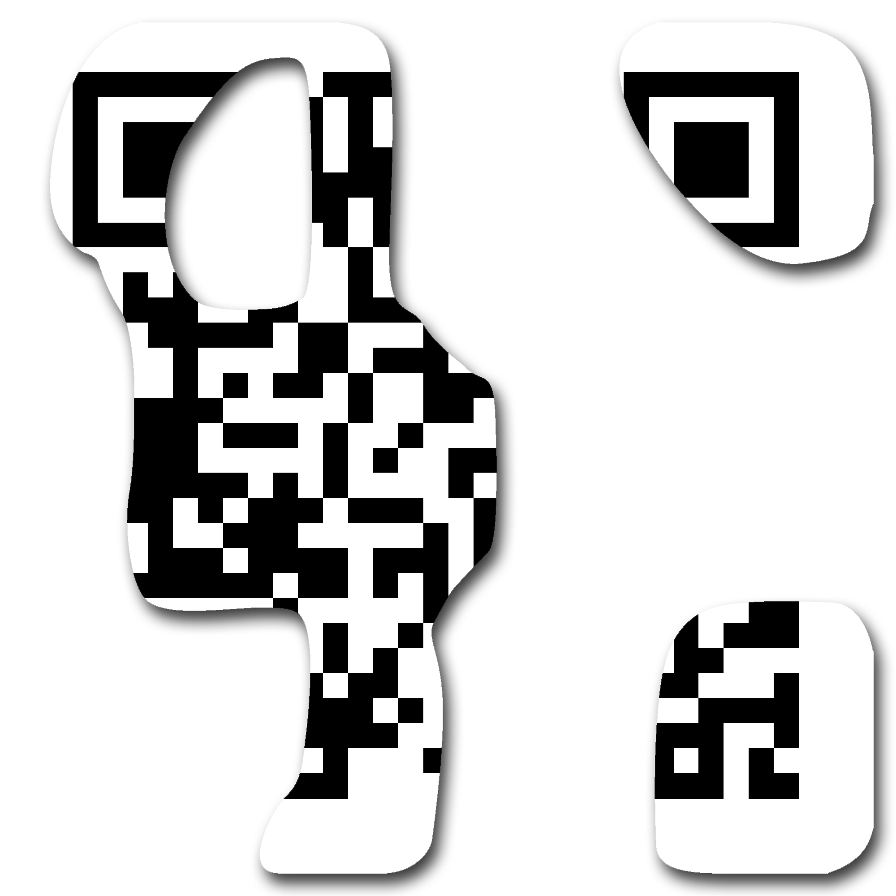

# QrCode2

Category: `misc`

Points: `578`

Solves: 9

Description:

> In the year 2124, the Sylastan beings stumbled upon a tattered piece of paper amidst the ruins of the British Museum. Legend had it that the black and white patterns on the paper directly encoded a precious treasure known to the long-lost humans as the "flag", a priceless wealth of immeasurable significance.
> 
> \*flag format: flag{.\*}

---

This challenge finally forced me to understand QR Code internals in more detail. We are given a pretty badly damaged QR Code:



You may wonder, how to we recover data from such a badly damaged QR Code, when the information is literally encoded as pixels? Well, it is pretty well known that QR code has error/erasure correction built into the system, using the Reed-Solomon algorithm. ([Just read Wikipedia](https://en.wikipedia.org/wiki/QR_code))

Hence, after a quick scan of the image itself to ensure there are no funny pieces baked into the metadata, we proceed to recover the QR code piece by piece.

For this, there is actually a very helpful online tool - [QRazyBox](https://merri.cx/qrazybox/).

(As I did not save screenshots of me doing this and I can't be bothered to do this again I will not show any images of the process.)

---

## Part I

To parse a QR code, first we need to read its """metadata""", or format info. You can find out more about them in the wikipedia article, but basically it is made up of 2 identical sets (for erasure resistance) of a string of 15 bits (pixels) surrounding the 3 finder patterns. Of the 15 bits, 5 contain actual data, while the remaining 10 are redundancy bits for, again, error/erasure correction.


And, what a surprise, we already have 4 out of the 5 bits! Most importantly we have the 3 mask bits that determine the mask pattern applied to the data bits of the QR code, so we don't have to perform extra guessing. (Note that another mask is itself separately applied to the 15 bits.)

We still have to guess one bit for the error correction level though. Based on the other existing bit that we have, we know it is either level H (with 44 ECC bytes / 26 data bytes) or level M (with 26 ECC bytes / 44 data bytes).

Here, we have 2 pieces of information that help us deduce the correct error correction level:

1. After "un-applying" the mask (using QRazyBox), we can manually parse the bottom right corner of the QR code to determine the encoding mode and the message length. The encoding mode is, as expected (sanity check), binary, while the message length is 33, which tells us that the error correction level cannot be H.
2. We can identify the [padding bits](https://merri.cx/qrazybox/help/extension-tools/padding-bits-recovery.html) from the QR code, which roughly tells us where the data ends.

---

## Part II

If we immediately try to run the QR code in its current stage through the Extract QR Information tool we learn that we have not enough bytes. That is because Reed-Solomon can recover *erasures* up to the number of redundant data added. Since we have 26 ECC bytes, we can only have 26 bytes of "missing" data. So how else can we recover data?

Firstly, we can fill the missing padding bits ([same link again](https://merri.cx/qrazybox/help/extension-tools/padding-bits-recovery.html)). Everything between the terminator sequence ("34th" (half-)byte) and the ECC bytes are padding bytes, alternating between `0xEC` and `0x11`.

Secondly, we can "guess" some of the flag bytes, since [we "already" know the flag header](welcome.md).

With that, we arrive at exactly 44 bytes (26 missing bytes), and we can use the online tool to properly read the QR code and get the flag!

Alternatively, we can craft a simple python script to just apply the Reed-Solomon algorithm on our data.

```python
from reedsolo import RSCodec

b = bytes([66,22,102,198,22,119,0,0,66,179,69,0,0,0,0,0,0,0,0,0,0,0,0,0,0,0,0,0,0,0,0,0,0,103,208,236,17,236,17,236,17,236,17,236,93,40,242,117,113,245,155,98,24,204,182,152,82,159,59,204,42,61,216,156,45,27,50,219,0,0])

a = RSCodec(26).decode(b, erase_pos=[i for i, x in enumerate(b) if x == 0])[0]
c = ''.join(f'{x:08b}' for x in a)[12:12+33*8]
d = bytes([int(c[i*8:(i+1)*8], 2) for i in range(len(c)//8)]).decode()
print(d)
```

```
flag{D4+4_2e(0\\/3R_v_!5_S0_3a5_v}
```

---

P.S.

Whoever designed QrCode1, thank you for the cryptic and unguessable `"method": "SH5"` hint near the end of the challenge which ended up causing me to waste half a day malding about it (either that or I just have a skill issue)
