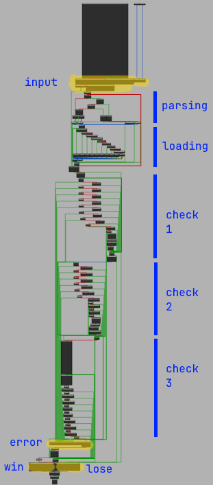
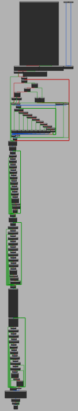
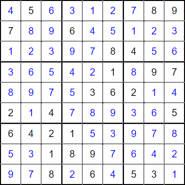

# Cooking Mama

Category: `rev`

Points: `999`

Solves: 3

Description:

> im new to rust, so i cooked this :)
> 
> Author: kestryix

- [Cooking Mama](#cooking-mama)
  - [Part I: Introduction](#part-i-introduction)
  - [Part II: Head](#part-ii-head)
    - [Part IIA: Rust Calling Convention? (Extra)](#part-iia-rust-calling-convention-extra)
  - [Part III: Parsing](#part-iii-parsing)
  - [Part IV: Loading](#part-iv-loading)
  - [Part V: Checking](#part-v-checking)
  - [Appendix: Dynamic Analysis](#appendix-dynamic-analysis)
    - [Part IV](#part-iv)
    - [Part V](#part-v)

---

## Part I: Introduction

```
$ ./cooking_mama
⠀⠀⢀⣴⣿⣿⣷⣦⣌⠛⢦⡀⠀⠈⠓⢦⣀⡀⠀⣸⣿⣿⣿⡀⠀
⠀⠀⡾⠋⠉⢿⣿⣿⡿⠟⠦⣝⡲⣄⣀⠀⠈⠉⠉⣽⡿⢿⣿⡇⠀
⠀⠀⣷⠀⣠⣿⡿⠋⠀⠀⣶⢤⣙⠳⢭⣙⠲⠤⠴⠋⠑⠀⠁⣧⠀
⠀⠀⢸⡼⠛⠛⠀⠀⠀⣼⠉⢿⣿⣧⣶⡿⠛⠶⢤⣀⠀⠀⠀⣻
⠀⠀⢨⡇⠀⠀⠀⠀⠀⠈⠉⠉⢸⡟⣺⠃⠀⠀⠀⠈⠙⠲⠶⠋⠀
⠀⠀⣸⠁⠀⠀⠀⠀⠀⢀⡀⠀⢸⡷⠋⠀⠀⠀⠀⠀⠀⠀⠀⠀⠀
⠀⣰⠃⠀⠀⠀⠠⣄⡀⠀⠉⣳⣼⠇⠀⠀⠀⠀⠀⠀⠀⠀⠀⠀⠀WHO LET HIM COOK
⣞⠁⠀⠲⣄⠀⠀⠀⠉⠉⡷⠃⠀⠀⠀⠀⠀⠀⠀⠀⠀⠀⠀⠀⠀
⣌⠳⣤⡀⠈⠓⠦⢤⡴⠚⠁⠀⠀⠀⠀⠀⣀⣀⡀⠀⠀⠀⠀⠀⠀
⣿⣷⣤⡿⢷⠀⣀⡴⣷⠒⠒⢒⣶⢤⠞⠉⠙⢻⣿⣷⣄⠀⠀⠀⠀
⠙⠻⣿⣷⠈⠛⠙⡇⣿⠀⠀⢯⣽⢿⠀⠀⠀⣴⠚⠉⠛⠀⠀⠀⠀
⣶⣆⠀⢹⣠⠶⣄⡇⢻⠛⠓⠒⠚⠋⠙⠓⠲⠮⠿⠆⠀⠀⠀⠀⠀
⣿⣿⠀⢸⠙⠒⢃⣇⡞⠀⠀⠀⠀⠀⠀⠀⠀⠀⠀⠀⠀⠀⠀
> grey{abcd}
⠀⠀⠀⠀⠀⠀⠀⠀⠀⠀⠀⠀⠀⠀⠀⠀⠀⠀⠀⠀⠀⠀⠀⠀⠀⠀⠀⠀⠀⠀
⠀⠀⠀⠀⣠⠞⠉⢉⠩⢍⡙⠛⠋⣉⠉⠍⢉⣉⣉⣉⠩⢉⠉⠛⠲⣄⠀⠀⠀⠀
⠀⠀⠀⡴⠁⠀⠂⡠⠑⠀⠀⠀⠂⠀⠀⠀⠀⠠⠀⠀⠐⠁⢊⠀⠄⠈⢦⠀⠀⠀
⠀⣠⡾⠁⠀⠀⠄⣴⡪⠽⣿⡓⢦⠀⠀⡀⠀⣠⢖⣻⣿⣒⣦⠀⡀⢀⣈⢦⡀⠀
⣰⠑⢰⠋⢩⡙⠒⠦⠖⠋⠀⠈⠁⠀⠀⠀⠀⠈⠉⠀⠘⠦⠤⠴⠒⡟⠲⡌⠛⣆
⢹⡰⡸⠈⢻⣈⠓⡦⢤⣀⡀⢾⠩⠤⠀⠀⠤⠌⡳⠐⣒⣠⣤⠖⢋⡟⠒⡏⡄⡟  COOK HARDER
⠀⠙⢆⠀⠀⠻⡙⡿⢦⣄⣹⠙⠒⢲⠦⠴⡖⠒⠚⣏⣁⣤⣾⢚⡝⠁⠀⣨⠞⠀
⠀⠀⠈⢧⠀⠀⠙⢧⡀⠈⡟⠛⠷⡾⣶⣾⣷⠾⠛⢻⠉⢀⡽⠋⠀⠀⣰⠃⠀⠀
⠀⠀⠀⠀⠑⢤⡠⢂⠌⡛⠦⠤⣄⣇⣀⣀⣸⣀⡤⠼⠚⡉⢄⠠⣠⠞⠁⠀⠀⠀
⠀⠀⠀⠀⠀⠀⠉⠓⠮⣔⡁⠦⠀⣤⠤⠤⣤⠄⠰⠌⣂⡬⠖⠋⠀⠀⠀⠀⠀⠀
⠀⠀⠀⠀⠀⠀⠀⠀⠀⠀⠉⠒⠤⢤⣀⣀⡤⠴⠒⠉⠀⠀⠀⠀⠀⠀⠀⠀⠀⠀
```

Rust rev is particularly annoying because its "ABI is not extremely well-defined" apparently, and the decompilation is all over the place (to be fair the disassembly too). Plus there are way too many error checks built into the functions that don't add substance to the logic but clutter the disassembly.

As usual, we will start from the strings. Near the end of the main function there are two `print` blocks side by side, which look pretty much identical except for of course the string that is printed out (`0x49882` vs `0x4948c`).

```asm
loc_9721:
lea     rax, unk_49882
mov     [rsp+308h+var_2C8], rax
mov     qword ptr [rsp+48h], 407h
mov     qword ptr [rsp+308h+var_308], r14
mov     qword ptr [rsp+308h+var_308+8], r15
mov     qword ptr [rsp+308h+var_2B8], r12
mov     qword ptr [rsp+308h+var_2B8+8], 1
mov     [rsp+308h+var_298], 0
mov     qword ptr [rsp+308h+var_2A8], rbx
mov     qword ptr [rsp+308h+var_2A8+8], 1
lea     rdi, [rsp+308h+var_2B8]
call    cs:_ZN3std2io5stdio6_print17ha0212c65ac6652d4E_ptr ; std::io::stdio::_print::ha0212c65ac6652d4 ...
```

```
gef➤  x/s 0x55555559d882
0x55555559d882: "⢻⣿⡗⢶⣤⣀", '⠀' <repeats 21 times>, "⣀⣠⣄\n⠀⢻⣇⠀⠈⠙⠳⣦⣀", '⠀' <repeats 13 times>, "⣀⣤⠶⠛⠋⣹⣿⡿\n⠀⠀⠹⣆⠀⠀⠀⠀⠙⢷⣄⣀⣀⣀⣤⣤⣤⣄⣀⣴⠞⠋⠉⠀⠀⠀⢀⣿⡟⠁\n⠀⠀⠀⠙⢷⡀⠀⠀⠀⠀⠉⠉⠉", '⠀' <repeats 12 times>, "⣠⡾⠋⠀⠀\n⠀⠀⠀⠀⠈⠻⡶⠂", '⠀' <repeats 14 times>, "⢠⣠⡾⠋⠀⠀⠀⠀\n⠀⠀⠀⠀⠀⣼⠃⠀⢠⠒⣆⠀⠀⠀⠀⠀⠀⢠⢲⣄⠀⠀⠀⢻⣆⠀⠀⠀⠀⠀\n⠀⠀⠀⠀⢰⡏⠀⠀⠈⠛⠋⠀⢀⣀⡀⠀⠀⠘⠛⠃⠀⠀⠀⠈⣿⡀⠀⠀⠀⠀\n⠀⠀⠀⠀⣾⡟⠛⢳⠀⠀⠀⠀⠀⣉⣀⠀⠀⠀⠀⣰⢛⠙⣶⠀⢹⣇⠀⠀⠀⠀ flag is grey{your_input_here} :)\n⠀⠀⠀⠀⢿⡗⠛⠋⠀⠀⠀⠀⣾⠋⠀⢱⠀⠀⠀⠘⠲⠗⠋⠀⠈⣿⠀⠀⠀⠀\n⠀⠀⠀⠀⠘⢷⡀⠀⠀⠀⠀⠀⠈⠓⠒⠋⠀⠀⠀⠀⠀⠀⠀⠀⠀⢻⡇⠀⠀⠀\n⠀⠀⠀⠀⠀⠈⡇", '⠀' <repeats 18 times>, "⢸⣧⠀⠀\n"
gef➤  x/s 0x55555559d48c
0x55555559d48c: '⠀' <repeats 30 times>, "\n⠀⠀⠀⠀⣠⠞⠉⢉⠩⢍⡙⠛⠋⣉⠉⠍⢉⣉⣉⣉⠩⢉⠉⠛⠲⣄⠀⠀⠀⠀\n⠀⠀⠀⡴⠁⠀⠂⡠⠑⠀⠀⠀⠂⠀⠀⠀⠀⠠⠀⠀⠐⠁⢊⠀⠄⠈⢦⠀⠀⠀\n⠀⣠⡾⠁⠀⠀⠄⣴⡪⠽⣿⡓⢦⠀⠀⡀⠀⣠⢖⣻⣿⣒⣦⠀⡀⢀⣈⢦⡀⠀\n⣰⠑⢰⠋⢩⡙⠒⠦⠖⠋⠀⠈⠁⠀⠀⠀⠀⠈⠉⠀⠘⠦⠤⠴⠒⡟⠲⡌⠛⣆\n⢹⡰⡸⠈⢻⣈⠓⡦⢤⣀⡀⢾⠩⠤⠀⠀⠤⠌⡳⠐⣒⣠⣤⠖⢋⡟⠒⡏⡄⡟  COOK HARDER\n⠀⠙⢆⠀⠀⠻⡙⡿⢦⣄⣹⠙⠒⢲⠦⠴⡖⠒⠚⣏⣁⣤⣾⢚⡝⠁⠀⣨⠞⠀\n⠀⠀⠈⢧⠀⠀⠙⢧⡀⠈⡟⠛⠷⡾⣶⣾⣷⠾⠛⢻⠉⢀⡽⠋⠀⠀⣰⠃⠀⠀\n⠀⠀⠀⠀⠑⢤⡠⢂⠌⡛⠦⠤⣄⣇⣀⣀⣸⣀⡤⠼⠚⡉⢄⠠⣠⠞⠁⠀⠀⠀\n⠀⠀⠀⠀⠀⠀⠉⠓⠮⣔⡁⠦⠀⣤⠤⠤⣤⠄⠰⠌⣂⡬⠖⠋⠀⠀⠀⠀⠀⠀\n⠀⠀⠀⠀⠀⠀⠀⠀⠀⠀⠉⠒⠤⢤⣀⣀⡤⠴⠒⠉⠀⠀⠀⠀⠀⠀⠀⠀⠀⠀\n⢻⣿⡗⢶⣤⣀", '⠀' <repeats 21 times>, "⣀⣠⣄\n⠀⢻⣇⠀⠈⠙⠳⣦⣀", '⠀' <repeats 13 times>, "⣀⣤⠶⠛⠋⣹⣿⡿\n⠀⠀⠹⣆⠀⠀⠀⠀⠙⢷⣄⣀⣀⣀⣤⣤⣤⣄⣀⣴⠞⠋⠉⠀⠀⠀⢀⣿⡟⠁\n⠀⠀⠀⠙⢷⡀⠀⠀⠀⠀⠉⠉⠉", '⠀' <repeats 12 times>, "⣠⡾⠋⠀⠀\n⠀⠀⠀⠀⠈⠻⡶⠂", '⠀' <repeats 14 times>, "⢠⣠⡾⠋⠀⠀⠀⠀\n⠀⠀⠀⠀⠀⣼⠃⠀⢠⠒⣆⠀⠀⠀⠀⠀⠀⢠⢲⣄⠀⠀⠀⢻⣆⠀⠀⠀⠀⠀\n⠀⠀⠀⠀⢰⡏⠀⠀⠈⠛⠋⠀⢀⣀⡀⠀⠀⠘⠛⠃⠀⠀⠀⠈⣿⡀⠀⠀⠀⠀\n⠀⠀⠀⠀⣾⡟⠛⢳⠀⠀⠀⠀⠀⣉⣀⠀⠀⠀⠀⣰⢛⠙⣶⠀⢹⣇⠀⠀⠀⠀ flag is grey{your_input_here} :)\n⠀⠀⠀⠀⢿⡗⠛⠋⠀⠀⠀⠀⣾⠋⠀⢱⠀⠀⠀⠘⠲⠗⠋⠀⠈⣿⠀⠀⠀⠀\n⠀⠀⠀⠀⠘⢷⡀⠀⠀⠀⠀⠀⠈⠓⠒⠋⠀⠀⠀⠀⠀⠀⠀⠀⠀⢻⡇⠀⠀⠀\n⠀⠀⠀⠀⠀⠈⡇", '⠀' <repeats 18 times>, "⢸⣧⠀⠀\n"
```

Oh right, Rust strings are not `null`-terminated. Either way, we can tell that `0x49882` is the win branch while `0x4948c` is the lose branch.

Now, the control flow. The graph generated by IDA looks extremely daunting, but upon closer inspection we can actually see that it can be broken into multiple constituent parts:



Additionally, we see that a lot of the mess is contributed by the `jmp`s to the error (bounds check?) and lose branches. Look at how much cleaner the graph becomes once we hide them (I simply undefined the nodes in IDA):



Still, with the verbosity and repetitiveness, I can't help to wonder whether the challenge is slightly obfuscated or whether assembling Rust just sucks.

But now we can at least break the problem into parts for us to work on -- refer to the table of contents at the top for navigation.

---

## Part II: Head

We shall start scanning through the disassembly from the beginning.

One tip I generally follow in Rust disassembly is to understand the big picture first before delving into specifics as needed, which we can easily accomplish by looking at what functions are called. Of course this is not foolproof and may cause us to miss out critical information in well-structured binaries, but this works 90% of the time.

For this, we can enable basic block boundaries in IDA (`Options` > `General` > `Disassembly` > `Display disassembly lines`) for an easier time scanning too.

For example, we can basically skip over the very first block as we can tell that the functions referenced and called are all related to printing stuff on the screen. We then look at the second block:

```asm
mov     rax, 500000000h
mov     qword ptr [rsp+308h+var_168], rax
pxor    xmm0, xmm0
movdqu  [rsp+308h+var_168+8], xmm0
mov     dword ptr [rsp+308h+var_158+8], 0
movaps  xmm1, cs:xmmword_49000
movups  [rsp+308h+var_158+0Ch], xmm1
mov     rax, 600000000h
mov     [rsp+308h+var_13C], rax
movdqu  [rsp+308h+var_134], xmm0
movdqu  [rsp+308h+var_124], xmm0
mov     [rsp+308h+var_114], 0
mov     rax, 400000008h
mov     [rsp+308h+var_10C], rax
movdqu  [rsp+308h+var_104], xmm0
movdqu  [rsp+308h+var_104+0Ch], xmm0
movaps  xmm1, cs:xmmword_49010
movups  [rsp+308h+var_E8], xmm1
movdqu  [rsp+308h+var_D8], xmm0
movaps  xmm1, cs:xmmword_49020
movups  [rsp+308h+var_C8], xmm1
movaps  xmm1, cs:xmmword_49030
movups  [rsp+308h+var_B8], xmm1
movdqu  [rsp+308h+var_A8], xmm0
mov     [rsp+308h+var_98], 0
movaps  xmm1, cs:xmmword_49040
movups  [rsp+308h+var_94], xmm1
mov     [rsp+308h+var_84], 1
movdqu  [rsp+308h+var_74], xmm0
movdqu  xmmword ptr [rsp+288h], xmm0
mov     rax, 800000001h
mov     [rsp+308h+var_64], rax
mov     [rsp+308h+var_5C], 9
movdqu  [rsp+308h+var_58], xmm0
mov     [rsp+308h+var_48], 0
movaps  xmm1, cs:xmmword_49050
movups  [rsp+308h+var_40], xmm1
mov     rax, 300000005h
mov     [rsp+308h+var_30], rax
mov     [rsp+308h+var_28], 0
```

This block consists almost exclusively of instructions that load values into stack memory. Again Rust uses a lot of owords which I find annoying to rev. So instead of trying to piece them together we can just get the result dynamically.

The `memcpy`ed region spans from `rsp+(0x308-0x168)` to `rsp+(0x308-0x28)`, which is 41 qwords starting from `rsp+0x1a0`.

```
gef➤  b *0x55555555ce68
Breakpoint 1 at 0x55555555ce68
gef➤  r
...
gef➤  x/41gx $rsp+0x1a0
0x7fffffffdcc0: 0x0000000500000000      0x0000000000000000
0x7fffffffdcd0: 0x0000000000000000      0x0000000800000000
0x7fffffffdce0: 0x0000000700000009      0x0000000000000000
0x7fffffffdcf0: 0x0000000000000006      0x0000000000000000
0x7fffffffdd00: 0x0000000000000000      0x0000000000000000
0x7fffffffdd10: 0x0000000000000000      0x0000000800000000
0x7fffffffdd20: 0x0000000000000004      0x0000000000000000
0x7fffffffdd30: 0x0000000000000000      0x0000000000000000
0x7fffffffdd40: 0x0000000000000001      0x0000000700000009
0x7fffffffdd50: 0x0000000000000000      0x0000000000000000
0x7fffffffdd60: 0x0000000600000003      0x0000000000000002
0x7fffffffdd70: 0x0000000200000000      0x0000000400000000
0x7fffffffdd80: 0x0000000000000000      0x0000000000000000
0x7fffffffdd90: 0x0000000500000000      0x0000000400000006
0x7fffffffdda0: 0x0000000100000002      0x0000000000000000
0x7fffffffddb0: 0x0000000000000000      0x0000000000000000
0x7fffffffddc0: 0x0000000100000000      0x0000000900000008
0x7fffffffddd0: 0x0000000000000000      0x0000000000000000
0x7fffffffdde0: 0x0000000000000000      0x0000000000000008
0x7fffffffddf0: 0x0000000000000006      0x0000000300000005
0x7fffffffde00: 0x0000000000000000
```

<a id="interesting-numbers"></a>

This looks very interesting. Even though the values are loaded into memory in a weird way, the end result consists almost exclusively of dwords with values from 0 to 9. We will keep a mental note of this memory region for later.

```
gef➤  x/82wx $rsp+0x1a0
0x7fffffffdcc0: 0x00000000      0x00000005      0x00000000      0x00000000
0x7fffffffdcd0: 0x00000000      0x00000000      0x00000000      0x00000008
0x7fffffffdce0: 0x00000009      0x00000007      0x00000000      0x00000000
0x7fffffffdcf0: 0x00000006      0x00000000      0x00000000      0x00000000
0x7fffffffdd00: 0x00000000      0x00000000      0x00000000      0x00000000
0x7fffffffdd10: 0x00000000      0x00000000      0x00000000      0x00000008
0x7fffffffdd20: 0x00000004      0x00000000      0x00000000      0x00000000
0x7fffffffdd30: 0x00000000      0x00000000      0x00000000      0x00000000
0x7fffffffdd40: 0x00000001      0x00000000      0x00000009      0x00000007
0x7fffffffdd50: 0x00000000      0x00000000      0x00000000      0x00000000
0x7fffffffdd60: 0x00000003      0x00000006      0x00000002      0x00000000
0x7fffffffdd70: 0x00000000      0x00000002      0x00000000      0x00000004
0x7fffffffdd80: 0x00000000      0x00000000      0x00000000      0x00000000
0x7fffffffdd90: 0x00000000      0x00000005      0x00000006      0x00000004
0x7fffffffdda0: 0x00000002      0x00000001      0x00000000      0x00000000
0x7fffffffddb0: 0x00000000      0x00000000      0x00000000      0x00000000
0x7fffffffddc0: 0x00000000      0x00000001      0x00000008      0x00000009
0x7fffffffddd0: 0x00000000      0x00000000      0x00000000      0x00000000
0x7fffffffdde0: 0x00000000      0x00000000      0x00000008      0x00000000
0x7fffffffddf0: 0x00000006      0x00000000      0x00000005      0x00000003
0x7fffffffde00: 0x00000000      0x00000000
```

The next few lines in the node basically prints something again and calls

```rust
io::stdout().flush().unwrap();
```

(Irrelevant, but did it for run / practice.)

### Part IIA: Rust Calling Convention? (Extra)

**Disclaimer:** This part is not extremely important to the writeup and more for my own practice (and reference in the future). I believe Rust disassembly is not as intuitive to me partly due to the extensive reliance on structs, with its complexities overflowing into the calling convention, and this part aims to demystify that a little.

Now we go to the next node. The other node from the `jnz` branch is irrelevant as it is just error handling.

```asm
call    cs:_ZN3std2io5stdio5stdin17h821c04443a399516E_ptr ; std::io::stdio::stdin::h821c04443a399516 ...

mov     [rsp+308h+var_2C8], rax
lea     rdi, [rsp+308h+var_2B8]
lea     r14, [rsp+308h+var_2C8]
lea     rdx, [rsp+308h+PTR_2E0]
mov     rsi, r14
call    cs:_ZN3std2io5stdio5Stdin9read_line17h75874c24c55eccd0E_ptr ; std::io::stdio::Stdin::read_line::h75874c24c55eccd0 ...

cmp     qword ptr [rsp+308h+var_2B8], 0
jnz     loc_9824
```

From the function names we know that

```rust
io::stdin().read_line(&mut input).unwrap()
```

was called. But the arguments and return values seem all over the place. For curiosity sake let's crack this open in `GDB`:

```
gef➤  b *0x55555555ced8
Breakpoint 2 at 0x55555555ced8
gef➤  c
Continuing.
>
Breakpoint 2, 0x000055555555ced8 in cooking_mama::main ()
...
───────────────────────────────────────────────────────────────────────────────────────────────────────────────────────────────────────────────────────────────────────────────────────────────────────────────────────── code:x86:64 ────
   0x55555555cecb <cooking_mama::main+587> lea    r14, [rsp+0x40]
   0x55555555ced0 <cooking_mama::main+592> lea    rdx, [rsp+0x28]
   0x55555555ced5 <cooking_mama::main+597> mov    rsi, r14
●→ 0x55555555ced8 <cooking_mama::main+600> call   QWORD PTR [rip+0x540e2]        # 0x5555555b0fc0
   0x55555555cede <cooking_mama::main+606> cmp    QWORD PTR [rsp+0x50], 0x0
   0x55555555cee4 <cooking_mama::main+612> jne    0x55555555d824 <_ZN12cooking_mama4main17h61864c778b35fb2fE+2980>
   0x55555555ceea <cooking_mama::main+618> mov    rax, QWORD PTR [rsp+0x38]
   0x55555555ceef <cooking_mama::main+623> test   rax, rax
   0x55555555cef2 <cooking_mama::main+626> je     0x55555555d0bd <_ZN12cooking_mama4main17h61864c778b35fb2fE+1085>
───────────────────────────────────────────────────────────────────────────────────────────────────────────────────────────────────────────────────────────────────────────────────────────────────────────────── arguments (guessed) ────
*0x5555555b0fc0 (
   $rdi = 0x007fffffffdb70 → 0x005555555ae1f8 → 0x0055555559d09b →  and BYTE PTR ds:[rbx+0x72], dh,
   $rsi = 0x007fffffffdb60 → 0x005555555b1040 → <std::io::stdio::stdin::INSTANCE+0> add BYTE PTR [rax], al,
   $rdx = 0x007fffffffdb48 → 0x0000000000000001,
   $rcx = 0x005555555b2ba0 → 0x0000000000000000
)
...
gef➤  x/4gx 0x007fffffffdb48
0x7fffffffdb48: 0x0000000000000001      0x0000000000000000
0x7fffffffdb58: 0x0000000000000000      0x00005555555b1040
```

The breakpoint is set right before `read_line`. Our landmark being `rsi` which points to the `stdin` instance, and matching against the Rust documentation

```rust
pub fn read_line(&self, buf: &mut String) -> Result<usize>
```

it seems that the arguments start at `rsi` with `rdx` being the input buffer. For now it seems to be unused, but upon stepping over:

```
gef➤  ni
grey{abcd}
...
gef➤  x/4gx 0x007fffffffdb70
0x7fffffffdb70: 0x0000000000000000      0x000000000000000b
0x7fffffffdb80: 0x000055555559d070      0x0000000000000000
gef➤  x/4gx 0x007fffffffdb48
0x7fffffffdb48: 0x00005555555b4bb0      0x000000000000000b
0x7fffffffdb58: 0x000000000000000b      0x00005555555b1040
gef➤  x/8gx 0x00005555555b4bb0-0x10
0x5555555b4ba0: 0x0000000000000000      0x0000000000000021
0x5555555b4bb0: 0x6362617b79657267      0x00000000000a7d64
0x5555555b4bc0: 0x0000000000000000      0x000000000001e441
0x5555555b4bd0: 0x0000000000000000      0x0000000000000000
gef➤  x/s 0x00005555555b4bb0
0x5555555b4bb0: "grey{abcd}\n"
```

Everything seems to line up:

- `rdi` is used to store the return value as, at least in this case, `Result` cannot fit into a single register.
- Again, the actual arguments start at `rsi`. `rdx` in this case is indeed our input buffer, a pretty common `ptr`-`cap`-`len` implementation of Rust `String`s.

Again the `unwrap` branch can be skipped over.

## Part III: Parsing

```asm
mov     rax, qword ptr [rsp+308h+var_2D8+8]
test    rax, rax
jz      loc_90BD
```

As the `String` struct is located in `rsp+(0x308-0x2C8)`, `rax` retrieves the length of our input. If zero, we jump straight to the checking stage, skipping over both the parsing and loading stages directly. But obviously our input cannot be empty, so we have no choice but to take a quick look at what this group of nodes does.

```asm
mov     rcx, [rsp+308h+PTR_2E0]
add     rax, rcx
jmp     short loc_8F1B
```

`rcx` and `rax` now point to the start and end of the byte string respectively.

<a id="loop"></a>

After the above node we seem to enter a loop (see the rightmost red arrow in the parsing group in the image near the start), do keep a mental note of this.

<a id="this-block"></a>

```asm
loc_8F1B:
movzx   edx, byte ptr [rcx]
test    dl, dl
js      short loc_8F40

; ...

loc_8F40:
mov     esi, edx
and     esi, 1Fh
movzx   r8d, byte ptr [rcx+1]
and     r8d, 3Fh
cmp     dl, 0DFh
jbe     short loc_8F94

movzx   edi, byte ptr [rcx+2]
shl     r8d, 6
and     edi, 3Fh
or      edi, r8d
cmp     dl, 0F0h
jb      short loc_8FAE

movzx   edx, byte ptr [rcx+3]
and     esi, 7
shl     esi, 12h
shl     edi, 6
and     edx, 3Fh
or      edx, edi
or      edx, esi
cmp     edx, 110000h
jz      loc_90BD
```

Firstly we shall take care of the branches. It might seem complicated with all the registers shuffling around and stuff, but if we stare at it closely we see that the conditions only concern `byte ptr [rcx]` with cutoffs at `0x80`, `0xE0` and `0xF0`. At the very end if all branches fail it seems to short-circuit straight to the checking stage (like when the length is zero).

Now we take a look at how the different branches are handled:

```asm
inc     rcx
lea     esi, [rdx-31h]
cmp     esi, 9
jnb     short loc_8F12
jmp     loc_8FD0
```

```asm
loc_8F94:
add     rcx, 2
shl     esi, 6
or      esi, r8d
mov     edx, esi
lea     esi, [rdx-31h]
cmp     esi, 9
jnb     loc_8F12
jmp     short loc_8FD0
```

```asm
loc_8FAE:
add     rcx, 3
shl     esi, 0Ch
or      edi, esi
mov     edx, edi
lea     esi, [rdx-31h]
cmp     esi, 9
jnb     loc_8F12
db      66h, 66h, 2Eh
nop     word ptr [rax+rax+00000000h]
; 8FD0
```

<a id="this-branch"></a>

```asm
add     rcx, 4
lea     esi, [rdx-31h]
cmp     esi, 9
jnb     short loc_8F12
jmp     short loc_8FD0
```

Fortunately for us they all `jmp` to the same two nodes at the end (aside from the weird disassembly at the end of the third node).

<a id="loop-end"></a>

```asm
loc_8F12:
cmp     rcx, rax
jz      loc_90BD
```

which marks the end of the [*loop*](#loop), subsequently entering the checking stage. If not taken, we go all the way to the top of the loop. (If taken, the program short-circuits as mentioned above.)

And if you were observant enough you may have noticed that `rax` remained unchanged throughout the whole operation. Now it is pretty clear that here it functions as an anchor to mark the end of the string so that we know where to stop and break out of the loop. `rcx` meanwhile acts as a pointer iterating over the bytes in the string and marking out the bytes "consumed" by the loop.


```asm
loc_8FD0:
add     edx, 0FFFFFFD0h
xor     esi, esi
```

which marks the end of the parsing stage, subsequently entering the loading stage. The `add` instruction is practically equivalent to subtracting `edx` by `0x30`.

So what is `edx`? Or more generally, which registers have been modified from the branches above?

We take the branch that traverses the most checks, which we get by combining the whole of [this block](#this-block) and [this branch](#this-branch).

This would require `byte ptr [rcx]` to have its first 4 MSBs all set to `true`. Crucially, after the end of the whole chunk, we end up with

```python
MEM = b'...'
edx = (
      (MEM[rcx+0] & 0b00000111) << 18 # from sil
    | (MEM[rcx+1] & 0b00111111) << 12 # from r8d
    | (MEM[rcx+2] & 0b00111111) << 6  # from dil
    | (MEM[rcx+3] & 0b00111111)       # from dl
)
```

The other branches are also pretty similar, differing just by the number of bytes consumed. We can work just with this information, but for a more intuitive understanding this is actually just [`UTF-8`](https://en.wikipedia.org/wiki/UTF-8#Encoding). (I was able to skip this part entirely once I saw that the format is practically identical to [another chal](../20240405-geekctf/rev/lucky-numbers-revenge-2.md#part-ii) that I solved like a week prior :P)

Then I recalled, yeah, Rust `String`s are `UTF-8`-compliant `u8` vectors which can be iterated to spit out `char`s (Unicode codepoints). So this is probably what's going on here. I guess this is good closure after solving two chals related to the same concept.

---

## Part IV: Loading

Within the loop described in the part above, after extracting the current iteration of `char` from the `String`, we find ourselves in another loop.

Fortunately the structure of the loop is, again, very simple. We start from the head:

<a id="inner-loop-break"></a>

```asm
loc_8FD5:
cmp     dword ptr [rsp+rsi+308h+var_168], 0
jz      loc_8F02

; ...

loc_8F02:
add     rsi, rsp
add     rsi, 1A0h
nop     dword ptr [rax+00h]

loc_8F10:
mov     [rsi], edx

; 8F12
```

The short `cmp` instruction simply checks if the dword slot at that memory region is "filled" or "marked".

`8F12` here breaks out of the inner loop, but also recall that it marks the end of the outer loop ([here](#loop-end)).

Then we realise, the branches within the loop are all practically identical. This is the next branch if `jz loc_8F02` is not taken:

```asm
cmp     dword ptr [rsp+rsi+308h+var_168+4], 0
jz      short loc_9045

; ...

loc_9045:
add     rsi, rsp
add     rsi, 1A4h
jmp     loc_8F10
```

And if `jz loc_9045` is not taken:

```asm
cmp     dword ptr [rsp+rsi+308h+var_168+8], 0
jz      short loc_9054

; ...

loc_9054:
add     rsi, rsp
add     rsi, 1A8h
jmp     loc_8F10
```

And on and on. At the end if none of the `jz`s are taken:

```asm
; loc_9033:
add     rsi, 24h ; '$'
cmp     rsi, 144h
jnz     short loc_8FD5

jmp     loc_8F12
```

If `jnz` is taken, we return to the start of this current loop. If not, we `jmp` to `8F12`, breaking out of the loop just like [above](#inner-loop-break).

In simpler code:

```python
# python automatically iterates over unicode chars
ARR = [] # of dwords, starting at rsp+(0x308-0x168)
for c in input(): # 8F12
    cur = ord(c)
    if not (0 <= cur-0x31 < 9):
        continue
    cur -= 0x30 # 8FD0
    idx = 0
    while idx != 0x144: # 9033
        if ARR[(idx+0x0)//4] == 0: # 8FD5
            idx += 0x0
        elif ARR[(idx+0x4)//4] == 0:
            idx += 0x4
        elif ARR[(idx+0x8)//4] == 0:
            idx += 0x8
        # ...
        elif ARR[(idx+0x20)//4] == 0:
            idx += 0x20
        else:
            # 0x24 * 9 = 0x144
            idx += 0x24 # 9033
            continue
        idx //= 4 # to account for dword size
        break
    else: # 9033
        continue
    ARR[idx] = cur # 8F10
```

Note that `0x144 = 0x4 * 9 * 9`. We are seeing a lot of 9s here and there...

Either way we can further abstract the code:

```python
# pre-populated with numbers above
ARR = [0 for _ in range(81)]
for c in input():
    if (cur := ord(c)-0x30) not in range(1, 10):
        continue
    try:
        ARR[ARR.index(0)] = cur
    except ValueError:
        continue # break works here too
```

By "numbers above" I mean [these](#interesting-numbers). In fact if we represent them as a 9x9 matrix as it seems to be intended to:

```python
DATA = [0, 5, 0, 0, 0, 0, 0, 8, 9, 7, 0, 0, 6, 0, 0, 0, 0, 0, 0, 0, 0, 0, 0, 8, 4, 0, 0, 0, 0, 0, 0, 0, 1, 0, 9, 7, 0, 0, 0, 0, 3, 6, 2, 0, 0, 2, 0, 4, 0, 0, 0, 0, 0, 5, 6, 4, 2, 1, 0, 0, 0, 0, 0, 0, 0, 1, 8, 9, 0, 0, 0, 0, 0, 0, 8, 0, 6, 0, 5, 3, 0]
assert len(DATA) == 81

print('\n'.join(
    ' '.join(map(str, DATA[i*9:(i+1)*9]))
    for i in range(len(DATA)//9)
).replace('0', '_'))
```

```
_ 5 _ _ _ _ _ 8 9
7 _ _ 6 _ _ _ _ _
_ _ _ _ _ 8 4 _ _
_ _ _ _ _ 1 _ 9 7
_ _ _ _ 3 6 2 _ _
2 _ 4 _ _ _ _ _ 5
6 4 2 1 _ _ _ _ _
_ _ 1 8 9 _ _ _ _
_ _ 8 _ 6 _ 5 3 _
```

I think at this point it is quite obvious what we are looking at. But in the spirit of rev let's just take a look at the checks to be doubly sure.

---

## Part V: Checking

Initially a mess, this part becomes beautifully straightforward once the two "sink nodes" are hidden: the bounds checking (`error`; `97E8`) and the failure route (`fail`; `9771`). We will soon see that there is just one simple loop involved.

```asm
loc_90BD:
xorps   xmm1, xmm1
movaps  [rsp+308h+var_2A8], xmm1
movaps  [rsp+308h+var_2B8], xmm1
mov     dword ptr [rsp+308h+var_298], 0
mov     esi, dword ptr [rsp+308h+var_168]
test    esi, esi
jz      near ptr unk_9771
```

The region in the stack from `rsp+0x50` to `rsp+0x74` is cleared, with a size equivalent to 9 dwords.

Then again, our dear sudoku input region (`rsp+(0x308-0x168)`) is referenced again, and again checking whether the dword slot is filled. Why this check is done at the very beginning even before the loop is beyond me, possibly just compiler shenanigans?

```asm
lea     rax, [rsp+308h+var_48]
lea     rcx, [rsp+308h+var_144]
xor     r9d, r9d
lea     rdx, off_5A238
movdqa  xmm0, cs:xmmword_49060
mov     r10, rcx
mov     edi, esi
xor     r8d, r8d
```

The node right before the start of the loop. `rax` and `rdx` don't seem very important to me, `r8` and `r9` are cleared (at least where dwords are concerned), `r10` is set to `rsp+(0x308-0x168)+0x24`, and `xmm0` is a concatenation of 4 `0x00000001`s.

```asm
loc_910B:
movsxd  rdi, edi
cmp     edi, 9
ja      near ptr unk_97E8
```

Bounds check ensuring that `edi <= 9`. Sort of a Rust sanity check because only `1 <= x <= 9` can enter our input memory. `edi == 0` can be seen being taken care of separately, but jumping to(wards) `fail` instead of `error`.

```asm
mov     [rsp+rdi*4+308h+var_2BC], 1
movsxd  rdi, dword ptr [r10-20h]
test    rdi, rdi
jz      loc_9260

cmp     edi, 9
ja      near ptr unk_97E8
```

Similar code is repeated 7 more times differing only in the `-20h` part (the 9th iteration is split between the start and the end of the loop). They all commonly `jz` to `9260`, essentially breaking out of the loop, which is:

```asm
loc_9260:
test    r8b, 1
jz      near ptr unk_9771
```

Here we clearly see that `r8` is used as a check flag. If all tests pass and the program did not prematurely break out of the loop, the LSB in `r8` will be set and we will not jump to `fail`.

So we first figure out what the 9 iterations of code do. Stripping away the checks we are essentially left with:

```asm
movsxd  rdi, dword ptr [r10-20h]
mov     [rsp+rdi*4+308h+var_2BC], 1
```

If you recall that `rsp+(0x308-0x2BC)+0x4` is the start of the 9 dwords cleared out before entering the loop, we have our answer! Each of the 9 dwords act as mini-flags that check if their corresponding index is present. In more readable code,

```python
MARKED = [0 for _ in range(9)]
for num in ARR[:9]:
    MARKED[num] = 1
```

Then at the end of the iteration the mini flags are checked against.

```asm
mov     [rsp+rdi*4+308h+var_2BC], 1
movdqa  xmm2, [rsp+308h+var_2A8]
pcmpeqd xmm2, xmm0
movdqa  xmm3, [rsp+308h+var_2B8]
pcmpeqd xmm3, xmm0
pand    xmm3, xmm2
movmskps edi, xmm3
xor     edi, 0Fh
jnz     short loc_9260
```

We have to deal with `SIMD` instructions which are annoying, but they can become slightly more intuitive if we view the `xmm` registers as arrays of 4 dwords.

```python
import numpy as np
xmm0 = np.array([0x1]*4, dtype=np.int32) # (defined earlier)
xmm2 = np.array(MARKED[4:8], dtype=np.int32) # movdqa
xmm2 = (xmm2 == xmm0).astype(np.int32) * -1 # pcmpeqd
xmm3 = np.array(MARKED[:4], dtype=np.int32) # movdqa
xmm3 = (xmm3 == xmm0).astype(np.int32) * -1 # pcmpeqd
xmm3 &= xmm2 # pand; -1 is 0xffffffff
edi = np.packbits(xmm3 < 0, bitorder='little')[0] # movmskps
assert edi ^ 0xf == 0x0
```

Or even more abstract:

```python
assert all(x == 1 for x in MARKED[:8])
```

The last element in the 9-element `MARKED` array is checked on its own as it can't cleanly fit into the 2 `xmm` registers (no point using `SIMD` anyway).

```asm
cmp     dword ptr [rsp+308h+var_298], 1
jnz     short loc_9260
```

(A reminder that `9260` breaks out of the loop, which we don't want happen so early.)

```asm
movaps  [rsp+308h+var_2A8], xmm1
movaps  [rsp+308h+var_2B8], xmm1
mov     dword ptr [rsp+308h+var_298], 0
cmp     r9, 8
jz      short loc_926A

setnb   r8b
mov     edi, [r10]
add     r10, 24h ; '$'
inc     r9
test    edi, edi
jnz     loc_910B
```

Then here we realise the `r8` flag isn't even necessary at all: Once the loop counter (`r9`) hits its target (from 0 to 8, iterating 9 times total) we automatically jump to the start of the second check, essentially passing the first check automatically.

Notice the `r10` increase over there? We see that the 81-dword array is indeed treated as 9 rows (`0x144 // 0x24 = 0x9`) of 9 dwords (`0x9 * 0x4 = 0x24`). All in all, this check is functionally equivalent to:

```python
for i in range(9):
    MARKED = [0 for _ in range(9)]
    for j in range(9):
        MARKED[ARR[i*9+j]] = 1
    assert all(x == 1 for x in MARKED)
```

Or,

```python
assert all(
    set(ARR[i*9:(i+1)*9]) == set(range(1, 10))
    for i in range(9)
)
```

Drawing comparisons to sudoku, it is abundantly clear that this checks the uniqueness requirement for each row. It is pretty easy to deduce (and verify) that the subsequent two checks check each column and grid as well.

---

And with that, I believe there is sufficient evidence to deduce that we are looking at a sudoku puzzle. Plugging the above puzzle (scroll up a bit from [Part V](#part-v-checking)) into [any online solver](https://sudokuspoiler.com/sudoku/sudoku9) we get



```
463127894512312397563654288975141789365397853764297241
```

```
$ ./cooking_mama
⠀⠀⢀⣴⣿⣿⣷⣦⣌⠛⢦⡀⠀⠈⠓⢦⣀⡀⠀⣸⣿⣿⣿⡀⠀
⠀⠀⡾⠋⠉⢿⣿⣿⡿⠟⠦⣝⡲⣄⣀⠀⠈⠉⠉⣽⡿⢿⣿⡇⠀
⠀⠀⣷⠀⣠⣿⡿⠋⠀⠀⣶⢤⣙⠳⢭⣙⠲⠤⠴⠋⠑⠀⠁⣧⠀
⠀⠀⢸⡼⠛⠛⠀⠀⠀⣼⠉⢿⣿⣧⣶⡿⠛⠶⢤⣀⠀⠀⠀⣻
⠀⠀⢨⡇⠀⠀⠀⠀⠀⠈⠉⠉⢸⡟⣺⠃⠀⠀⠀⠈⠙⠲⠶⠋⠀
⠀⠀⣸⠁⠀⠀⠀⠀⠀⢀⡀⠀⢸⡷⠋⠀⠀⠀⠀⠀⠀⠀⠀⠀⠀
⠀⣰⠃⠀⠀⠀⠠⣄⡀⠀⠉⣳⣼⠇⠀⠀⠀⠀⠀⠀⠀⠀⠀⠀⠀WHO LET HIM COOK
⣞⠁⠀⠲⣄⠀⠀⠀⠉⠉⡷⠃⠀⠀⠀⠀⠀⠀⠀⠀⠀⠀⠀⠀⠀
⣌⠳⣤⡀⠈⠓⠦⢤⡴⠚⠁⠀⠀⠀⠀⠀⣀⣀⡀⠀⠀⠀⠀⠀⠀
⣿⣷⣤⡿⢷⠀⣀⡴⣷⠒⠒⢒⣶⢤⠞⠉⠙⢻⣿⣷⣄⠀⠀⠀⠀
⠙⠻⣿⣷⠈⠛⠙⡇⣿⠀⠀⢯⣽⢿⠀⠀⠀⣴⠚⠉⠛⠀⠀⠀⠀
⣶⣆⠀⢹⣠⠶⣄⡇⢻⠛⠓⠒⠚⠋⠙⠓⠲⠮⠿⠆⠀⠀⠀⠀⠀
⣿⣿⠀⢸⠙⠒⢃⣇⡞⠀⠀⠀⠀⠀⠀⠀⠀⠀⠀⠀⠀⠀⠀
> 463127894512312397563654288975141789365397853764297241
⢻⣿⡗⢶⣤⣀⠀⠀⠀⠀⠀⠀⠀⠀⠀⠀⠀⠀⠀⠀⠀⠀⠀⠀⠀⠀⠀⣀⣠⣄
⠀⢻⣇⠀⠈⠙⠳⣦⣀⠀⠀⠀⠀⠀⠀⠀⠀⠀⠀⠀⠀⠀⣀⣤⠶⠛⠋⣹⣿⡿
⠀⠀⠹⣆⠀⠀⠀⠀⠙⢷⣄⣀⣀⣀⣤⣤⣤⣄⣀⣴⠞⠋⠉⠀⠀⠀⢀⣿⡟⠁
⠀⠀⠀⠙⢷⡀⠀⠀⠀⠀⠉⠉⠉⠀⠀⠀⠀⠀⠀⠀⠀⠀⠀⠀⠀⣠⡾⠋⠀⠀
⠀⠀⠀⠀⠈⠻⡶⠂⠀⠀⠀⠀⠀⠀⠀⠀⠀⠀⠀⠀⠀⠀⢠⣠⡾⠋⠀⠀⠀⠀
⠀⠀⠀⠀⠀⣼⠃⠀⢠⠒⣆⠀⠀⠀⠀⠀⠀⢠⢲⣄⠀⠀⠀⢻⣆⠀⠀⠀⠀⠀
⠀⠀⠀⠀⢰⡏⠀⠀⠈⠛⠋⠀⢀⣀⡀⠀⠀⠘⠛⠃⠀⠀⠀⠈⣿⡀⠀⠀⠀⠀
⠀⠀⠀⠀⣾⡟⠛⢳⠀⠀⠀⠀⠀⣉⣀⠀⠀⠀⠀⣰⢛⠙⣶⠀⢹⣇⠀⠀⠀⠀ flag is grey{your_input_here} :)
⠀⠀⠀⠀⢿⡗⠛⠋⠀⠀⠀⠀⣾⠋⠀⢱⠀⠀⠀⠘⠲⠗⠋⠀⠈⣿⠀⠀⠀⠀
⠀⠀⠀⠀⠘⢷⡀⠀⠀⠀⠀⠀⠈⠓⠒⠋⠀⠀⠀⠀⠀⠀⠀⠀⠀⢻⡇⠀⠀⠀
⠀⠀⠀⠀⠀⠈⡇⠀⠀⠀⠀⠀⠀⠀⠀⠀⠀⠀⠀⠀⠀⠀⠀⠀⠀⢸⣧⠀⠀
```

```
grey{463127894512312397563654288975141789365397853764297241}
```

---

## Appendix: Dynamic Analysis

To be completely honest I would be lying if I claimed I did not rely on actually running the binary to understand like half of the disassembly because I got tired of reading it.

After figuring out the input format (which I believe is still pretty straightforward in [Part III](#part-iii-parsing) just by looking at it) we can just plug in some numbers and see what happens.

### Part IV

First we have the mess that starts with this (and many similar copies of itself):

```asm
cmp     dword ptr [rsp+rsi+308h+var_168], 0
```

Knowing `rsi` is `0x0` at the start (literally right after the `xor` instruction), we can refresh ourselves on how the memory region we are dealing with looks like at the very beginning of this stage:

```
$ gdb cooking_mama
...
gef➤  b *0x55555555cfd5
Breakpoint 1 at 0x55555555cfd5
gef➤  r
...
⠀⠀⢀⣴⣿⣿⣷⣦⣌⠛⢦⡀⠀⠈⠓⢦⣀⡀⠀⣸⣿⣿⣿⡀⠀
⠀⠀⡾⠋⠉⢿⣿⣿⡿⠟⠦⣝⡲⣄⣀⠀⠈⠉⠉⣽⡿⢿⣿⡇⠀
⠀⠀⣷⠀⣠⣿⡿⠋⠀⠀⣶⢤⣙⠳⢭⣙⠲⠤⠴⠋⠑⠀⠁⣧⠀
⠀⠀⢸⡼⠛⠛⠀⠀⠀⣼⠉⢿⣿⣧⣶⡿⠛⠶⢤⣀⠀⠀⠀⣻
⠀⠀⢨⡇⠀⠀⠀⠀⠀⠈⠉⠉⢸⡟⣺⠃⠀⠀⠀⠈⠙⠲⠶⠋⠀
⠀⠀⣸⠁⠀⠀⠀⠀⠀⢀⡀⠀⢸⡷⠋⠀⠀⠀⠀⠀⠀⠀⠀⠀⠀
⠀⣰⠃⠀⠀⠀⠠⣄⡀⠀⠉⣳⣼⠇⠀⠀⠀⠀⠀⠀⠀⠀⠀⠀⠀WHO LET HIM COOK
⣞⠁⠀⠲⣄⠀⠀⠀⠉⠉⡷⠃⠀⠀⠀⠀⠀⠀⠀⠀⠀⠀⠀⠀⠀
⣌⠳⣤⡀⠈⠓⠦⢤⡴⠚⠁⠀⠀⠀⠀⠀⣀⣀⡀⠀⠀⠀⠀⠀⠀
⣿⣷⣤⡿⢷⠀⣀⡴⣷⠒⠒⢒⣶⢤⠞⠉⠙⢻⣿⣷⣄⠀⠀⠀⠀
⠙⠻⣿⣷⠈⠛⠙⡇⣿⠀⠀⢯⣽⢿⠀⠀⠀⣴⠚⠉⠛⠀⠀⠀⠀
⣶⣆⠀⢹⣠⠶⣄⡇⢻⠛⠓⠒⠚⠋⠙⠓⠲⠮⠿⠆⠀⠀⠀⠀⠀
⣿⣿⠀⢸⠙⠒⢃⣇⡞⠀⠀⠀⠀⠀⠀⠀⠀⠀⠀⠀⠀⠀⠀
> 1

Breakpoint 1, 0x000055555555cfd5 in cooking_mama::main ()
...
───────────────────────────────────────────────────────────────────────────────────────────────────────────────────────────────────────────────────────────────────────────────────────────────────────────────────────── code:x86:64 ────
   0x55555555cfc5 <cooking_mama::main+837> data16 nop WORD PTR cs:[rax+rax*1+0x0]
   0x55555555cfd0 <cooking_mama::main+848> add    edx, 0xffffffd0
   0x55555555cfd3 <cooking_mama::main+851> xor    esi, esi
●→ 0x55555555cfd5 <cooking_mama::main+853> cmp    DWORD PTR [rsp+rsi*1+0x1a0], 0x0
   0x55555555cfdd <cooking_mama::main+861> je     0x55555555cf02 <_ZN12cooking_mama4main17h61864c778b35fb2fE+642>
   0x55555555cfe3 <cooking_mama::main+867> cmp    DWORD PTR [rsp+rsi*1+0x1a4], 0x0
   0x55555555cfeb <cooking_mama::main+875> je     0x55555555d045 <_ZN12cooking_mama4main17h61864c778b35fb2fE+965>
   0x55555555cfed <cooking_mama::main+877> cmp    DWORD PTR [rsp+rsi*1+0x1a8], 0x0
   0x55555555cff5 <cooking_mama::main+885> je     0x55555555d054 <_ZN12cooking_mama4main17h61864c778b35fb2fE+980>
...
──────────────────────────────────────────────────────────────────────────────────────────────────────────────────────────────────────────────────────────────────────────────────────────────────────────────────────────────────────────
gef➤  x/16gx $rsp+0x1a0
0x7fffffffdcd0: 0x0000000500000000      0x0000000000000000
0x7fffffffdce0: 0x0000000000000000      0x0000000800000000
0x7fffffffdcf0: 0x0000000700000009      0x0000000000000000
0x7fffffffdd00: 0x0000000000000006      0x0000000000000000
0x7fffffffdd10: 0x0000000000000000      0x0000000000000000
0x7fffffffdd20: 0x0000000000000000      0x0000000800000000
0x7fffffffdd30: 0x0000000000000004      0x0000000000000000
0x7fffffffdd40: 0x0000000000000000      0x0000000000000000
```

We are reminded that the dword locations are already semi-prefilled (all the way back in [Part II](#part-ii-head)).

Stepping over a few instructions we eventually see our input `1` getting filled into the first dword slot, matching up with both what we already sort of expect and what we analysed earlier.

```
gef➤  ni
...
gef➤  ni
...
gef➤  ni
...
gef➤  ni
...
gef➤  ni
...
gef➤  ni
...
───────────────────────────────────────────────────────────────────────────────────────────────────────────────────────────────────────────────────────────────────────────────────────────────────────────────────────── code:x86:64 ────
   0x55555555cf05 <cooking_mama::main+645> add    rsi, 0x1a0
   0x55555555cf0c <cooking_mama::main+652> nop    DWORD PTR [rax+0x0]
   0x55555555cf10 <cooking_mama::main+656> mov    DWORD PTR [rsi], edx
 → 0x55555555cf12 <cooking_mama::main+658> cmp    rcx, rax
   0x55555555cf15 <cooking_mama::main+661> je     0x55555555d0bd <_ZN12cooking_mama4main17h61864c778b35fb2fE+1085>
   0x55555555cf1b <cooking_mama::main+667> movzx  edx, BYTE PTR [rcx]
   0x55555555cf1e <cooking_mama::main+670> test   dl, dl
   0x55555555cf20 <cooking_mama::main+672> js     0x55555555cf40 <_ZN12cooking_mama4main17h61864c778b35fb2fE+704>
   0x55555555cf22 <cooking_mama::main+674> inc    rcx
...
──────────────────────────────────────────────────────────────────────────────────────────────────────────────────────────────────────────────────────────────────────────────────────────────────────────────────────────────────────────
gef➤  x/16gx $rsp+0x1a0
0x7fffffffdcd0: 0x0000000500000001      0x0000000000000000
0x7fffffffdce0: 0x0000000000000000      0x0000000800000000
0x7fffffffdcf0: 0x0000000700000009      0x0000000000000000
0x7fffffffdd00: 0x0000000000000006      0x0000000000000000
0x7fffffffdd10: 0x0000000000000000      0x0000000000000000
0x7fffffffdd20: 0x0000000000000000      0x0000000800000000
0x7fffffffdd30: 0x0000000000000004      0x0000000000000000
0x7fffffffdd40: 0x0000000000000000      0x0000000000000000
```

Now let's see what happens when we add more numbers. In this case having 7 numbers will already "overflow" the branches.

```
gef➤  r
...
⠀⠀⢀⣴⣿⣿⣷⣦⣌⠛⢦⡀⠀⠈⠓⢦⣀⡀⠀⣸⣿⣿⣿⡀⠀
⠀⠀⡾⠋⠉⢿⣿⣿⡿⠟⠦⣝⡲⣄⣀⠀⠈⠉⠉⣽⡿⢿⣿⡇⠀
⠀⠀⣷⠀⣠⣿⡿⠋⠀⠀⣶⢤⣙⠳⢭⣙⠲⠤⠴⠋⠑⠀⠁⣧⠀
⠀⠀⢸⡼⠛⠛⠀⠀⠀⣼⠉⢿⣿⣧⣶⡿⠛⠶⢤⣀⠀⠀⠀⣻
⠀⠀⢨⡇⠀⠀⠀⠀⠀⠈⠉⠉⢸⡟⣺⠃⠀⠀⠀⠈⠙⠲⠶⠋⠀
⠀⠀⣸⠁⠀⠀⠀⠀⠀⢀⡀⠀⢸⡷⠋⠀⠀⠀⠀⠀⠀⠀⠀⠀⠀
⠀⣰⠃⠀⠀⠀⠠⣄⡀⠀⠉⣳⣼⠇⠀⠀⠀⠀⠀⠀⠀⠀⠀⠀⠀WHO LET HIM COOK
⣞⠁⠀⠲⣄⠀⠀⠀⠉⠉⡷⠃⠀⠀⠀⠀⠀⠀⠀⠀⠀⠀⠀⠀⠀
⣌⠳⣤⡀⠈⠓⠦⢤⡴⠚⠁⠀⠀⠀⠀⠀⣀⣀⡀⠀⠀⠀⠀⠀⠀
⣿⣷⣤⡿⢷⠀⣀⡴⣷⠒⠒⢒⣶⢤⠞⠉⠙⢻⣿⣷⣄⠀⠀⠀⠀
⠙⠻⣿⣷⠈⠛⠙⡇⣿⠀⠀⢯⣽⢿⠀⠀⠀⣴⠚⠉⠛⠀⠀⠀⠀
⣶⣆⠀⢹⣠⠶⣄⡇⢻⠛⠓⠒⠚⠋⠙⠓⠲⠮⠿⠆⠀⠀⠀⠀⠀
⣿⣿⠀⢸⠙⠒⢃⣇⡞⠀⠀⠀⠀⠀⠀⠀⠀⠀⠀⠀⠀⠀⠀
> 1111111

Breakpoint 1, 0x000055555555cfd5 in cooking_mama::main ()
...
gef➤  c
Continuing.

Breakpoint 1, 0x000055555555cfd5 in cooking_mama::main ()
...
gef➤  c
Continuing.

Breakpoint 1, 0x000055555555cfd5 in cooking_mama::main ()
...
gef➤  c
Continuing.

Breakpoint 1, 0x000055555555cfd5 in cooking_mama::main ()
...
gef➤  c
Continuing.

Breakpoint 1, 0x000055555555cfd5 in cooking_mama::main ()
...
gef➤  c
Continuing.

Breakpoint 1, 0x000055555555cfd5 in cooking_mama::main ()
...
gef➤  c
Continuing.

Breakpoint 1, 0x000055555555cfd5 in cooking_mama::main ()
...
───────────────────────────────────────────────────────────────────────────────────────────────────────────────────────────────────────────────────────────────────────────────────────────────────────────────────────── code:x86:64 ────
   0x55555555cfc5 <cooking_mama::main+837> data16 nop WORD PTR cs:[rax+rax*1+0x0]
   0x55555555cfd0 <cooking_mama::main+848> add    edx, 0xffffffd0
   0x55555555cfd3 <cooking_mama::main+851> xor    esi, esi
●→ 0x55555555cfd5 <cooking_mama::main+853> cmp    DWORD PTR [rsp+rsi*1+0x1a0], 0x0
   0x55555555cfdd <cooking_mama::main+861> je     0x55555555cf02 <_ZN12cooking_mama4main17h61864c778b35fb2fE+642>
   0x55555555cfe3 <cooking_mama::main+867> cmp    DWORD PTR [rsp+rsi*1+0x1a4], 0x0
   0x55555555cfeb <cooking_mama::main+875> je     0x55555555d045 <_ZN12cooking_mama4main17h61864c778b35fb2fE+965>
   0x55555555cfed <cooking_mama::main+877> cmp    DWORD PTR [rsp+rsi*1+0x1a8], 0x0
   0x55555555cff5 <cooking_mama::main+885> je     0x55555555d054 <_ZN12cooking_mama4main17h61864c778b35fb2fE+980>
...
──────────────────────────────────────────────────────────────────────────────────────────────────────────────────────────────────────────────────────────────────────────────────────────────────────────────────────────────────────────
gef➤  x/16gx $rsp+0x1a0
0x7fffffffdcd0: 0x0000000500000001      0x0000000100000001
0x7fffffffdce0: 0x0000000100000001      0x0000000800000001
0x7fffffffdcf0: 0x0000000700000009      0x0000000000000000
0x7fffffffdd00: 0x0000000000000006      0x0000000000000000
0x7fffffffdd10: 0x0000000000000000      0x0000000000000000
0x7fffffffdd20: 0x0000000000000000      0x0000000800000000
0x7fffffffdd30: 0x0000000000000004      0x0000000000000000
0x7fffffffdd40: 0x0000000000000000      0x0000000000000000
```

At this point 6 out of 7 `1`s have been filled in and in the behaviour we expect. Now we are about to fill the 7th `1`, being able to see in action both the "spot is taken" procedure and the overflow procedure.

(Stepping through the program with `ni`)

```
 → 0x55555555cfdd <cooking_mama::main+861> je     0x55555555cf02 <_ZN12cooking_mama4main17h61864c778b35fb2fE+642>       NOT taken [Reason: !(Z)]
 → 0x55555555cfe3 <cooking_mama::main+867> cmp    DWORD PTR [rsp+rsi*1+0x1a4], 0x0
 → 0x55555555cfeb <cooking_mama::main+875> je     0x55555555d045 <_ZN12cooking_mama4main17h61864c778b35fb2fE+965>       NOT taken [Reason: !(Z)]
 → 0x55555555cfed <cooking_mama::main+877> cmp    DWORD PTR [rsp+rsi*1+0x1a8], 0x0
 → 0x55555555cff5 <cooking_mama::main+885> je     0x55555555d054 <_ZN12cooking_mama4main17h61864c778b35fb2fE+980>       NOT taken [Reason: !(Z)]
 → 0x55555555cff7 <cooking_mama::main+887> cmp    DWORD PTR [rsp+rsi*1+0x1ac], 0x0
 → 0x55555555cfff <cooking_mama::main+895> je     0x55555555d063 <_ZN12cooking_mama4main17h61864c778b35fb2fE+995>       NOT taken [Reason: !(Z)]
 → 0x55555555d001 <cooking_mama::main+897> cmp    DWORD PTR [rsp+rsi*1+0x1b0], 0x0
 → 0x55555555d009 <cooking_mama::main+905> je     0x55555555d072 <_ZN12cooking_mama4main17h61864c778b35fb2fE+1010>      NOT taken [Reason: !(Z)]
 → 0x55555555d00b <cooking_mama::main+907> cmp    DWORD PTR [rsp+rsi*1+0x1b4], 0x0
 → 0x55555555d013 <cooking_mama::main+915> je     0x55555555d081 <_ZN12cooking_mama4main17h61864c778b35fb2fE+1025>      NOT taken [Reason: !(Z)]
 → 0x55555555d015 <cooking_mama::main+917> cmp    DWORD PTR [rsp+rsi*1+0x1b8], 0x0
 → 0x55555555d01d <cooking_mama::main+925> je     0x55555555d090 <_ZN12cooking_mama4main17h61864c778b35fb2fE+1040>      NOT taken [Reason: !(Z)]
 → 0x55555555d01f <cooking_mama::main+927> cmp    DWORD PTR [rsp+rsi*1+0x1bc], 0x0
 → 0x55555555d027 <cooking_mama::main+935> je     0x55555555d09f <_ZN12cooking_mama4main17h61864c778b35fb2fE+1055>      NOT taken [Reason: !(Z)]
 → 0x55555555d029 <cooking_mama::main+937> cmp    DWORD PTR [rsp+rsi*1+0x1c0], 0x0
 → 0x55555555d031 <cooking_mama::main+945> je     0x55555555d0ae <_ZN12cooking_mama4main17h61864c778b35fb2fE+1070>      NOT taken [Reason: !(Z)]
```

We see that none of the branches are taken as all 9 dword slots are filled.

```
 → 0x55555555d033 <cooking_mama::main+947> add    rsi, 0x24
 → 0x55555555d037 <cooking_mama::main+951> cmp    rsi, 0x144
 → 0x55555555d03e <cooking_mama::main+958> jne    0x55555555cfd5 <_ZN12cooking_mama4main17h61864c778b35fb2fE+853>       TAKEN [Reason: !Z]
```

For the overflow procedure, our memory pseudo-pointer is incremented by 9 dwords, and since we have not reached the end of our loop we continue looking for slots from the beginning again.

```
●→ 0x55555555cfd5 <cooking_mama::main+853> cmp    DWORD PTR [rsp+rsi*1+0x1a0], 0x0
 → 0x55555555cfdd <cooking_mama::main+861> je     0x55555555cf02 <_ZN12cooking_mama4main17h61864c778b35fb2fE+642>       NOT taken [Reason: !(Z)]
 → 0x55555555cfe3 <cooking_mama::main+867> cmp    DWORD PTR [rsp+rsi*1+0x1a4], 0x0
 → 0x55555555cfeb <cooking_mama::main+875> je     0x55555555d045 <_ZN12cooking_mama4main17h61864c778b35fb2fE+965>       TAKEN [Reason: Z]
   ↳  0x55555555d045 <cooking_mama::main+965> add    rsi, rsp
      0x55555555d048 <cooking_mama::main+968> add    rsi, 0x1a4
      0x55555555d04f <cooking_mama::main+975> jmp    0x55555555cf10 <_ZN12cooking_mama4main17h61864c778b35fb2fE+656>
```

Finally we found our slot. Our actualy pointer becomes `rsp+0x24+0x1a4`, which is `(rsp+0x1a0)+0x4*(9+1)` (i.e. `ARR[10]`).

```
gef➤  ni
...
gef➤  ni
...
gef➤  ni
...
gef➤  ni
...
gef➤  ni
...
───────────────────────────────────────────────────────────────────────────────────────────────────────────────────────────────────────────────────────────────────────────────────────────────────────────────────────── code:x86:64 ────
   0x55555555cf05 <cooking_mama::main+645> add    rsi, 0x1a0
   0x55555555cf0c <cooking_mama::main+652> nop    DWORD PTR [rax+0x0]
   0x55555555cf10 <cooking_mama::main+656> mov    DWORD PTR [rsi], edx
 → 0x55555555cf12 <cooking_mama::main+658> cmp    rcx, rax
   0x55555555cf15 <cooking_mama::main+661> je     0x55555555d0bd <_ZN12cooking_mama4main17h61864c778b35fb2fE+1085>
   0x55555555cf1b <cooking_mama::main+667> movzx  edx, BYTE PTR [rcx]
   0x55555555cf1e <cooking_mama::main+670> test   dl, dl
   0x55555555cf20 <cooking_mama::main+672> js     0x55555555cf40 <_ZN12cooking_mama4main17h61864c778b35fb2fE+704>
   0x55555555cf22 <cooking_mama::main+674> inc    rcx
──────────────────────────────────────────────────────────────────────────────────────────────────────────────────────────────────────────────────────────────────────────────────────────────────────────────────────────────────────────
gef➤  x/16gx $rsp+0x1a0
0x7fffffffdcd0: 0x0000000500000001      0x0000000100000001
0x7fffffffdce0: 0x0000000100000001      0x0000000800000001
0x7fffffffdcf0: 0x0000000700000009      0x0000000000000001
0x7fffffffdd00: 0x0000000000000006      0x0000000000000000
0x7fffffffdd10: 0x0000000000000000      0x0000000000000000
0x7fffffffdd20: 0x0000000000000000      0x0000000800000000
0x7fffffffdd30: 0x0000000000000004      0x0000000000000000
0x7fffffffdd40: 0x0000000000000000      0x0000000000000000
```

### Part V

Within the loop described [above](#part-v-checking), the first real memory access is from the instruction

```asm
mov     [rsp+rdi*4+308h+var_2BC], 1
```

Simple register / variable tracing leads us to `rdi` -> `rsi` -> `dword ptr [rsp+308h+var_168]`, our `ARR[0]`. Verifying in the binary,

```
gef➤  b *0x55555555d0d2
Breakpoint 2 at 0x55555555d0d2
gef➤  c
Continuing.

Breakpoint 2, 0x000055555555d0d2 in cooking_mama::main ()
...
───────────────────────────────────────────────────────────────────────────────────────────────────────────────────────────────────────────────────────────────────────────────────────────────────────────────────────── code:x86:64 ────
   0x55555555d0c0 <cooking_mama::main+1088> movaps XMMWORD PTR [rsp+0x60], xmm1
   0x55555555d0c5 <cooking_mama::main+1093> movaps XMMWORD PTR [rsp+0x50], xmm1
   0x55555555d0ca <cooking_mama::main+1098> mov    DWORD PTR [rsp+0x70], 0x0
●→ 0x55555555d0d2 <cooking_mama::main+1106> mov    esi, DWORD PTR [rsp+0x1a0]
   0x55555555d0d9 <cooking_mama::main+1113> test   esi, esi
   0x55555555d0db <cooking_mama::main+1115> je     0x55555555d771 <_ZN12cooking_mama4main17h61864c778b35fb2fE+2801>
   0x55555555d0e1 <cooking_mama::main+1121> lea    rax, [rsp+0x2c0]
   0x55555555d0e9 <cooking_mama::main+1129> lea    rcx, [rsp+0x1c4]
   0x55555555d0f1 <cooking_mama::main+1137> xor    r9d, r9d
──────────────────────────────────────────────────────────────────────────────────────────────────────────────────────────────────────────────────────────────────────────────────────────────────────────────────────────────────────────
gef➤  x/wx $rsp+0x1a0
0x7fffffffdcd0: 0x00000001
gef➤  b *0x55555555d117
Breakpoint 3 at 0x55555555d117
gef➤  c
Continuing.

Breakpoint 3, 0x000055555555d117 in cooking_mama::main ()
...
───────────────────────────────────────────────────────────────────────────────────────────────────────────────────────────────────────────────────────────────────────────────────────────────────────────────────────── code:x86:64 ────
   0x55555555d10b <cooking_mama::main+1163> movsxd rdi, edi
   0x55555555d10e <cooking_mama::main+1166> cmp    edi, 0x9
   0x55555555d111 <cooking_mama::main+1169> ja     0x55555555d7e8 <_ZN12cooking_mama4main17h61864c778b35fb2fE+2920>
●→ 0x55555555d117 <cooking_mama::main+1175> mov    DWORD PTR [rsp+rdi*4+0x4c], 0x1
   0x55555555d11f <cooking_mama::main+1183> movsxd rdi, DWORD PTR [r10-0x20]
   0x55555555d123 <cooking_mama::main+1187> test   rdi, rdi
   0x55555555d126 <cooking_mama::main+1190> je     0x55555555d260 <_ZN12cooking_mama4main17h61864c778b35fb2fE+1504>
   0x55555555d12c <cooking_mama::main+1196> cmp    edi, 0x9
   0x55555555d12f <cooking_mama::main+1199> ja     0x55555555d7e8 <_ZN12cooking_mama4main17h61864c778b35fb2fE+2920>
──────────────────────────────────────────────────────────────────────────────────────────────────────────────────────────────────────────────────────────────────────────────────────────────────────────────────────────────────────────
gef➤  p $rdi
$1 = 0x1
gef➤  ni
...
gef➤  x/9wx $rsp+0x4c+0x4
0x7fffffffdb80: 0x00000001      0x00000000      0x00000000      0x00000000
0x7fffffffdb90: 0x00000000      0x00000000      0x00000000      0x00000000
0x7fffffffdba0: 0x00000000
```

See how the slot gets "marked" by the index. Looking at our next instruction we can figure out what `r10` is directly:

```
gef➤  p $r10-0x20
$2 = 0x7fffffffdcd4
gef➤  x/9wx $rsp+0x1a0
0x7fffffffdcd0: 0x00000001      0x00000005      0x00000001      0x00000001
0x7fffffffdce0: 0x00000001      0x00000001      0x00000001      0x00000008
0x7fffffffdcf0: 0x00000009
```

From the disassembly we know that this instruction reference just goes down the memory in `0x4` increments, effectively iterating over the array.

The `test rdi, rdi` instruction also makes sure that the entire array is filled (non-zero).

```
gef➤  ni
...
gef➤  ni
...
gef➤  ni
...
gef➤  ni
...
gef➤  ni
...
gef➤  ni
...
───────────────────────────────────────────────────────────────────────────────────────────────────────────────────────────────────────────────────────────────────────────────────────────────────────────────────────── code:x86:64 ────
   0x55555555d12c <cooking_mama::main+1196> cmp    edi, 0x9
   0x55555555d12f <cooking_mama::main+1199> ja     0x55555555d7e8 <_ZN12cooking_mama4main17h61864c778b35fb2fE+2920>
   0x55555555d135 <cooking_mama::main+1205> mov    DWORD PTR [rsp+rdi*4+0x4c], 0x1
 → 0x55555555d13d <cooking_mama::main+1213> movsxd rdi, DWORD PTR [r10-0x1c]
   0x55555555d141 <cooking_mama::main+1217> test   rdi, rdi
   0x55555555d144 <cooking_mama::main+1220> je     0x55555555d260 <_ZN12cooking_mama4main17h61864c778b35fb2fE+1504>
   0x55555555d14a <cooking_mama::main+1226> cmp    edi, 0x9
   0x55555555d14d <cooking_mama::main+1229> ja     0x55555555d7e8 <_ZN12cooking_mama4main17h61864c778b35fb2fE+2920>
   0x55555555d153 <cooking_mama::main+1235> mov    DWORD PTR [rsp+rdi*4+0x4c], 0x1
──────────────────────────────────────────────────────────────────────────────────────────────────────────────────────────────────────────────────────────────────────────────────────────────────────────────────────────────────────────
gef➤  x/9wx $rsp+0x4c+0x4
0x7fffffffdb80: 0x00000001      0x00000000      0x00000000      0x00000000
0x7fffffffdb90: 0x00000001      0x00000000      0x00000000      0x00000000
0x7fffffffdba0: 0x00000000
```

Now we see that index `5` is also marked.

Jumping straight to the check at the end,

```
gef➤  b *0x55555555d20b
Breakpoint 4 at 0x55555555d20b
gef➤  c
Continuing.

Breakpoint 4, 0x000055555555d20b in cooking_mama::main ()
gef➤  x/9wx $rsp+0x1a0
0x7fffffffdcd0: 0x00000001      0x00000005      0x00000001      0x00000001
0x7fffffffdce0: 0x00000001      0x00000001      0x00000001      0x00000008
0x7fffffffdcf0: 0x00000009
gef➤  x/9wx $rsp+0x4c+0x4
0x7fffffffdb80: 0x00000001      0x00000000      0x00000000      0x00000000
0x7fffffffdb90: 0x00000001      0x00000000      0x00000000      0x00000001
0x7fffffffdba0: 0x00000001
```

The result makes sense, as we only have indices `1`, `5`, `8` and `9` in our input.

And of course, static analysis already told us that we want all of them to be marked:

```
gef➤  del
gef➤  b *0x55555555d20b
Breakpoint 5 at 0x55555555d20b
gef➤  r
...
⠀⠀⢀⣴⣿⣿⣷⣦⣌⠛⢦⡀⠀⠈⠓⢦⣀⡀⠀⣸⣿⣿⣿⡀⠀
⠀⠀⡾⠋⠉⢿⣿⣿⡿⠟⠦⣝⡲⣄⣀⠀⠈⠉⠉⣽⡿⢿⣿⡇⠀
⠀⠀⣷⠀⣠⣿⡿⠋⠀⠀⣶⢤⣙⠳⢭⣙⠲⠤⠴⠋⠑⠀⠁⣧⠀
⠀⠀⢸⡼⠛⠛⠀⠀⠀⣼⠉⢿⣿⣧⣶⡿⠛⠶⢤⣀⠀⠀⠀⣻
⠀⠀⢨⡇⠀⠀⠀⠀⠀⠈⠉⠉⢸⡟⣺⠃⠀⠀⠀⠈⠙⠲⠶⠋⠀
⠀⠀⣸⠁⠀⠀⠀⠀⠀⢀⡀⠀⢸⡷⠋⠀⠀⠀⠀⠀⠀⠀⠀⠀⠀
⠀⣰⠃⠀⠀⠀⠠⣄⡀⠀⠉⣳⣼⠇⠀⠀⠀⠀⠀⠀⠀⠀⠀⠀⠀WHO LET HIM COOK
⣞⠁⠀⠲⣄⠀⠀⠀⠉⠉⡷⠃⠀⠀⠀⠀⠀⠀⠀⠀⠀⠀⠀⠀⠀
⣌⠳⣤⡀⠈⠓⠦⢤⡴⠚⠁⠀⠀⠀⠀⠀⣀⣀⡀⠀⠀⠀⠀⠀⠀
⣿⣷⣤⡿⢷⠀⣀⡴⣷⠒⠒⢒⣶⢤⠞⠉⠙⢻⣿⣷⣄⠀⠀⠀⠀
⠙⠻⣿⣷⠈⠛⠙⡇⣿⠀⠀⢯⣽⢿⠀⠀⠀⣴⠚⠉⠛⠀⠀⠀⠀
⣶⣆⠀⢹⣠⠶⣄⡇⢻⠛⠓⠒⠚⠋⠙⠓⠲⠮⠿⠆⠀⠀⠀⠀⠀
⣿⣿⠀⢸⠙⠒⢃⣇⡞⠀⠀⠀⠀⠀⠀⠀⠀⠀⠀⠀⠀⠀⠀
> 123467

Breakpoint 1, 0x000055555555cfd5 in cooking_mama::main ()
...
gef➤  x/9wx $rsp+0x1a0
0x7fffffffdcd0: 0x00000001      0x00000005      0x00000002      0x00000003
0x7fffffffdce0: 0x00000004      0x00000006      0x00000007      0x00000008
0x7fffffffdcf0: 0x00000009
gef➤  x/9wx $rsp+0x4c+0x4
0x7fffffffdb80: 0x00000001      0x00000001      0x00000001      0x00000001
0x7fffffffdb90: 0x00000001      0x00000001      0x00000001      0x00000001
0x7fffffffdba0: 0x00000001
gef➤  ni
...
gef➤  ni
...
gef➤  ni
...
gef➤  ni
...
gef➤  ni
...
gef➤  ni
...
gef➤  ni
...
───────────────────────────────────────────────────────────────────────────────────────────────────────────────────────────────────────────────────────────────────────────────────────────────────────────────────────── code:x86:64 ────
   0x55555555d21f <cooking_mama::main+1439> pand   xmm3, xmm2
   0x55555555d223 <cooking_mama::main+1443> movmskps edi, xmm3
   0x55555555d226 <cooking_mama::main+1446> xor    edi, 0xf
 → 0x55555555d229 <cooking_mama::main+1449> jne    0x55555555d260 <_ZN12cooking_mama4main17h61864c778b35fb2fE+1504>     NOT taken [Reason: !(!Z)]
   0x55555555d22b <cooking_mama::main+1451> cmp    DWORD PTR [rsp+0x70], 0x1
   0x55555555d230 <cooking_mama::main+1456> jne    0x55555555d260 <_ZN12cooking_mama4main17h61864c778b35fb2fE+1504>
   0x55555555d232 <cooking_mama::main+1458> movaps XMMWORD PTR [rsp+0x60], xmm1
   0x55555555d237 <cooking_mama::main+1463> movaps XMMWORD PTR [rsp+0x50], xmm1
   0x55555555d23c <cooking_mama::main+1468> mov    DWORD PTR [rsp+0x70], 0x0
──────────────────────────────────────────────────────────────────────────────────────────────────────────────────────────────────────────────────────────────────────────────────────────────────────────────────────────────────────────
gef➤  p $rdi
$3 = 0x0
```

Passing the first iteration of the first check.
