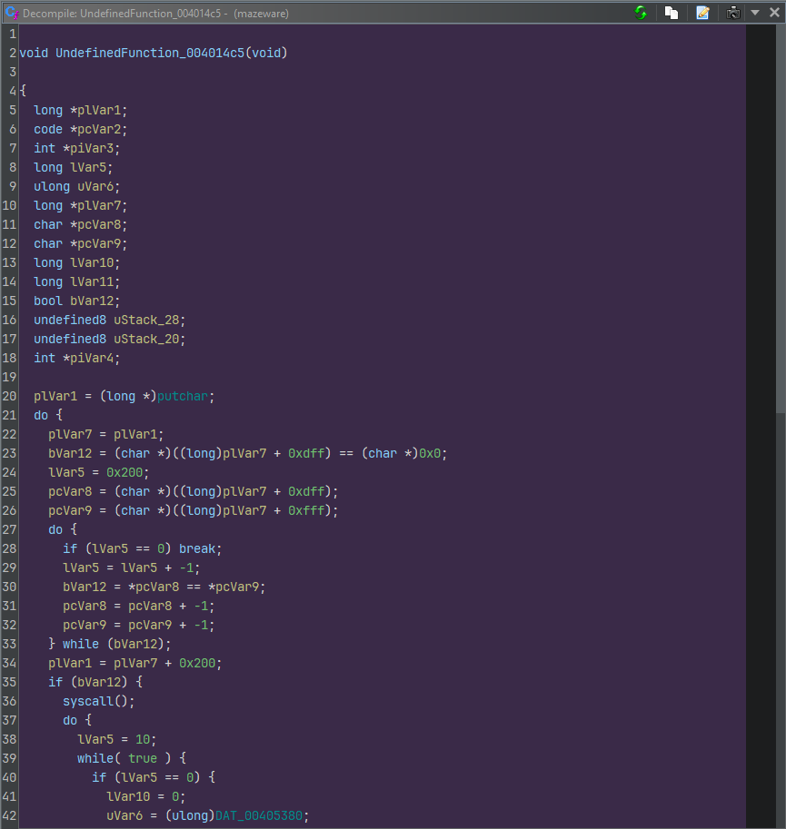

# Mazeware

Category: `rev`

Points: `1000`

Solves: 2

Description:

> finally... looks like a normal reversing challenge written in C... (or isit?)
> 
> ( ͡° ͜ʖ ͡°)
> 
> Author: Elma

**Note:** This is a pretty comprehensive writeup detailing almost all the steps I took to reach the flag. If some of the parts bore you feel free to skip around.

This writeup is also broken up into 4 parts for ease of navigation:

- [Mazeware](#mazeware)
  - [Part I: Playing the Game](#part-i-playing-the-game)
  - [Part II: More Than Meets the Eye](#part-ii-more-than-meets-the-eye)
    - [Part IIA: Just Beneath Plainsight](#part-iia-just-beneath-plainsight)
    - [Part IIB: Caught in the Act](#part-iib-caught-in-the-act)
    - [Part IIC: Forensic Investigation](#part-iic-forensic-investigation)
  - [Part III: Shellcode Train](#part-iii-shellcode-train)
    - [Part IIIA: Trojan Wrapper](#part-iiia-trojan-wrapper)
    - [Part IIIB: Logic Bomb](#part-iiib-logic-bomb)
    - [Part IIIC: Keylogger Maze...?](#part-iiic-keylogger-maze)
  - [Part IV: Home Stretch](#part-iv-home-stretch)

Thank you Elma for blessing us with this challenge!

---

## Part I: Playing the Game

We are given a binary to explore. Scrolling through the decompilation nothing immediately jumps out. In fact it is simple enough for me to describe each function here:

```c
__int64 __fastcall main(int a1, char **a2, char **a3)
{
  printf("%s", byte_4041C0);
  getchar();
  sub_4019E1();
  return 0LL;
}
```

The welcome screen. `byte_4041C0` points to the welcome banner:

```
⠀⠀⠀⠀⠀⠀⠀⠀⠀⠀⠀⠀⠀⠀⣀⠀⣘⣩⣅⣤⣤⣄⣠⠀⠀⠀⠀⠀⠀⠀⠀⠀⠀⠀⠀⠀⠀⠀⠀⠀⠀⠀⠀⠀⠀⠀⠀⠀
⠀⠀⠀⠀⠀⠀⠀⠀⠀⠀⠀⠀⠀⠄⢈⣻⣿⣿⢷⣾⣭⣯⣯⡳⣤⠀⠀⠀⠀⠀⠀⠀⠀⠀⠀⠀⠀⠀⠀⠀⠀⠀⠀⠀⠀⠀⠀⠀
⠀⠀⠀⠀⠀⠀⠀⠀⠀⠀⠀⠀⠀⠀⣧⠻⠿⡻⢿⠿⡾⣽⣿⣳⣧⡷⠀⠀⠀⠀⠀⠀⠀⠀⠀⠀⠀⠀⠀⠀⠀⠀⠀⠀⠀⠀⠀⠀
⠀⠀⠀⠀⠀⠀⠀⠀⠀⠀⠀⠈⢰⡶⢈⠐⡀⠀⠀⠁⠀⠀⠀⠈⢿⡽⠁⠀⠀⠀⠀⠀⠀⠀⠀⠀⠀⠀⠀⠀⠀⠀⠀⠀⠀⠀⠀⠀
⠀⠀⠀⠀⠀⠀⠀⠀⠀⠀⠀⠀⢫⢅⢠⣥⣐⡀⠀⠀⠀⠀⠀⠀⢸⢳⠀⠀⠀⠀⠀⠀⠀⠀⠀⠀⠀⠀⠀⠀⠀⠀⠀⠀⠀⠀⠀⠀
⠀⠀⠀⠀⠀⠀⠀⠀⠀⠀⠀⠠⠆⠡⠱⠒⠖⣙⠂⠈⠵⣖⡂⠄⢸⠉⠁⠀⠀⠀⠀⠀⠀⠀⠀⠀⠀⠀⠀⠀⠀⠀⠀⠀⠀⠀⠀⠀
⠀⠀⠀⠀⠀⠀⠀⠀⠀⠀⠀⢻⠆⠀⠰⡈⢆⣑⠂⠀⠀⠀⠀⠀⠏⡀⠀⠀⠀⠀⠀⠀⠀⠀⠀⠀⠀⠀⠀⠀⠀⠀⠀⠀⠀⠀⠀⠀
⠀⠀⠀⠀⠀⠀⠀⠀⠀⠀⠀⠀⢗⠀⠱⡈⢆⠙⠉⠃⠀⠀⠀⠀⠃⠁⠀⠀⠀COOK TOO MUCH⠀⠀⠀⠀⠀⠀
⠀⠀⠀⠀⠀⠀⠀⠀⠀⠀⠀⠀⠀⠦⡡⢘⠩⠯⠒⠀⠀⠀⢀⠐⠀⠀⠀⠀⠀AND YOU WILL⠀⠀⠀⠀⠀⠀⠀
⠀⠀⠀⠀⠀⠀⠀⠀⠀⠀⠀⠀⠀⡄⢔⡢⢡⡀⠀⠀⠀⠀⠀⠀⠀⠀⠀⠀⠀GET RICKED!!⠀⠀⠀⠀⠀⠀⠀
⠀⠀⠀⠀⠀⠀⠀⠀⠀⠀⠀⠀⠀⠁⢆⠸⡁⠋⠃⠁⠀⢀⢠⣄⠀⠀⠀⠀⠀⠀⠀⠀⠀⠀⠀⠀⠀⠀⠀⠀⠀⠀⠀⠀⠀⠀⠀⠀
⠀⠀⠀⠀⠀⠀⠀⠀⠀⠀⠀⠀⢰⡰⠌⣒⠡⠄⠀⢀⠔⠁⣸⣿⣷⣤⣀⡄⠀⠀⠀⠀⠀⠀⠀⠀⠀⠀⠀⠀⠀⠀⠀⠀⠀⠀⠀⠀
⠀⠀⠀⠀⠀⠀⠀⣐⣤⡄⠀⠀⠘⢚⣒⢂⠇⣜⠒⠉⠀⢀⣿⣿⣿⣿⣿⣿⣿⣷⣶⣶⣦⣔⣀⢄⠀⠀⠀⠀⠀⠀⠀⠀⠀⠀⠀⠀
⠀⡀⢀⢠⣤⣶⣿⣿⣿⡆⠀⠀⠐⡂⠌⠐⠝⠀⠀⠀⢀⣾⣿⣿⣿⣿⣿⣿⣿⣿⣿⣿⣿⣿⣿⣿⣷⣤⠀⠀⠀⠀⠀⠀⠀⠀⠀⠀
⢨⣶⣿⣿⣿⣿⣿⣿⣿⣿⣤⡶⢐⡑⣊⠀⡴⢤⣀⣀⣿⣿⣿⣿⣿⣿⣿⣿⣿⣿⣿⣿⣿⣿⣿⣿⣿⣷⠀⠀⠀⠀⠀⠀⠀⠀⠀⠀
⢸⣿⣿⣿⣿⣿⣿⣿⣿⣿⣿⡏⠀⠷⡈⠀⠶⢶⣰⣸⣿⣿⣿⣿⣿⣿⣿⣿⣿⣿⣿⣿⣿⣿⣿⣿⣿⣿⣆⠀⠀⠀⠀⠀⠀⠀⠀⠀
⢾⣿⣿⣿⣿⣿⣿⣿⣿⣿⣿⣯⣉⠑⠚⣙⡒⠒⠲⣾⣿⣿⣿⣿⣿⣿⣿⣿⣿⣿⣿⣿⣿⣿⣿⣿⣿⣿⣿⡁⠀⠀⠀⠀⠀⠀⠀⠀
⣸⣿⣿⣿⣿⣿⣿⣿⣿⣿⣿⡷⠶⠀⠀⠤⣬⣍⣹⣿⣿⣿⣿⣿⣿⣿⣿⣿⣿⣿⣿⣿⣿⣿⣿⣿⣿⣿⣿⣄⠀⠀⠀⠀⠀⠀⠀⠀
⣸⣿⣿⣿⣿⣿⣿⣿⣿⣿⣿⣛⣙⠀⢠⠲⠖⠶⣾⣿⣿⣿⣿⣿⣿⣿⣿⣿⣿⣿⣿⣿⣿⣿⣿⣿⣿⣿⣿⣿⡄⠀⠀⠀⠀⠀⠀⠀
⣿⣿⣿⣿⣿⣿⣿⣿⣿⣿⣿⣯⣭⣰⢘⣙⣛⣲⣿⣿⣿⣿⡿⡻⠿⠿⠿⠿⢿⣿⣿⣿⣿⣿⣿⣿⣿⣿⣿⣿⣿⣷⣦⡀⠀⠀⠀⠀
⢿⣿⣿⣿⣿⣿⣿⣿⣿⣿⣿⣷⠶⢾⡠⢤⣭⣽⣿⣿⣿⣿⡟⣱⠦⠄⠤⠐⡄⠹⣿⣿⣿⣿⣿⣿⣿⣿⣿⣿⣿⣿⣿⣿⣶⣤⡀⠀
⣾⣿⣿⣿⣿⣿⣿⣿⣿⣿⣿⣿⡛⣻⡕⠶⠶⣿⣿⣿⣿⣿⣿⣗⣎⠒⣀⠃⡐⢀⠙⣿⣿⣿⣿⣿⣿⣿⣿⣿⣿⣿⣿⣿⣿⣿⣷⠀
⢻⣿⣿⣿⣿⣿⣿⣿⣿⣿⣿⣿⣭⣹⣏⣛⣛⣿⣿⣿⣿⣿⣿⣿⣞⣍⣉⢉⠰⠀⠠⢹⣿⣿⣿⣿⣿⣿⣿⣿⣿⣿⣿⣿⣿⣿⣿⠅
⣽⣿⣿⣿⣿⣿⣿⣿⣿⣿⣿⣿⠶⢼⡧⢤⣽⣿⣿⣿⣿⣿⣿⣿⣿⣿⣿⣿⣯⣣⣡⣛⣿⣿⣿⣿⣿⣿⣿⣿⣿⣿⣿⣿⣿⣿⣿⣅
⡿⣷⣽⡿⠛⠋⠉⣉⡐⠶⣾⣾⣟⣻⡕⠶⣾⣿⣿⣿⣿⣿⣿⣿⣿⣿⣿⣿⣿⣿⣿⣿⣿⣿⣿⣹⣫⣿⣿⣿⣿⣿⣿⣿⣿⣿⣿⠗
⢸⣿⣟⣥⡶⢘⡻⢶⡹⣛⣼⣿⣯⣽⢯⣙⣿⣿⣿⣿⣿⣿⣿⣿⣿⣿⣿⣿⣿⣿⣿⣿⣿⣿⣿⠿⠿⣿⣿⣿⣿⣿⣿⡿⠿⠟⠁⠀
⠘⢟⣾⣿⣿⣚⠷⣳⢳⣫⣽⣿⣛⣾⡷⢾⣿⣿⣿⣿⣿⣿⣿⣿⣿⣿⣿⣿⣿⣿⣿⣿⣿⣿⣿⣆⠀⠀⠁⠀⠈⠀⠀⠀⠀⠀⠀⠀
⠀⠀⠙⢋⣿⣿⣯⣙⣯⣵⣿⣿⣯⣽⣟⣻⣿⣿⣿⣿⣿⣿⣿⣿⣿⣿⣿⣿⣿⣿⣿⣿⣿⣿⣿⡯⠀⠀⠀⠀⠀⠀⠀⠀⠀⠀⠀⠀
⠀⠀⠀⠀⠉⠛⢻⠟⣿⣿⣿⣿⣿⣿⣿⣿⣿⣿⣿⣿⣿⣿⣿⣿⣿⣿⣿⣿⣿⣿⣿⣿⣿⣿⣿⣿⡀⠀⠀⠀⠀⠀⠀⠀⠀⠀⠀⠀
⠀⠀⠀⠀⠀⠀⠀⢸⣿⣿⣿⣟⡟⣿⣿⣿⣿⣿⣿⣿⣿⣿⣿⣿⣿⣿⣿⣿⣿⣿⣿⣿⣿⣿⣿⣿⡄⠀⠀⠀⠀⠀⠀⠀⠀⠀⠀⠀
⠀⠀⠀⠀⠀⠀⣡⣿⣿⣿⣿⡗⣮⢻⣽⣿⣿⣿⣿⣿⣿⣿⣿⣿⣿⣿⣿⣿⣿⣿⣿⣿⣿⣿⣿⣿⣷⠀⠀⠀⠀⠀⠀⠀⠀⠀⠀⠀

     PRESS ENTER TO BEGIN YOUR ADVENTURE!
```

And `sub_4019E1` is of course our game loop. Below is how the game looks like, after pressing enter:

```
        W A S D to navigate
        ###########
        #^#       #
        # ### # ###
        # #   #   #
        # ### ### #
        #      #F #
        ###########
```

```c
void sub_4019E1()
{
  unsigned __int8 v0; // [rsp+5h] [rbp-Bh]
  unsigned __int8 v1; // [rsp+6h] [rbp-Ah]
  unsigned __int8 v2; // [rsp+7h] [rbp-9h]
  unsigned __int8 v3; // [rsp+7h] [rbp-9h]
  char v4; // [rsp+7h] [rbp-9h]
  int i; // [rsp+8h] [rbp-8h]

  for ( i = 0; i <= 2; i = 4 )
  {
    do
    {
      v0 = (unsigned __int16)sub_401704((__int64)*(&off_4058B0 + i)) >> 8;
      v1 = sub_401704((__int64)*(&off_4058B0 + i)) & 0xF;
      sub_4017CD((char *)*(&off_4058B0 + i), v0, v1);
      do
      {
        v2 = getchar();
        if ( v2 > 0x60u )
          v2 -= 32;
        if ( v2 > 0x40u )
        {
          v3 = v2 - 65;
          if ( v3 )
          {
            if ( v3 / 3u - v3 % 3u == 1 )
            {
              if ( sub_40173D((__int64)*(&off_4058B0 + i), v0 + 1, v1) )
                ++v0;
            }
            else
            {
              v4 = v3 - 18;
              if ( v4 )
              {
                if ( v4 == 4 && sub_40173D((__int64)*(&off_4058B0 + i), v0, v1 - 1) )
                  --v1;
              }
              else if ( sub_40173D((__int64)*(&off_4058B0 + i), v0, v1 + 1) )
              {
                ++v1;
              }
            }
          }
          else if ( sub_40173D((__int64)*(&off_4058B0 + i), v0 - 1, v1) )
          {
            --v0;
          }
        }
      }
      while ( !(unsigned int)sub_4017CD((char *)*(&off_4058B0 + i), v0, v1) );
      printf("\n\tNext level? Enter to continue...");
      getchar();
      getchar();
      ++i;
    }
    while ( i != 3 );
    sub_40147C();
  }
}
```

The outermost `for` loop

```c
  for ( i = 0; i <= 2; i = 4 )
```

seems completely unnecessary as it is implied the block only gets accessed exactly once. But other than that the control flow is pretty intuitive, especially with the contextual clue from the string in the `printf` that the outer `do`-`while` loop makes up the 3 levels of the maze while the inner `do`-`while` loop prints the maze level until the win condition for the level is reached.

The `v2` and `v3` `if` branches should also be pretty obvious to anyone who has done 2D terminal game reversing, with

```c
        if ( v2 > 0x60u )
          v2 -= 32;
        if ( v2 > 0x40u )
```

signalling the program does not distinguish upper and lower case input, as well as 4 separate calls to the same function with only slightly differing arguments

```c
sub_40173D((__int64)*(&off_4058B0 + i), v0 + 1, v1)
sub_40173D((__int64)*(&off_4058B0 + i), v0, v1 - 1)
sub_40173D((__int64)*(&off_4058B0 + i), v0, v1 + 1)
sub_40173D((__int64)*(&off_4058B0 + i), v0 - 1, v1)
```

instantly jumping out that `v0` and `v1` should represent the `x` and `y` coordinates. By extension `off_4058B0` shall be the level data, and in the context of

```c
              if ( sub_40173D((__int64)*(&off_4058B0 + i), v0 + 1, v1) )
                ++v0;
```

it is sufficiently clear (without even analysing the function itself) that `sub_40173D` checks for valid move (since it is a maze game). Matching the varied calls to the corresponding input tells us that `v0` is `x` and `v1` is `y`.

Note that each of the interpretations can be independently verified by cracking the functions open and scrutinising what they do, but for the sake of this writeup it shall be omitted.

But just as an example, `sub_4017CD`, which controls the inner `do`-`while` loop, looks like this:

```c
__int64 __fastcall sub_4017CD(char *a1, int a2, int a3)
{
  int v5; // [rsp+4h] [rbp-3Ch]
  int v6; // [rsp+14h] [rbp-2Ch]
  int i; // [rsp+18h] [rbp-28h]
  int v8; // [rsp+1Ch] [rbp-24h]
  unsigned int v9; // [rsp+20h] [rbp-20h]
  int j; // [rsp+24h] [rbp-1Ch]
  int v11; // [rsp+30h] [rbp-10h]
  int v12; // [rsp+38h] [rbp-8h]

  v5 = a2;
  puts("\x1B[H\x1B[2J\n\n");
  puts("\tW A S D to navigate");
  if ( a2 == -1 && a3 == -1 )
  {
    a3 = a1[1];
    v5 = a1[3];
  }
  v11 = a1[4];
  v6 = 0;
  for ( i = 0; i < v11; ++i )
    v6 += a1[5];
  v12 = v11 * *a1 + a1[2];
  v8 = 0;
  v9 = 0;
  putchar(9); // \t, or left padding
  for ( j = 0; j < v6; ++j )
  {
    if ( v8 == v11 * a3 + v5 )
    {
      if ( v8 == v12 )
        v9 = 1;
      putchar(94); // ^ i.e. player
    }
    else if ( v8 == v12 )
    {
      putchar(70); // F i.e. flag
    }
    else if ( (((int)(unsigned __int8)a1[v8 / 8 + 6] >> (7 - v8 % 8)) & 1) != 0 )
    {
      putchar(35); // # i.e. wall
    }
    else
    {
      putchar(32); // ' ' i.e. space
    }
    if ( !(++v8 % v11) )
      printf("\n\t"); // newline + left padding
  }
  return v9;
}
```

Matching up the characters that are displayed by `putchar` we see that it pretty much matches what we would expect to see just by playing the game, so we can know that it does what we expect it to do and confirms our previous educated guesses. ~~(Right...?)~~

Another thing is that a relevant result is also actually returned in the function:

```c
  v9 = 0;
// ...
      if ( v8 == v12 )
        v9 = 1;
// ...
  return v9;
```

This means that the function returns `true` if the player has the same coordinates as the flag, i.e. we have cleared the level.

Finally, it is pretty obvious at this point that `sub_40147C` outside the two `do`-`while` loops of the game function will lead us to victory. But before that, based on how simple this game seems to be, how about we just... play the game properly?

```
        W A S D to navigate
        ###########
        # #       #
        # ### # ###
        # #   #   #
        # ### ### #
        #      #^ #
        ###########

        Next level? Enter to continue..
```

```
        W A S D to navigate
        #########################################
        #      ^# #   #     #   #         #     #
        # ####### # ### ##### # # # # # ### ### #
        #     #   #   #   #   #   # # # # #   # #
        # # ### # # ### ##### ### ####### # #####
        # # # # # #     #   # #   #         #   #
        # # # # ### ### # ### ### # ########### #
        # #     #     #     #   # # #       # # #
        ##### ####### # ### ### ### ##### # # # #
        #       #     # #         # # # # #     #
        # ####### # ##### ######### # # # ### ###
        #     #   # #   #     # #       # # # #F#
        # ### ####### ##### ### # # ####### # # #
        # #   #   #     # # # #   #   #   #   # #
        # # # ### ### ### # # ### ### # ### ### #
        # # #   #   #   # #   # #   #     #   # #
        # ### ### ##### # ### # # ##### ### ### #
        # # #       #     #     #   #     #   # #
        # # # ### # ### # # ### ### ### ### ### #
        # #     # #     #     #     #           #
        #########################################
```

Okay...

```
        W A S D to navigate
        #################
        # ^             #
        #               #
        #               #
        #         #######
        #         #     #
        #         #  F  #
        #         #     #
        #################
```

Never mind then.

But wait! We are professional hackers :)

```
gdb mazeware
...
gef➤  r
```

We play the game normally until the last level, where we break out and set a breakpoint to the call to the draw-and-check-win function (which is the inner `do`-`while` loop condition):

```
        W A S D to navigate
        #################
        # ^             #
        #               #
        #               #
        #         #######
        #         #     #
        #         #  F  #
        #         #     #
        #################
        ^C
Program received signal SIGINT, Interrupt.
...
gef➤  b *0x401bf6
gef➤  c
a
```

```
●→   0x401bf6                  call   0x4017cd
...
gef➤  ni
```

Here the function will of course return `0x0` as we have not reached the flag yet, but we pretend it did:

```
$rax   : 0x0
...
gef➤  set $rax=0x1

gef➤  c

Continuing.

        Next level? Enter to continue...
https://www.youtube.com/watch?v=dQw4w9WgXcQ
```

I guess we got to the end...? (By the way if you somehow don't recognise the link feel free to click [here](https://www.youtube.com/watch?v=dQw4w9WgXcQ))

Note that this method is sometimes risky as the win function may only return the desired result if legitimate steps are taken to get there (anti-cheat essentially, for instance the `x` and `y` values must be correct etc.). But long story short this was not the case for this challenge, you can crack the win function open if you want.

---

## Part II: More Than Meets the Eye

### Part IIA: Just Beneath Plainsight

Actually never mind, I'll just do it for you:

```c
int sub_40147C()
{
  char *s; // [rsp+8h] [rbp-8h]

  s = (char *)malloc(0x2CuLL);
  sub_4013F5(byte_405340, &unk_4040C0, s);
  return puts(s);
}
```

```c
__int64 __fastcall sub_4013F5(__int64 a1, __int64 a2, __int64 a3)
{
  char v5[264]; // [rsp+20h] [rbp-110h] BYREF
  unsigned __int64 v6; // [rsp+128h] [rbp-8h]

  v6 = __readfsqword(0x28u);
  sub_40122E(a1, v5);
  sub_4012FB(v5, a2, a3);
  return 0LL;
}
```

```c
__int64 __fastcall sub_40122E(const char *a1, __int64 a2)
{
  unsigned int v3; // [rsp+10h] [rbp-10h]
  int i; // [rsp+14h] [rbp-Ch]
  int j; // [rsp+18h] [rbp-8h]
  int v6; // [rsp+1Ch] [rbp-4h]

  v6 = strlen(a1);
  LOBYTE(v3) = 0;
  for ( i = 0; i <= 255; ++i )
    *(_BYTE *)(i + a2) = i;
  for ( j = 0; j <= 255; ++j )
  {
    v3 = (unsigned __int8)(*(_BYTE *)(j + a2) + v3 + a1[j % v6]);
    sub_4011F6(j + a2, a2 + v3);
  }
  return 0LL;
}

__int64 __fastcall sub_4012FB(__int64 a1, const char *a2, __int64 a3)
{
  unsigned int v5; // [rsp+24h] [rbp-1Ch]
  unsigned int v6; // [rsp+28h] [rbp-18h]
  size_t v7; // [rsp+30h] [rbp-10h]
  size_t v8; // [rsp+38h] [rbp-8h]

  LOBYTE(v5) = 0;
  LOBYTE(v6) = 0;
  v7 = 0LL;
  v8 = strlen(a2);
  while ( v7 < v8 )
  {
    v5 = (unsigned __int8)(v5 + 1);
    v6 = (unsigned __int8)(*(_BYTE *)(v5 + a1) + v6);
    sub_4011F6((char *)(v5 + a1), (char *)(a1 + v6));
    *(_BYTE *)(a3 + v7) = *(_BYTE *)((unsigned __int8)(*(_BYTE *)(v5 + a1) + *(_BYTE *)(v6 + a1)) + a1) ^ a2[v7];
    ++v7;
  }
  return 0LL;
}

/*
 * simple byte swap function, will not elaborate further
 */
char *__fastcall sub_4011F6(char *a1, char *a2)
{
  char *result; // rax
  char v3; // [rsp+1Ch] [rbp-4h]

  v3 = *a1;
  *a1 = *a2;
  result = a2;
  *a2 = v3;
  return result;
}
```

In case you are unaware, this is apparently the [`RC4` algorithm](https://en.wikipedia.org/wiki/RC4). (I should probably get this algorithm into my pattern recognition database, it has popped up enough times already HAHA)

Either way, whatever it is, we know that the function applies some algorithm on two strings in the binary and outputs the result (the rickroll URL above). Rev chal spidey-senses are now tingling telling us that the strings must be tampered somewhere along the way in order to switch to outputting the flag at the end, and this is especially likely given that they are both stored in `.data`.

The first thing to do is hence to check out their cross-references.

```
.data:00000000004040C0 unk_4040C0      db  8Bh                 ; DATA XREF: sub_40147C+21↑o
```

Okay, looks all good.

```
.data:0000000000405340 ; _BYTE byte_405340[64]
.data:0000000000405340 byte_405340     db 44h, 55h, 62h, 1Dh, 5Dh, 46h, 0F9h, 2Ch, 32h, 5Eh, 62h
.data:0000000000405340                                         ; DATA XREF: sub_40147C+2B↑o
.data:0000000000405340                                         ; sub_4014C5+AE↑o
```

Ooh, something's up, isn't it? Unknown function at `0x4014c5`?

```
.text:00000000004014C5 ; void sub_4014C5()
.text:00000000004014C5 sub_4014C5      proc near               ; DATA XREF: sub_4014C5+156↓o
.text:00000000004014C5                                         ; .data:00000000004058D8↓o
```

Perhaps we just keep backtracking until we reach somewhere familiar.

```
.data:00000000004058D0 off_4058D0      dq offset loc_4016FE    ; DATA XREF: sub_4017CD+204↑o
.data:00000000004058D8                 dq offset sub_4014C5
```

```
.text:00000000004019C5 loc_4019C5:                             ; CODE XREF: sub_4017CD+126↑j
.text:00000000004019C5                 mov     eax, [rbp+var_1C]
.text:00000000004019C8                 cmp     eax, [rbp+var_2C]
.text:00000000004019CB                 jl      loc_4018F8
.text:00000000004019D1                 mov     rsp, offset off_4058D0
.text:00000000004019D8                 mov     eax, [rbp+var_20]
.text:00000000004019DB                 retn
.text:00000000004019DB sub_4017CD      endp
.text:00000000004019DB
.text:00000000004019DC ; ---------------------------------------------------------------------------
.text:00000000004019DC                 mov     eax, [rbp-20h]
.text:00000000004019DF                 leave
.text:00000000004019E0                 retn
.text:00000000004019E0 ; } // starts at 4017CD
```

Here we are! If you forgot, `sub_4017CD` is the draw-and-check-win function.

We see that a `retn` has been secretly sneaked in at `4019DB`, which perhaps IDA somehow didn't quite recognise?

Either way, this basically means that at the end of the draw-and-check-win function (which is actually first called before the first iteration of the inner `do`-`while` loop), the program jumps to a secret shadow function that tampers with our stored string.

Why do I call it a shadow function? Well, it's because I first analysed this on Ghidra (IDK why but IDA Free decompilation didn't want to work at first), and all Ghidra rev players would probably understand the ecstacy upon seeing the purple decompilation background:



---

### Part IIB: Caught in the Act

Realistically, this process of reaching our shadow function can easily been disrupted at multiple stages. For example our function could have referenced the string *indirectly*. Or perhaps the true win function could have had nothing to do with the fake win function at all. It would have made the discovery process much more difficult.

But ultimately, like a forensic scene, there are multiple clues we could perhaps piece together to reach our final conclusion. The above `XREF` is just one of them.

For example, where we broke out of the game while trying to hack it, if we just ran a simple `vmmap`:

```
gef➤  vmmap
[ Legend:  Code | Heap | Stack ]
Start              End                Offset             Perm Path
0x000000003ff000 0x00000000400000 0x00000000000000 rw- [REDACTED]/mazeware
0x00000000400000 0x00000000401000 0x00000000001000 r-- [REDACTED]/mazeware
0x00000000401000 0x00000000402000 0x00000000002000 r-x [REDACTED]/mazeware
0x00000000402000 0x00000000403000 0x00000000003000 r-- [REDACTED]/mazeware
0x00000000403000 0x00000000404000 0x00000000003000 r-- [REDACTED]/mazeware
0x00000000404000 0x00000000406000 0x00000000004000 rw- [REDACTED]/mazeware
0x00000000406000 0x00000000427000 0x00000000000000 rw- [heap]
0x007ffff7d8f000 0x007ffff7d92000 0x00000000000000 rw-
0x007ffff7d92000 0x007ffff7dba000 0x00000000000000 r-- [REDACTED]/lib/libc.so.6
0x007ffff7dba000 0x007ffff7f4e000 0x00000000028000 r-x [REDACTED]/lib/libc.so.6
0x007ffff7f4e000 0x007ffff7f4f000 0x000000001bc000 r-x [REDACTED]/lib/libc.so.6
0x007ffff7f4f000 0x007ffff7fa7000 0x000000001bd000 r-- [REDACTED]/lib/libc.so.6
0x007ffff7fa7000 0x007ffff7fa8000 0x00000000215000 --- [REDACTED]/lib/libc.so.6
0x007ffff7fa8000 0x007ffff7fac000 0x00000000215000 r-- [REDACTED]/lib/libc.so.6
0x007ffff7fac000 0x007ffff7fae000 0x00000000219000 rw- [REDACTED]/lib/libc.so.6
0x007ffff7fae000 0x007ffff7fbd000 0x00000000000000 rw-
0x007ffff7fbd000 0x007ffff7fc1000 0x00000000000000 r-- [vvar]
0x007ffff7fc1000 0x007ffff7fc3000 0x00000000000000 r-x [vdso]
0x007ffff7fc3000 0x007ffff7fc5000 0x00000000000000 r-- [REDACTED]/lib/ld-linux-x86-64.so.2
0x007ffff7fc5000 0x007ffff7fef000 0x00000000002000 r-x [REDACTED]/lib/ld-linux-x86-64.so.2
0x007ffff7fef000 0x007ffff7ffa000 0x0000000002c000 r-- [REDACTED]/lib/ld-linux-x86-64.so.2
0x007ffff7ffb000 0x007ffff7ffd000 0x00000000037000 r-- [REDACTED]/lib/ld-linux-x86-64.so.2
0x007ffff7ffd000 0x007ffff7fff000 0x00000000039000 rw- [REDACTED]/lib/ld-linux-x86-64.so.2
0x007ffffffde000 0x007ffffffff000 0x00000000000000 rw- [stack]
```

It is much more obvious with syntax highlighting, but suspiciously there are two contiguous `r-x` segments inside `libc`, which we can verify did not exist at the start of the program.

```
0x007ffff7dba000 0x007ffff7f4e000 0x00000000028000 r-x [REDACTED]/lib/libc.so.6
0x007ffff7f4e000 0x007ffff7f4f000 0x000000001bc000 r-x [REDACTED]/lib/libc.so.6
```

Could the memory have been tampered?

```
gef➤  watch *(char [4096]*)0x7ffff7f4e000
Watchpoint 1: *(char [4096]*)0x7ffff7f4e000
gef➤  r
```

```
$r8    : 0x0
$r9    : 0x0
$r10   : 0x007ffff7f4e350  →  0x00000000000000c3
...
     0x40158a                  mov    BYTE PTR [r10+r8*1], al
 →   0x40158e                  inc    rcx
...
gef➤  vmmap
...
0x007ffff7dba000 0x007ffff7f4e000 0x00000000028000 r-x [REDACTED]/lib/libc.so.6
0x007ffff7f4e000 0x007ffff7f4f000 0x000000001bc000 rwx [REDACTED]/lib/libc.so.6
...
```

And `0x40158a` is inside the shadow function.

**Important note:** The challenge was actually patched halfway through the CTF:

> 1. we have updated the dist file for mazeware to include libc and ld, to avoid unintentional behaviour. the solution has not changed.

where the binary links to a specific provided `libc` instead of the default system one. Before the patch, on some `libc` versions (like mine), the program crashes at the start of the second maze within the tampered address range, immediately drawing suspicion and hence making detection easier.

(To be fair, this is before the much more giveaway hint was released, so)

---

### Part IIC: Forensic Investigation

Above are the traces I've caught during my solve, but there are other traces left behind as well:

1. Running `strace` on the binary, at the first maze:

```
write(1, "\tW A S D to navigate\n", 21  W A S D to navigate
) = 21
write(1, "\t###########\n", 13  ###########
)         = 13
write(1, "\t#^#       #\n", 13  #^#       #
)         = 13
write(1, "\t# ### # ###\n", 13  # ### # ###
)         = 13
write(1, "\t# #   #   #\n", 13  # #   #   #
)         = 13
write(1, "\t# ### ### #\n", 13  # ### ### #
)         = 13
write(1, "\t#      #F #\n", 13  #      #F #
)         = 13
write(1, "\t###########\n", 13  ###########
)         = 13
mprotect(0x7fbf7b6b9000, 4096, PROT_READ|PROT_WRITE|PROT_EXEC) = 0
mprotect(0x7fbf7b6b9000, 4096, PROT_READ|PROT_EXEC) = 0
mprotect(0x401000, 4096, PROT_READ|PROT_WRITE|PROT_EXEC) = 0
mprotect(0x401000, 4096, PROT_READ|PROT_EXEC) = 0
```

These `mprotect`s are completely out of the ordinary and can be immediately investigated further (see the part above).

2. If you break into the debugger right at the start of the second maze you could notice a suspicious unlabeled function (#3) between the ones in the binary and the libc calls:

```
[#0] 0x7ffff7ea67e2 → read()
[#1] 0x7ffff7e1ec36 → _IO_file_underflow()
[#2] 0x7ffff7e1fd96 → _IO_default_uflow()
[#3] 0x7ffff7f4e50d → mov rbx, rax
[#4] 0x401a7c → mov BYTE PTR [rbp-0x9], al
[#5] 0x401d05 → mov eax, 0x0
[#6] 0x7ffff7dbbd90 → mov edi, eax
[#7] 0x7ffff7dbbe40 → __libc_start_main()
[#8] 0x401135 → hlt
```

The function is indeed within the tampered address range. Also further investigation tells us that the instructions located there has been modified since the start of the program.

3. While investigating one of the global variables used in the `RC4` algorithm we notice a suspicious and large nonsensical global variable right below that hasn't seem to be discovered by us yet:

```
.data:0000000000405380 ; unsigned __int16 word_405380[664]
.data:0000000000405380 word_405380     dw 1B5h, 887h, 0E189h, 0AD05h, 0DF03h, 1696h, 9FA5h, 95BFh
.data:0000000000405380                                         ; DATA XREF: sub_4014C5+94↑o
.data:0000000000405390                 dw 9EF6h, 0CA2Fh, 29DDh, 0F368h, 0D812h, 2EDEh, 0A4C1h
...
.data:000000000040552A                 dw 997Ah, 5AA0h, 95B5h, 91F6h, 7C62h, 9729h, 22h, 4 dup(0)

.data:0000000000405540                 dw 362h, 0FFA1h, 52F8h, 895Dh, 6363h, 9132h, 7DE8h, 0D50h
.data:0000000000405550                 dw 2740h, 88FBh, 5B07h, 7CCDh, 6515h, 7AFCh, 655Ch, 3412h
...
.data:000000000040589C                 dw 45B4h, 0B255h, 5A36h, 8731h, 6 dup(0)
```

And guess what, it `XREF`s into the shadow function.

---

## Part III: Shellcode Train

### Part IIIA: Trojan Wrapper

Let us finally explore the shadow function.

```c
void sub_4014C5()
{
  void (*v0)(); // rbx
  _BYTE *v1; // rdi
  bool v2; // zf
  _BYTE *v3; // rsi
  __int64 v4; // rcx
  _QWORD *v5; // rbx
  __int64 i; // r9
  _QWORD *v7; // r10
  __int64 v8; // r8
  char *v9; // rdi
  __int64 v10; // rcx
  __int64 v11; // r9
  void *v12; // r10
  void (*v13)(); // rax
  __int64 (__fastcall *v14)(char *, int, int); // rax
  __int64 j; // rcx
  _QWORD v16[3]; // [rsp+0h] [rbp-28h]
  void (*v17)(); // [rsp+18h] [rbp-10h]

  v0 = (void (*)())((unsigned __int64)&printf & 0xFFFFFFFFFFFFF000LL);
  do
  {
    v0 = (void (*)())((char *)v0 + 4096);
    v1 = (char *)v0 - 1;
    v3 = (char *)v0 - 513;
    v2 = v0 == (void (*)())513;
    v4 = 512LL;
    do
    {
      if ( !v4 )
        break;
      v2 = *v3-- == *v1--;
      --v4;
    }
    while ( v2 );
  }
  while ( !v2 );
  __asm { syscall; LINUX - }
  v17 = v0;
  v5 = (_QWORD *)((char *)v0 - 4096);
  while ( 1 )
  {
    for ( i = 10LL; ; --i )
    {
      if ( !i )
      {
        v7 = v5 - 18;
        v8 = 0LL;
        v9 = (char *)&word_405380[1] + word_405380[0];
        v10 = -(__int64)word_405380[0];
        v11 = 0LL;
        while ( 1 )
        {
          *((_BYTE *)v7 + v8++) = byte_405340[v11] ^ v9[v10++];
          if ( ++v11 == 32 )
            v11 = 0LL;
          if ( !v10 )
          {
            *(_QWORD *)((char *)v7 + 78) = &getchar;
            __asm { syscall; LINUX - }
            v12 = (char *)v7 + 41;
            off_404040 = v12;
            __asm { syscall; LINUX - sys_mprotect }
            v13 = sub_4014C5;
            v17 = sub_4014C5;
            do
              v13 = (void (*)())((char *)v13 + 1);
            while ( *(_DWORD *)v13 != -98693133 );
            v16[2] = (char *)v13 - (char *)sub_4014C5;
            v14 = sub_4017CD;
            do
              v14 = (__int64 (__fastcall *)(char *, int, int))((char *)v14 + 1);
            while ( (*(_DWORD *)v14 ^ 0xDEADBEEF) != 491649892 );
            v16[1] = 15LL;
            v16[0] = 0x52C89480A000000LL;
            for ( j = 0LL; ; ++j )
            {
              *((_BYTE *)v14 + j) ^= *((_BYTE *)v16 + j);
              if ( j == 9 )
                break;
            }
            *(_QWORD *)((char *)v14 - 7) = 0x8B90909090909090LL;
            *(_BYTE *)v17 = 0;
            __asm { retn }
          }
        }
      }
      v5 += 2;
      if ( *v5 )
        break;
    }
  }
}
```

To be honest I found the decompilation annoying to read so I went to read the assembly instead. (Perhaps also honouring the author who crafted the entire remaining portion of the challenge by hand o7)

Firstly some introduction. There is a snippet commonly found in subsequent shellcodes:

```asm
mov     rax, 1
shl     rax, 3
sub     rax, 0FFFFFFFFFFFFFFFEh
mov     rdi, rbx
sub     rdi, 1000h
mov     rsi, 1000h
mov     rdx, 7
syscall
```

with `mov     rdx, 5`, they make up the `mprotect` calls (`rax = 0b1010`) that allow shellcode to be constantly loaded and unloaded beneath detection. After it is used up, each shellcode loads in its subsequent chunk of shellcode and also deletes itself in the process, forming a shellcode train. This is also why `mprotect` is run on the binary portion of the memory and why the shadow function is only run once despite it being hooked to the draw-and-check-win function. We will see it in action later.

Let's start from the beginning:

```asm
sub_4014C5 proc near

var_28= byte ptr -28h
anonymous_0= qword ptr -10h

push    rdi
mov     rbx, ds:off_404038
and     rbx, 0FFFFFFFFFFFFF000h

loc_4014D5:
add     rbx, 1000h
mov     rdi, rbx
sub     rdi, 1
mov     rsi, rdi
sub     rsi, 200h
mov     rcx, 200h
std
repe cmpsb
jnz     short loc_4014D5
```

This seems that the shellcode is attempting to locate a suitable location to home itself in. Basically the last `0x400` bytes of each page were compared (as two strings of length `0x200`) until they are the same. Probably an interesting approach to find a `null` region (don't fully understand).

```asm
mov     rax, 1
shl     rax, 3
sub     rax, 0FFFFFFFFFFFFFFFEh
mov     rdi, rbx
sub     rdi, 1000h
mov     rsi, 1000h
mov     rdx, 7
syscall                 ; LINUX -
push    rbx
sub     rbx, 1000h
```

Once found, the page is converted to `rwx`, the location is saved (on the stack), and the pointer now points to the start (instead of end) of the page.

Now we enter a more interesting loop, the graph of which was generated in IDA in an extremely ugly way:

```asm
loc_40152A:
mov     r9, 0Ah

loc_401531:
test    r9, r9
jz      short loc_401547

add     rbx, 10h
mov     rax, [rbx]
test    rax, rax
jnz     short loc_40152A

dec     r9
jmp     short loc_401531
```

The program basically tries to find 10 consecutive blocks (owords) of `0x0` (only the starting qword is checked though). If any starting qword is not `0x0` in the process the loop restarts from the beginning.

Exiting the loop:

```asm
loc_401547:
mov     r10, rbx
sub     r10, 90h
mov     r15, ds:off_404040
lea     rdi, word_405380
xor     rcx, rcx
mov     r8, rcx
mov     cx, [rdi]
add     rdi, rcx
inc     rdi
inc     rdi
lea     rsi, byte_405340
neg     rcx
xor     r9, r9
```

Firstly, the start of the mini `null` region and the `GOT` entry for `getchar` are saved in `r10` and `r15` respectively.

Next, see point 3 of [Part IIC](#part-iic-idk2). Here the first word (saved in `rcx`) seems to be treated as the size of the data, with `rdi` pointing to the end of the data. `rsi` in turn points to what seems like a key (as mentioned, used in the `RC4` algorithm).

Now another loop:

```asm
loc_401581:
mov     al, [rdi+rcx]
mov     dl, [rsi+r9]
xor     al, dl
mov     [r10+r8], al
inc     rcx
inc     r8
inc     r9
cmp     r9, 20h ; ' '
jnz     short loc_4015A4

mov     r9, 0

loc_4015A4:
test    rcx, rcx
jnz     short loc_401581
```

The loop counter is quite interesting, but ltimately the bytes still get iterated in the standard fashion.

```python
for rcx in range(-len(DATA), 0):
    cur = DATA[len(DATA)+rcx]
    # ...
```

`r8` and `r9` iterate over `rsi` (the key) and `r10` (the target memory region) respectively. `r9` is of course modulo-treated with the length of the key. But other than that we can see that this is but a simple `xor` decryption to get our next shellcode.

We can try looking at it directly in IDA, but for some reason even the disassembly is incredibly disgusting, so I gave up and explored it inside GDB instead (but this will be for later).

```asm
mov     [r10+4Eh], r15
pop     rbx

mov     rax, 1
shl     rax, 3
sub     rax, 0FFFFFFFFFFFFFFFEh
mov     rdi, rbx
sub     rdi, 1000h
mov     rsi, 1000h
mov     rdx, 5
syscall                 ; LINUX -

add     r10, 29h ; ')'
mov     ds:off_404040, r10
```

This hooks the decrypted shellcode to the `getchar` function, by making the `getchar` call jump to the shellcode (`r10+0x29`) and allowing the shellcode (`r10+0x4e`) jump to `getchar` afterwards.

At the same time the page gets closed off from writing (`r-x`) to avoid suspicion.

The rest of the shellcode focuses on removing itself from the binary, since a new shellcode is hooked to a different function and we don't want this particular shellcode to run anymore. But I would not detail it here.

```asm
sub     r10, 22h ; '"'
push    r10
retn
sub_4014C5 endp ; sp-analysis failed
```

Near the end, we jump to a specific offset in the new shellcode. As mentioned we will explore the new shellcode in GDB instead:

```
gef➤  b *0x4016fd
Breakpoint 1 at 0x4016fd
gef➤  r
...
───────────────────────────────────────────────────────────────────────────────────────────────────────────────────────────────────────────────────────────────────────────────────────────────────────────────────────── code:x86:64 ────
     0x4016f6                  cld
     0x4016f7                  sub    r10, 0x22
     0x4016fb                  push   r10
●→   0x4016fd                  ret
   ↳  0x7ffff7f4e357                  rep    movs BYTE PTR es:[rdi], BYTE PTR ds:[rsi]
      0x7ffff7f4e359                  mov    rax, 0xa
      0x7ffff7f4e360                  and    rdi, 0xfff000
      0x7ffff7f4e367                  mov    rsi, 0x1000
      0x7ffff7f4e36e                  mov    rdx, 0x5
      0x7ffff7f4e375                  syscall
...
gef➤  x/6i 0x7ffff7f4e350
   0x7ffff7f4e350:      ret
   0x7ffff7f4e351:      pop    rbp
   0x7ffff7f4e352:      jmp    0x7ffff7f4e350
   0x7ffff7f4e354:      pop    rax
   0x7ffff7f4e355:      jmp    0x7ffff7f4e351
   0x7ffff7f4e357:      rep movs BYTE PTR es:[rdi],BYTE PTR ds:[rsi]
   0x7ffff7f4e359:      mov    rax,0xa
   0x7ffff7f4e360:      and    rdi,0xfff000
   0x7ffff7f4e367:      mov    rsi,0x1000
   0x7ffff7f4e36e:      mov    rdx,0x5
   0x7ffff7f4e375:      syscall
   0x7ffff7f4e377:      jmp    0x7ffff7f4e354
```

Honestly not much here also, just a continuation of the shellcode wipe and closing off `.text` from writes. The program then returns to normal execution and the injection is complete.

---

### Part IIIB: Logic Bomb

Remember the `GOT` modification from above?

```
gef➤  x/gx 0x404040
0x404040 <getchar@got.plt>:     0x00007ffff7f4e379
```

This points to the start of our second carriage of the shellcode train. We shall take a look at the assembly:

```asm
gef➤  x/100i 0x00007ffff7f4e379
   0x7ffff7f4e379:      mov    rax,rsp
   0x7ffff7f4e37c:      add    rax,0x4

   0x7ffff7f4e380:      movabs rbx,0xdeadbeef
   0x7ffff7f4e38a:      xor    ebx,DWORD PTR [rax]
   0x7ffff7f4e38c:      cmp    ebx,0xd1beafe5
   0x7ffff7f4e392:      jne    0x7ffff7f4e37c

   0x7ffff7f4e394:      mov    ecx,DWORD PTR [rax-0x4]
   0x7ffff7f4e397:      cmp    ecx,0x1
   0x7ffff7f4e39a:      je     0x7ffff7f4e3a8

   0x7ffff7f4e39c:      movabs rbx,0x7ffff7e19ae0
   0x7ffff7f4e3a6:      jmp    rbx
...
```

The program seems to be looking for a specific variable on the stack demarcated through a loaded signature. We don't have to carry out extra analysis, we can simply set a breakpoint there:

```
gef➤  b *0x7ffff7f4e394
Breakpoint 2 at 0x7ffff7f4e394
gef➤  c
Continuing.
...
─────────────────────────────────────────────────────────────────────────────────────────────────────────────────────────────────────────────────────────────────────────────────────────────────────────────────────────── registers ────
$rax   : 0x007fffffffdfbc  →  0xffffdfd00f13110a
...
─────────────────────────────────────────────────────────────────────────────────────────────────────────────────────────────────────────────────────────────────────────────────────────────────────────────────────────────── stack ────
0x007fffffffdfa8│+0x0000: 0x00000000401a7c  →   mov BYTE PTR [rbp-0x9], al       ← $rsp
0x007fffffffdfb0│+0x0008: 0x0001010000000000
0x007fffffffdfb8│+0x0010: 0x0f13110a00000000
0x007fffffffdfc0│+0x0018: 0x007fffffffdfd0  →  0x0000000000000001        ← $rbp
```

`ecx` seems to be `rbp-0x8` in the game loop function, which we can easily figure out (from e.g. IDA but honestly anywhere) that that is used by the level variable. We need our level to be `0x1` (i.e. second level), otherwise the shellcode short-circuits and the regular `getchar` `libc` function is run.

The rest of the shellcode is honestly not that interesting and can be skipped dynamically, but the main gist is:

1. Open the current page for writes again
2. Load `0x39` into `r15` (singled out; its importance will be shown later)
3. Load another signature onto the stack (??)
4. Decrypt a new shellcode from (A) to (B) using the same method
   1. (A) `0x405540` (right below the first shellcode in `.data`)
   2. (B) The memory location marked by yet another signature (`0xbabe1337`), which we can easily find to be just right below where this current shellcode is located
5. Hook `getchar` to the new shellcode
6. Clear the current shellcode
7. Close the current page from writes
8. The program continues off where the new shellcode is written to.

---

### Part IIIC: Keylogger Maze...?

Based on our deductions above, we will be able to view our next stage of shellcode after entering level 2. Once again this shellcode is hooked to `getchar`. Let us now analyse it:

```asm
gef➤  x/213i 0x7ffff7f4e501
   0x7ffff7f4e501:      movabs rbx,0x7ffff7e19ae0
   0x7ffff7f4e50b:      call   rbx

   0x7ffff7f4e50d:      mov    rbx,rax
   0x7ffff7f4e510:      xor    rdx,rdx

   0x7ffff7f4e513:      cmp    rax,0x61
   0x7ffff7f4e517:      jb     0x7ffff7f4e51d
   0x7ffff7f4e519:      sub    rax,0x20

   0x7ffff7f4e51d:      cmp    rax,0x41
   0x7ffff7f4e521:      je     0x7ffff7f4e547
   0x7ffff7f4e523:      cmp    rax,0x57
   0x7ffff7f4e527:      je     0x7ffff7f4e53a
   0x7ffff7f4e529:      cmp    rax,0x53
   0x7ffff7f4e52d:      je     0x7ffff7f4e554
   0x7ffff7f4e52f:      cmp    rax,0x44
   0x7ffff7f4e533:      je     0x7ffff7f4e561
   0x7ffff7f4e535:      jmp    0x7ffff7f4e85f

   0x7ffff7f4e53a:      mov    rdi,0x1
   0x7ffff7f4e541:      sub    r15,0x12
   0x7ffff7f4e545:      jmp    0x7ffff7f4e56e
   0x7ffff7f4e547:      mov    rdi,0x2
   0x7ffff7f4e54e:      sub    r15,0x1
   0x7ffff7f4e552:      jmp    0x7ffff7f4e56e
   0x7ffff7f4e554:      mov    rdi,0x3
   0x7ffff7f4e55b:      add    r15,0x12
   0x7ffff7f4e55f:      jmp    0x7ffff7f4e56e
   0x7ffff7f4e561:      mov    rdi,0x4
   0x7ffff7f4e568:      add    r15,0x1
   0x7ffff7f4e56c:      jmp    0x7ffff7f4e56e

...

   0x7ffff7f4e85f:      mov    rax,rbx
   0x7ffff7f4e862:      ret
```

Interestingly the shellcode starts off by calling the actual `getchar` function. Obviously this stage of hook attempts to do something with our input.

Based on the `je` branches, we can tell that the program matches our input against `WASD` (case insensitive due to the branch right before). For invalid input, the program short-circuits immediately.

Now you see the `r15`? Recall that it was set to `0x39` in the previous shellcode, and interestingly it did not get modified at all between `getchar` calls (according to dynamic analysis). Either way, the `sub` and `add`s are immediately remeniscent of 2D maze controls.

```asm
   0x7ffff7f4e56e:      movabs rcx,0xffff
   0x7ffff7f4e578:      push   rcx
   0x7ffff7f4e579:      movabs rcx,0xffffff
   0x7ffff7f4e583:      push   rcx
   0x7ffff7f4e584:      movabs rcx,0xcff03c00
   0x7ffff7f4e58e:      push   rcx
   0x7ffff7f4e58f:      movabs rcx,0x3c300fff
   0x7ffff7f4e599:      push   rcx
   0x7ffff7f4e59a:      movabs rcx,0xcffff00c
   0x7ffff7f4e5a4:      push   rcx
   0x7ffff7f4e5a5:      movabs rcx,0xc033cf3
   0x7ffff7f4e5af:      push   rcx
   0x7ffff7f4e5b0:      movabs rcx,0xcf30c03c
   0x7ffff7f4e5ba:      push   rcx
   0x7ffff7f4e5bb:      movabs rcx,0xf3cffffc
   0x7ffff7f4e5c5:      push   rcx
   0x7ffff7f4e5c6:      movabs rcx,0xc03c0c
   0x7ffff7f4e5d0:      push   rcx
   0x7ffff7f4e5d1:      movabs rcx,0xfcf3cfcf
   0x7ffff7f4e5db:      push   rcx
   0x7ffff7f4e5dc:      movabs rcx,0xc3cdcff
   0x7ffff7f4e5e6:      push   rcx
   0x7ffff7f4e5e7:      movabs rcx,0xefccc303
   0x7ffff7f4e5f1:      push   rcx
   0x7ffff7f4e5f2:      movabs rcx,0xfc0f0303
   0x7ffff7f4e5fc:      push   rcx
   0x7ffff7f4e5fd:      movabs rcx,0xffffffff
   0x7ffff7f4e607:      push   rcx
```

For now it seems like a bunch of irrelevant stuff is pushed onto the stack. We will understand its significance very soon.

```asm
   0x7ffff7f4e608:      mov    rax,r15
   0x7ffff7f4e60b:      mov    rcx,0x10
   0x7ffff7f4e612:      div    ecx
   0x7ffff7f4e614:      nop
   0x7ffff7f4e615:      inc    rax
   0x7ffff7f4e618:      mov    r9,rax
   0x7ffff7f4e61b:      mov    r10,rax
```

Note that `div` in assembly is essentially `divmod`, where

- `rax = rax // <operand>` and
- `rdx = rax % <operand>`.

```asm
   0x7ffff7f4e61e:      pop    r8
   0x7ffff7f4e620:      dec    eax
   0x7ffff7f4e622:      test   eax,eax
   0x7ffff7f4e624:      jne    0x7ffff7f4e61eo

...

   0x7ffff7f4e642:      mov    rax,r9
   0x7ffff7f4e645:      neg    rax
   0x7ffff7f4e648:      add    rax,0xe
   0x7ffff7f4e64c:      pop    r9
   0x7ffff7f4e64e:      dec    eax
   0x7ffff7f4e650:      test   eax,eax
   0x7ffff7f4e652:      jne    0x7ffff7f4e64c
```

This loop pops the top of the stack into `r8` a number of times equal to `(r15//0x10) + 1`. Afterwards, correspondingly, the stack is popped `14 - ((r15//0x10)+1)` times, to clear the stack of the junk added earlier.

```asm
   0x7ffff7f4e626:      shl    edx,1
   0x7ffff7f4e628:      neg    edx
   0x7ffff7f4e62a:      add    edx,0x1e
   0x7ffff7f4e62d:      mov    r11,rdx
   0x7ffff7f4e630:      test   rdx,rdx
   0x7ffff7f4e633:      je     0x7ffff7f4e63e

   0x7ffff7f4e635:      shr    r8,1
   0x7ffff7f4e638:      dec    edx
   0x7ffff7f4e63a:      test   edx,edx
   0x7ffff7f4e63c:      jne    0x7ffff7f4e635

   0x7ffff7f4e63e:      and    r8,0x3
```

Here our loop value is `0x1e - 2*(r15%0x10)`. The equivalent number of bits is shifted *off* `r8`, and only the 2 LSBs are kept at the end.

Combined, this mimics `x`,`y`-indexing of a 2D structure (16 wide by 14 tall). Each cell in the structure has 4 possible values, taking up 2 bits each. The indexing comes purely from `r15` -- the `div` by `0x10` part makes perfect sense (since the structure is 16 wide), but the up/down controls changing `r15` by `0x12` is pretty unintuitive and I just assumed that up/down moves the player *diagonally*.

```asm
   0x7ffff7f4e654:      cmp    r8,0x2
   0x7ffff7f4e658:      je     0x7ffff7f4e71a
   0x7ffff7f4e65e:      test   r8,r8
   0x7ffff7f4e661:      jne    0x7ffff7f4e7c0
```

Here, values `0x1` and `0x3` are treated the same: The program unhooks the shellcode, clears itself, and returns, i.e. the hidden functionality ends with no apparent effect at all.

For `0x0`, stripping away the `mprotect`s, the main functionality is:

```asm
   0x7ffff7f4e6a1:      mov    rdi,0x1
   0x7ffff7f4e6a8:      test   r11,r11
   0x7ffff7f4e6ab:      je     0x7ffff7f4e6b8
   0x7ffff7f4e6ad:      shl    rdi,1
   0x7ffff7f4e6b0:      dec    r11
   0x7ffff7f4e6b3:      test   r11,r11
   0x7ffff7f4e6b6:      jne    0x7ffff7f4e6ad

   0x7ffff7f4e6b8:      lea    rsi,[rip+0xffffffffffffff40]        # 0x7ffff7f4e5ff
   0x7ffff7f4e6bf:      mov    rcx,r10
   0x7ffff7f4e6c2:      xor    r10,r10
   0x7ffff7f4e6c5:      mov    rax,0xb
   0x7ffff7f4e6cc:      mul    rcx
   0x7ffff7f4e6cf:      sub    rsi,rax
   0x7ffff7f4e6d2:      add    rsi,0xb

   0x7ffff7f4e6d6:      mov    rdx,QWORD PTR [rsi]
   0x7ffff7f4e6d9:      or     rdx,rdi
   0x7ffff7f4e6dc:      mov    QWORD PTR [rsi],rdx
```

Recalling what was previously saved, `r10` and `r11` correspond to the `y` and `x` coordinates respectively. This is really interesting -- the program generates a pointer that points to the maze (within the instructions), offsets it according to the player position, and marks the corresponding spot with `0x1`. To explain the

```asm
   0x7ffff7f4e6c5:      mov    rax,0xb
```

Each of the set of instructions pushing a line of maze onto the stack is `0xb` bytes, for example:

```asm
   0x7ffff7f4e5b0:      movabs rcx,0xcf30c03c
   0x7ffff7f4e5ba:      push   rcx
   0x7ffff7f4e5bb:      movabs rcx,0xf3cffffc
```

So essentially the instructions are indexed like a 2D structure. Either way the gist is that the program marks off the current position of the player from the maze presumably so that the player cannot return to where it went (since `0x1` (our mark) and `0x3` (probably the walls) are treated the same way).

Finally we have our `0x2` branch. I'm not going to analyse this further as it is pretty clear from here that that will be our win branch, but essentially the program modifies the `RC4`-encrypted string from the initial maze game (the one that turned out to be the rickroll URL) and writes in the actual encrypted flag. Which means that we should now get the flag upon reaching the end in the initial game.

---

## Part IV: Home Stretch

Let us now solve the embedded maze. The maze has 2 main gimmicks:

1. Up/down moves go diagonal instead.
2. Left/right has the potential to wrap around (flow to the previous / next line).

To combat this, we can print multiple copies of the maze side by side and offset each copy / line by 1:

```python
MAZE = [
    0xffff,
    0xffffff,
    0xcff03c00,
    0x3c300fff,
    0xcffff00c,
    0xc033cf3,
    0xcf30c03c,
    0xf3cffffc,
    0xc03c0c,
    0xfcf3cfcf,
    0xc3cdcff,
    0xefccc303,
    0xfc0f0303,
    0xffffffff,
][::-1]

CHR = ' #E#'
for y in range(len(MAZE)):
    print(' '*(15-y)*2, end='|')
    for k in range(-3, 3):
        if y+k >= len(MAZE):
            break
        line = MAZE[y+k]
        tmp = f'{line:032b}'
        for x in range(len(tmp)//2):
            cur = int(tmp[x*2:(x+1)*2], 2)
            if (y+k, x) == (3, 9):
                print('S', end='')
                continue
            print(CHR[cur], end='')
    print('|')
```

```
$ python3 solve.py
                              |# ####   ##         ############        ###########################   ##   #   ##E### # #  #   #|
                            |    ############        ###########################   ##   #   ##E### # #  #   #  #  ## #S# ####|
                          |        ###########################   ##   #   ##E### # #  #   #  #  ## #S# ####### ## ## ### ##|
                        |###################   ##   #   ##E### # #  #   #  #  ## #S# ####### ## ## ### ##    #    ##   # |
                      |###   ##   #   ##E### # #  #   #  #  ## #S# ####### ## ## ### ##    #    ##   # ## ## ######### |
                    |#E### # #  #   #  #  ## #S# ####### ## ## ### ##    #    ##   # ## ## ######### # ## #  #    ## |
                  |  #  ## #S# ####### ## ## ### ##    #    ##   # ## ## ######### # ## #  #    ##   #    # ## ## #|
                |### ## ## ### ##    #    ##   # ## ## ######### # ## #  #    ##   #    # ## ## ## ########    # |
              |    #    ##   # ## ## ######### # ## #  #    ##   #    # ## ## ## ########    #  ##  #    ######|
            |## ## ######### # ## #  #    ##   #    # ## ## ## ########    #  ##  #    ####### ####   ##     |
          |# ## #  #    ##   #    # ## ## ## ########    #  ##  #    ####### ####   ##         ############|
        |  #    # ## ## ## ########    #  ##  #    ####### ####   ##         ############        ########|
      |# ########    #  ##  #    ####### ####   ##         ############        ########|
    | ##  #    ####### ####   ##         ############        ########|
```

Solving the maze manually, we get

```
wwaassssddssaassdsddwdddsddddddddwwdwwaaassaaawwdwwaaasssaaawwwwwdwddsddwddsdssdddwwaw
```

After entering the payload while in level 2, we manually jump straight to the win function and that will yield us the flag.

```
gef➤  set $rip=0x401c2b
gef➤  c
Continuing.
grey{h1dd3n_1n_pl41n51gh7_35ffcbede152a94e}
```
